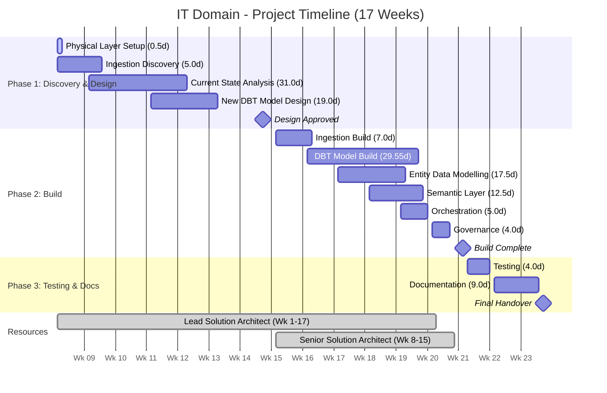
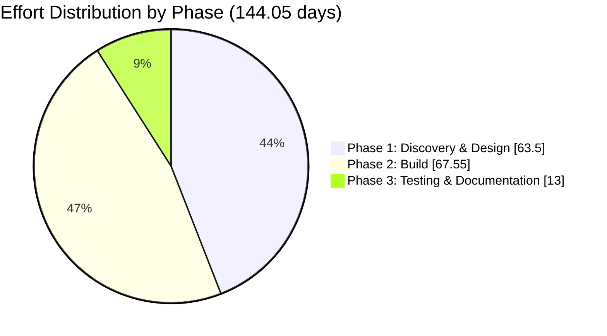

# IT Domain Data Pipeline - Scope of Work (INTERNAL)

**Client:** Canva  
**Domain:** IT (JIRA Analytics)  
**Prepared by:** Snowflake Professional Services  
**Date:** February 2026  
**Version:** 1.0 (DRAFT)  
**Document Status:** For Review

---

## Engagement Outcome

This outcome-based engagement will deliver a fully modernised data pipeline for the IT Domain as part of Canva's enterprise data migration initiative. Snowflake will discover and evaluate alternate ingestion methodologies (including Delta Share productionization or OpenFlow), analyse and redesign 150 existing DBT models into a new four-layer architecture (Landing, Conformed, Metrics, Semantic), build data models for 7 JIRA entities, establish semantic views for Snowflake Intelligence, configure orchestration through Airflow, implement data governance, and deliver complete documentation—all within a DEV environment only.

---

## Table of Contents

1. [In-Scope Pipelines](#1-in-scope-pipelines)
2. [Out of Scope](#2-out-of-scope)
3. [Effort Estimate](#3-effort-estimate)
   - 3.1 Assumptions Made on Estimate Calculation
   - 3.2 Effort Estimates - Detailed Breakdown
   - 3.3 Effort Summary
   - 3.4 Breakdown by Phase
   - 3.5 Phase-by-Phase Calculation
   - 3.6 Consolidated Effort Table
   - 3.7 Estimate Sensitivity
4. [High-Level Execution Plan](#4-high-level-execution-plan)
5. [Resourcing Needs](#5-resourcing-needs)
6. [Open Questions](#6-open-questions)
7. [Risks and Assumptions](#7-risks-and-assumptions)

---

## 1. In-Scope Pipelines

### 1.1 Data Sources & Entities

| Source | Entities | Description |
|--------|----------|-------------|
| **JIRA Cloud (via Delta Share or OpenFlow)** | 7 core entities | Primary JIRA instance data for IT operational analytics |
| **Legacy JIRA Instance** | Same 7 entities | Historical JIRA data from legacy instance (pending capacity) |

**JIRA Entities (7):**
- Issues
- Projects
- Users
- Components
- Versions
- Workflows
- Custom Fields

**Note:** Delta Share provides additional attributes (e.g., archive flag) not available through current Fivetran pipeline.

### 1.2 Deliverables Summary

| # | Deliverable | Description |
|---|-------------|-------------|
| 1 | **Ingestion Discovery & Build** | Evaluate Delta Share vs OpenFlow; productionize or build selected ingestion method |
| 2 | **Physical Layer Setup** | Create 4 Snowflake databases (Landing, Conformed, Metrics, Semantic) with schemas |
| 3 | **Data Model Analysis & Redesign** | Analyse 150 DBT models and redesign into 4-layer architecture |
| 4 | **DBT Project Development** | Consolidate and rebuild ~75 DBT models (50% reduction target) in new namespace |
| 5 | **Entity Data Modelling** | Design conformed and metrics layer models for 7 JIRA entities |
| 6 | **Semantic Layer** | Create 7 semantic views (one per JIRA entity) for Snowflake Intelligence |
| 7 | **Orchestration** | Scheduled orchestration via Airflow (migrated from Snowflake Tasks) |
| 8 | **Governance Implementation** | Data classifications, tagging framework, masking policies advisory |
| 9 | **Testing** | Data quality tests, unit tests (migrated from existing DBT tests) |
| 10 | **Documentation** | Solution design, data architecture, runbooks |

### 1.3 Ingestion Scope

The engagement includes discovery and implementation of the optimal ingestion methodology:

**Option A: Delta Share Productionization**
- Review existing POC (stored procedures + Python)
- Advise on best practices for productionization
- Migrate orchestration from Snowflake Tasks to Airflow
- Build production-ready ingestion pipeline

**Option B: OpenFlow Implementation**
- Evaluate OpenFlow JIRA Cloud connector capabilities
- Assess data coverage (including boards, sprints)
- Build OpenFlow-based ingestion if superior to Delta Share

**Discovery Outcome:** Recommend and implement the best approach based on:
- Data completeness (all 7 entities + boards/sprints)
- Multi-instance support (primary + legacy JIRA)
- Operational maintainability
- Cost considerations

---

## 2. Out of Scope

| Item | Rationale |
|------|-----------|
| **Production Environment Deployment** | Scope limited to DEV environment only |
| **Historical Data Migration** | Not required per workshop confirmation |
| **Downstream Consumer Re-pointing** | Migration guide provided; re-pointing is consumer responsibility |
| **Fivetran Decommissioning** | Separate operational activity |
| **Legacy JIRA Full Integration** | Capacity constraints; may be phased |
| **Security Use Cases** | Cross-instance security analytics identified but requires separate scoping |
| **Report Re-pointing** | Some reports exist but easy to manage; not in scope |
| **Productionization Support** | Runbooks provided; ongoing production support not included |

---

## 3. Effort Estimate

### 3.1 Assumptions Made on Estimate Calculation

#### 3.1.1 Discovery & Analysis Assumptions

| Assumption | Value | Source |
|------------|-------|--------|
| Time to analyse existing DBT model (per model) | 0.15 days | Many duplicates expected |
| Time for ingestion discovery | 5 days | Delta Share vs OpenFlow evaluation |
| Current state documentation availability | Partial | Existing POC available |
| Reverse engineering required | Minimal | POC code available for review |

#### 3.1.2 DBT Model Complexity Distribution (Estimated)

| Complexity | Count (Current) | Count (Target) | % Reduction |
|------------|-----------------|----------------|-------------|
| **Simple** | 90 | 45 | 50% |
| **Medium** | 45 | 23 | 49% |
| **Complex** | 15 | 7 | 53% |
| **Total** | **150** | **75** | **50%** |

*Note: High redundancy in current models (many duplicates exposing subsets) enables aggressive 50% consolidation target.*

#### 3.1.3 Effort per Model by Complexity

| Complexity Level | Definition | Effort per Model (Analysis) | Effort per Model (Build) |
|------------------|------------|-----------------------------|--------------------------| 
| **Simple** | Direct SELECT, minimal joins, no macros | 0.1 days | 0.2 days |
| **Medium** | Multiple joins, CTEs, standard transformations | 0.2 days | 0.4 days |
| **Complex** | Macros, complex CTEs, window functions, business logic | 0.4 days | 0.8 days |

#### 3.1.4 Model Distribution Across Layers

| Layer | Estimated Model Count | Rationale |
|-------|----------------------|-----------|
| Landing Layer | 7 | Raw ingested data (one per entity) |
| Conformed Layer | ~25 | Cleansed, standardized entities |
| Metrics Layer | ~35 | Aggregations, KPIs, business metrics |
| Semantic Layer | 7 | Semantic views (one per entity) |

#### 3.1.5 Other Key Assumptions

| Assumption | Value | Impact |
|------------|-------|--------|
| Total DBT models in scope (current state) | 150 | Confirmed in workshop |
| Target model count after consolidation | 75 (~50% of current) | High redundancy enables aggressive reduction |
| Overall complexity rating | 4-5 out of 10 | Many duplicates simplify analysis |
| Data volume | Small (compared to other domains) | Workshop confirmed |
| JIRA entities to model | 7 | Workshop confirmed |
| Semantic views | 7 (one per entity) | Assumption |
| Target environment | DEV only | Workshop confirmed |
| Existing Delta Share POC | Available | Workshop confirmed |
| SME availability | 4-6 hours/week | Expected commitment |
| Access to entire monolithic DBT project | Required | Cross-domain dependency analysis |
| Cortex Code access | Required | Development tooling |

---

### 3.2 Effort Estimates - Detailed Breakdown

#### 3.2.1 Physical Layer Setup

*Note: Effort assumes DEV environment setup only.*

| Activity | Description | Effort (Days) |
|----------|-------------|---------------|
| Database creation | Create 4 databases: it_landing, it_conformed, it_metrics, it_semantic | 0.25 |
| Schema creation | Create schemas per database: source, internal, expose | 0.15 |
| Access configuration | Initial role grants and access setup | 0.1 |
| **Subtotal** | | **0.5** |

#### 3.2.2 Ingestion Discovery & Build

| Activity | Description | Effort (Days) |
|----------|-------------|---------------|
| Delta Share POC review | Analyse existing stored procedures and Python code | 2.0 |
| OpenFlow evaluation | Assess JIRA connector capabilities, data coverage | 2.0 |
| Recommendation documentation | Document findings and recommendation | 1.0 |
| Ingestion build (selected approach) | Build production-ready ingestion pipeline | 5.0 |
| Airflow migration | Migrate orchestration from Snowflake Tasks to Airflow | 1.0 |
| Testing & validation | End-to-end ingestion testing | 1.0 |
| **Subtotal** | | **12.0** |

#### 3.2.3 Current State Analysis & Data Model Redesign

| Activity | Description | Calculation | Effort (Days) |
|----------|-------------|-------------|---------------|
| DBT model inventory | Catalogue all 150 models, identify duplicates | | 2.0 |
| Simple model analysis | Analyse simple DBT models | 90 models x 0.1 days | 9.0 |
| Medium model analysis | Analyse medium DBT models | 45 models x 0.2 days | 9.0 |
| Complex model analysis | Analyse complex DBT models | 15 models x 0.4 days | 6.0 |
| Duplicate identification | Map duplicates and consolidation opportunities (part of model analysis) | | 0.0 |
| Target model design | Design new 4-layer data model architecture (includes entity mapping) | | 4.0 |
| Design review & iteration | Stakeholder review and refinement | | 1.0 |
| **Subtotal** | | | **31.0** |

#### 3.2.4 New DBT Model Design

*Assumption: Target state is 50% of current model count (75 models) due to high redundancy.*

| Activity | Description | Calculation | Effort (Days) |
|----------|-------------|-------------|---------------|
| New model design | Design 75 models for new 4-layer architecture | 75 models x 0.2 days | 15.0 |
| Reusable component design | Design macros and shared logic | | 2.0 |
| Design documentation | Technical specifications | | 2.0 |
| **Subtotal** | | | **19.0** |

#### 3.2.5 New DBT Model Build

*Assumption: Complexity distribution for new models - Simple 45, Medium 23, Complex 7.*

| Activity | Description | Calculation | Effort (Days) |
|----------|-------------|-------------|---------------|
| Simple model build | Build simple DBT models | 45 models x 0.2 days | 9.0 |
| Medium model build | Build medium DBT models | 23 models x 0.4 days | 9.2 |
| Complex model build | Build complex DBT models | 7 models x 0.8 days | 5.6 |
| Macro/reusable component build | Build shared components | | 2.0 |
| Model configuration | YAML configs, tests, documentation | 75 models x 0.05 days | 3.75 |
| **Subtotal** | | | **29.55** |

#### 3.2.6 Entity Data Modelling (Conformed & Metrics)

| Activity | Description | Calculation | Effort (Days) |
|----------|-------------|-------------|---------------|
| Conformed layer design | Design cleansed entity models | 7 entities x 0.5 days | 3.5 |
| Conformed layer build | Build conformed models | 7 entities x 0.5 days | 3.5 |
| Metrics layer design | Design aggregations and KPIs | 7 entities x 0.75 days | 5.25 |
| Metrics layer build | Build metrics models | 7 entities x 0.75 days | 5.25 |
| **Subtotal** | | | **17.5** |

#### 3.2.7 Semantic Layer Development

| Activity | Description | Calculation | Effort (Days) |
|----------|-------------|-------------|---------------|
| Requirements discovery | Define AI/LLM use cases per entity | 7 entities x 0.25 days | 1.75 |
| Semantic model design | Dimensions, measures, relationships, synonyms | 7 models x 0.75 days | 5.25 |
| Semantic view build | Create and validate semantic views | 7 views x 0.5 days | 3.5 |
| Snowflake Intelligence validation | Test with Cortex Analyst | | 2.0 |
| **Subtotal** | | | **12.5** |

#### 3.2.8 Orchestration Setup

| Activity | Description | Effort (Days) |
|----------|-------------|---------------|
| Orchestration design | Scheduled trigger patterns | 1.0 |
| Airflow DAG development | Build DAGs for ingestion and transformation | 3.0 |
| Testing & validation | End-to-end orchestration testing | 1.0 |
| **Subtotal** | | **5.0** |

#### 3.2.9 Governance Implementation

| Activity | Description | Effort (Days) |
|----------|-------------|---------------|
| Governance discovery | Assess new data model sensitivity | 1.0 |
| Data classification | Apply classifications and tagging to new objects | 2.0 |
| Masking policies advisory | Recommend masking approach (leverage existing process) | 1.0 |
| **Subtotal** | | **4.0** |

#### 3.2.10 Testing

| Activity | Description | Effort (Days) |
|----------|-------------|---------------|
| Unit test migration | Migrate existing DBT tests (null checks, etc.) | 2.0 |
| Data quality testing | Accuracy, completeness, consistency | 2.0 |
| **Subtotal** | | **4.0** |

#### 3.2.11 Documentation

| Activity | Description | Effort (Days) |
|----------|-------------|---------------|
| Solution design document | Architecture and design documentation | 3.0 |
| Data architecture document | Data model specifications | 2.0 |
| Ingestion runbook | Operational procedures for ingestion | 1.5 |
| Transformation runbook | DBT operational procedures | 1.5 |
| Knowledge transfer | 2-3 training sessions | 1.0 |
| **Subtotal** | | **9.0** |

---

### 3.3 Effort Summary

| Category | Effort (Days) |
|----------|---------------|
| Physical Layer Setup | 0.5 |
| Ingestion Discovery & Build | 12.0 |
| Current State Analysis & Data Model Redesign | 31.0 |
| New DBT Model Design | 19.0 |
| New DBT Model Build | 29.55 |
| Entity Data Modelling | 17.5 |
| Semantic Layer Development | 12.5 |
| Orchestration Setup | 5.0 |
| Governance Implementation | 4.0 |
| Testing | 4.0 |
| Documentation | 9.0 |
| **Total Base Effort** | **144.05 days** |
| **Contingency (15%)** | **21.6 days** |
| **Grand Total** | **165.65 days** |

---

### 3.4 Breakdown by Phase

| Phase | Activities Included | Effort (Days) |
|-------|---------------------|---------------|
| **Phase 1: Discovery & Design** | Physical layer setup, ingestion discovery, current state analysis, model design | 63.5 |
| **Phase 2: Build** | Ingestion build, DBT model build, entity modelling, semantic layer, orchestration, governance | 67.55 |
| **Phase 3: Testing & Documentation** | Testing, documentation, knowledge transfer | 13.0 |
| **Subtotal** | | **144.05** |
| **Contingency (15%)** | | **21.6** |
| **Grand Total** | | **165.65** |

---

### 3.5 Phase-by-Phase Calculation

#### Phase 1: Discovery & Design (63.5 days)

| Activity | Effort (Days) | Calculation |
|----------|---------------|-------------|
| Physical layer setup | 0.5 | 4 DBs + schemas + access |
| Delta Share POC review | 2.0 | Analyse existing code |
| OpenFlow evaluation | 2.0 | Assess connector capabilities |
| Recommendation documentation | 1.0 | Document findings |
| DBT model inventory | 2.0 | Catalogue 150 models |
| Simple model analysis | 9.0 | 90 models x 0.1 days |
| Medium model analysis | 9.0 | 45 models x 0.2 days |
| Complex model analysis | 6.0 | 15 models x 0.4 days |
| Duplicate identification | 0.0 | Part of model analysis |
| Target model design | 4.0 | 4-layer architecture design |
| Design review | 1.0 | Stakeholder iterations |
| New model design | 15.0 | 75 models x 0.2 days |
| Reusable component design | 2.0 | Macros and shared logic |
| Design documentation | 2.0 | Technical specifications |
| Requirements discovery (semantic) | 1.75 | 7 entities x 0.25 days |
| Semantic model design | 5.25 | 7 models x 0.75 days |
| Governance discovery | 1.0 | Assess sensitivity |
| **Subtotal** | **63.5** | |

#### Phase 2: Build (67.55 days)

| Activity | Effort (Days) | Calculation |
|----------|---------------|-------------|
| Ingestion build | 5.0 | Build selected approach |
| Airflow migration | 1.0 | Migrate from SF Tasks |
| Ingestion testing | 1.0 | End-to-end validation |
| Simple model build | 9.0 | 45 models x 0.2 days |
| Medium model build | 9.2 | 23 models x 0.4 days |
| Complex model build | 5.6 | 7 models x 0.8 days |
| Macro build | 2.0 | Shared components |
| Model configuration | 3.75 | 75 models x 0.05 days |
| Conformed layer design | 3.5 | 7 entities x 0.5 days |
| Conformed layer build | 3.5 | 7 entities x 0.5 days |
| Metrics layer design | 5.25 | 7 entities x 0.75 days |
| Metrics layer build | 5.25 | 7 entities x 0.75 days |
| Semantic view build | 3.5 | 7 views x 0.5 days |
| Snowflake Intelligence validation | 2.0 | Cortex Analyst testing |
| Orchestration design | 1.0 | Scheduled patterns |
| Airflow DAG development | 3.0 | Build DAGs |
| Orchestration testing | 1.0 | End-to-end validation |
| Data classification | 2.0 | Apply to new objects |
| Masking policies advisory | 1.0 | Recommend approach |
| **Subtotal** | **67.55** | |

#### Phase 3: Testing & Documentation (13.0 days)

| Activity | Effort (Days) | Calculation |
|----------|---------------|-------------|
| Unit test migration | 2.0 | Existing DBT tests |
| Data quality testing | 2.0 | Accuracy, completeness |
| Solution design document | 3.0 | Architecture documentation |
| Data architecture document | 2.0 | Data model specs |
| Ingestion runbook | 1.5 | Operational procedures |
| Transformation runbook | 1.5 | DBT procedures |
| Knowledge transfer | 1.0 | 2-3 training sessions |
| **Subtotal** | **13.0** | |

---

### 3.6 Consolidated Effort Table

| Category | Phase | Activity | Effort (Days) | AI Scalable | Effort with AI | Calculation |
|----------|-------|----------|---------------|-------------|----------------|-------------|
| **Physical Layer Setup** | 1 | Database creation | 0.25 | Yes | 0.175 | 4 databases |
| | 1 | Schema creation | 0.15 | Yes | 0.105 | Schemas per database |
| | 1 | Access configuration | 0.1 | No | 0.1 | Initial role grants |
| | | **Subtotal** | **0.5** | | **0.38** | |
| **Ingestion Discovery** | 1 | Delta Share POC review | 2.0 | Yes | 1.4 | Analyse existing code |
| | 1 | OpenFlow evaluation | 2.0 | No | 2.0 | Assess capabilities |
| | 1 | Recommendation documentation | 1.0 | No | 1.0 | Document findings |
| | | **Subtotal** | **5.0** | | **4.4** | |
| **Ingestion Build** | 2 | Ingestion build | 5.0 | No | 5.0 | Selected approach |
| | 2 | Airflow migration | 1.0 | Yes | 0.7 | Migrate from SF Tasks |
| | 2 | Testing & validation | 1.0 | No | 1.0 | End-to-end testing |
| | | **Subtotal** | **7.0** | | **6.7** | |
| **Current State Analysis** | 1 | DBT model inventory | 2.0 | Yes | 1.4 | Catalogue 150 models |
| | 1 | Simple model analysis | 9.0 | Yes | 6.3 | 90 models x 0.1 days |
| | 1 | Medium model analysis | 9.0 | Yes | 6.3 | 45 models x 0.2 days |
| | 1 | Complex model analysis | 6.0 | Yes | 4.2 | 15 models x 0.4 days |
| | 1 | Duplicate identification | 0.0 | No | 0.0 | Part of model analysis |
| | 1 | Target model design | 4.0 | Yes | 2.8 | 4-layer architecture (includes entity mapping) |
| | 1 | Design review & iteration | 1.0 | No | 1.0 | Stakeholder review |
| | | **Subtotal** | **31.0** | | **22.0** | |
| **New DBT Model Design** | 1 | New model design | 15.0 | Yes | 10.5 | 75 models x 0.2 days |
| | 1 | Reusable component design | 2.0 | Yes | 1.4 | Macros and shared logic |
| | 1 | Design documentation | 2.0 | Yes | 1.4 | Technical specifications |
| | | **Subtotal** | **19.0** | | **13.3** | |
| **New DBT Model Build** | 2 | Simple model build | 9.0 | Yes | 6.3 | 45 models x 0.2 days |
| | 2 | Medium model build | 9.2 | Yes | 6.44 | 23 models x 0.4 days |
| | 2 | Complex model build | 5.6 | Yes | 3.92 | 7 models x 0.8 days |
| | 2 | Macro/component build | 2.0 | Yes | 1.4 | Shared components |
| | 2 | Model configuration | 3.75 | Yes | 2.625 | YAML, tests, docs |
| | | **Subtotal** | **29.55** | | **20.685** | |
| **Entity Data Modelling** | 2 | Conformed layer design | 3.5 | Yes | 2.45 | 7 entities x 0.5 days |
| | 2 | Conformed layer build | 3.5 | Yes | 2.45 | 7 entities x 0.5 days |
| | 2 | Metrics layer design | 5.25 | Yes | 3.675 | 7 entities x 0.75 days |
| | 2 | Metrics layer build | 5.25 | Yes | 3.675 | 7 entities x 0.75 days |
| | | **Subtotal** | **17.5** | | **12.25** | |
| **Semantic Layer** | 1 | Requirements discovery | 1.75 | No | 1.75 | 7 entities x 0.25 days |
| | 1 | Semantic model design | 5.25 | Yes | 3.675 | 7 models x 0.75 days |
| | 2 | Semantic view build | 3.5 | Yes | 2.45 | 7 views x 0.5 days |
| | 2 | Snowflake Intelligence validation | 2.0 | No | 2.0 | Cortex Analyst testing |
| | | **Subtotal** | **12.5** | | **9.875** | |
| **Orchestration Setup** | 2 | Orchestration design | 1.0 | No | 1.0 | Scheduled patterns |
| | 2 | Airflow DAG development | 3.0 | Yes | 2.1 | Build DAGs |
| | 2 | Testing & validation | 1.0 | No | 1.0 | End-to-end testing |
| | | **Subtotal** | **5.0** | | **4.1** | |
| **Governance** | 1 | Governance discovery | 1.0 | No | 1.0 | Assess sensitivity |
| | 2 | Data classification | 2.0 | No | 2.0 | Apply to new objects |
| | 2 | Masking policies advisory | 1.0 | No | 1.0 | Recommend approach |
| | | **Subtotal** | **4.0** | | **4.0** | |
| **Testing** | 3 | Unit test migration | 2.0 | No | 2.0 | Existing DBT tests |
| | 3 | Data quality testing | 2.0 | No | 2.0 | Accuracy, completeness |
| | | **Subtotal** | **4.0** | | **4.0** | |
| **Documentation** | 3 | Solution design document | 3.0 | Yes | 2.1 | Architecture documentation |
| | 3 | Data architecture document | 2.0 | Yes | 1.4 | Data model specs |
| | 3 | Ingestion runbook | 1.5 | No | 1.5 | Operational procedures |
| | 3 | Transformation runbook | 1.5 | No | 1.5 | DBT procedures |
| | 3 | Knowledge transfer | 1.0 | No | 1.0 | 2-3 training sessions |
| | | **Subtotal** | **9.0** | | **7.5** | |
| | | | | | | |
| **PHASE TOTALS** | | | | | | |
| | **Phase 1** | Discovery & Design | **63.5** | | **47.955** | |
| | **Phase 2** | Build | **67.55** | | **53.76** | |
| | **Phase 3** | Testing & Documentation | **13.0** | | **11.5** | |
| | | | | | | |
| | | **Total Base Effort** | **144.05** | | **113.215** | |
| | | **Contingency (15%)** | **21.6** | | **16.98** | |
| | | **Grand Total** | **165.65** | | **130.20** | |

---

### 3.7 Estimate Sensitivity

| If This Changes... | Impact on Estimate |
|--------------------|--------------------|
| DBT model count higher than 150 | +0.3 days per additional model |
| Fewer duplicates than expected (reduction < 50%) | +10-20 days |
| Delta Share POC requires significant rework | +5-10 days |
| OpenFlow selected and requires custom development | +5-8 days |
| Additional JIRA entities beyond 7 | +5-7 days per entity |
| SME availability drops to 2 hrs/week | +8-12 days (waiting time) |
| Multiple JIRA instances require separate handling | +10-15 days per instance |
| Semantic views increase beyond 7 | +2-3 days per view |
| Additional governance requirements | +3-5 days |
| Complex orchestration requirements | +5-8 days |
| Legacy JIRA data included in scope | +15-25 days |

---

## 4. High-Level Execution Plan

### Phase 1: Discovery & Design (Weeks 1-7)

**Objectives:** Evaluate ingestion options, understand current state, design target architecture

| Week | Activities |
|------|------------|
| 1-2 | Physical layer setup, Delta Share POC review, OpenFlow evaluation |
| 3 | Ingestion recommendation, begin DBT model inventory |
| 4-5 | Complete DBT model analysis, identify duplicates and consolidation opportunities |
| 6-7 | Target model design, design review with stakeholders |

**Key Milestones:**
- Ingestion approach selected and documented
- DBT model consolidation plan approved
- Target data model design signed off

### Phase 2: Build (Weeks 8-15)

**Objectives:** Build ingestion pipeline, develop all DBT models, semantic layer, orchestration

| Week | Activities |
|------|------------|
| 8-9 | Build ingestion pipeline, migrate to Airflow orchestration |
| 10-11 | Build Conformed layer DBT models, entity data models |
| 12-13 | Build Metrics layer DBT models, semantic layer development |
| 14-15 | Orchestration setup, governance implementation |

**Key Milestones:**
- Ingestion pipeline operational
- Conformed layer models complete
- Metrics layer models complete
- Semantic views deployed
- Orchestration operational

### Phase 3: Testing & Documentation (Weeks 16-17)

**Objectives:** Test thoroughly, document solution, transfer knowledge

| Week | Activities |
|------|------------|
| 16 | Unit test migration, data quality testing |
| 17 | Documentation completion, knowledge transfer, final handover |

**Key Milestones:**
- All tests passing
- Documentation delivered
- Knowledge transfer complete

### Timeline Diagram



### Effort by Phase



### Timeline Summary

```
Week:  1  2  3  4  5  6  7 | 8  9 10 11 12 13 14 15 | 16 17
       |--Discovery & Design------------|------Build--------------|Test &|
       |                                |                         | Docs |

Lead Solution Architect:
       |====================================================================|
       Week 1-17 (Full engagement)

Senior Solution Architect:
                                        |======================|
                                        Week 8-15 (Build phase)
```

**Total Duration:** ~17 weeks (4.25 months)

---

## 5. Resourcing Needs

### 5.1 Snowflake Professional Services Team

| Role | FTE | Duration | Responsibilities | Required Skills & Expertise |
|------|-----|----------|------------------|----------------------------|
| **Lead Solution Architect** | 1.0 | Full engagement (17 weeks) | Solution architecture, ingestion design, DBT development, technical leadership | DBT Core (advanced), Snowflake (advanced), Delta Share, OpenFlow, Data modeling (advanced), SQL (advanced), Airflow, Semantic Views/Cortex Analyst, Python |
| **Senior Solution Architect** | 1.0 | Weeks 8-15 (8 weeks) | DBT model development, entity modelling, testing | DBT Core (advanced), Snowflake, SQL (advanced), Python, Data migration, Testing frameworks |

### 5.2 Canva Team Requirements

| Role | Commitment | Duration | Responsibilities |
|------|------------|----------|------------------|
| **Domain SME (Akshun)** | 4-6 hrs/week | Full engagement | Requirements clarification, JIRA entity knowledge, model validation |
| **Technical Lead (Vinnie)** | 2-4 hrs/week | Full engagement | Technical decisions, approvals, escalations |
| **Analytics Engineer (Weiliang)** | As needed | Full engagement | DBT model support, testing assistance |
| **Data Platform Team** | As needed | Full engagement | Airflow infrastructure, database provisioning |

### 5.3 Infrastructure Requirements

| Requirement | Owner | Timeline |
|-------------|-------|----------|
| 4 Snowflake databases (Landing, Conformed, Metrics, Semantic) | Platform Team | Week 1 |
| Development environment access | Platform Team | Week 1 |
| Airflow environment for orchestration | Platform Team | Week 8 |
| Access to existing Delta Share POC | Akshun | Week 1 |
| Access to existing DBT models | Akshun | Week 1 |
| OpenFlow evaluation environment | Platform Team | Week 1-2 |

---

## 6. Open Questions

| # | Question | Owner | Impact | Priority |
|---|----------|-------|--------|----------|
| 1 | Does OpenFlow JIRA connector include boards and sprints data? | Dean/Vish | Ingestion decision | High |
| 2 | Does Delta Share schema include boards and sprints? | Akshun | Ingestion decision | High |
| 3 | What is the volume of legacy JIRA instance data? | Akshun | Future scope sizing | Medium |
| 4 | Are there specific semantic layer requirements beyond basic AI readiness? | Vinnie | Semantic layer design | Medium |
| 5 | What are the specific data classification requirements for JIRA data? | Akshun | Governance implementation | Medium |
| 6 | Can OpenFlow pass security review for JIRA integration? | Dean/Frank | Ingestion option viability | Medium |
| 7 | What refresh frequency is required (daily, hourly)? | Akshun | Orchestration design | Medium |
| 8 | Are there any dependencies on other domains for JIRA data? | Akshun | Design dependencies | Low |
| 9 | What is the timeline for legacy JIRA instance integration? | Vinnie | Future scope planning | Low |

---

## 7. Risks and Assumptions

### 7.1 Assumptions

| # | Assumption | Source |
|---|------------|--------|
| A1 | Total DBT models in scope is 150 | Workshop confirmed |
| A2 | High redundancy allows 50% model consolidation | Workshop confirmed |
| A3 | 7 JIRA entities are in scope | Workshop confirmed |
| A4 | Data volume is small compared to other domains | Workshop confirmed |
| A5 | Existing Delta Share POC is available for review | Workshop confirmed |
| A6 | Target environment is DEV only | Workshop confirmed |
| A7 | No historical data migration required | Workshop confirmed |
| A8 | Single JIRA instance in primary scope (legacy is future phase) | Workshop confirmed |
| A9 | DBT Core (open source) is the transformation platform | Standard |
| A10 | Airflow is available for orchestration | Workshop confirmed |
| A11 | SME availability of 4-6 hours/week throughout engagement | Expected commitment |
| A12 | Existing DBT tests (null checks, etc.) exist and can be migrated | Workshop confirmed |
| A13 | No report re-pointing required (consumer responsibility) | Workshop confirmed |
| A14 | Access to entire monolithic DBT project granted | Required for analysis |
| A15 | Cortex Code can be connected to target Snowflake environment | Development tooling |
| A16 | Activities marked as "AI Scalable" are subject to 30% effort reduction when using AI-assisted development tools | Effort calculation assumption |
| A17 | Design reviews are approved in a timely fashion | Standard |
| A18 | Productionization support (beyond runbooks) is not included | Workshop confirmed |
| A19 | Access to personnel with source data knowledge for target state model design is available | Required for analysis |

### 7.2 Risks

| # | Risk | Likelihood | Impact | Mitigation |
|---|------|------------|--------|------------|
| R1 | **Fewer duplicates than expected** - Model consolidation target not achievable | Medium | High | Early duplicate analysis; adjust target if needed; clearly communicate revised scope |
| R2 | **Delta Share POC issues** - Existing POC requires significant rework | Medium | Medium | Early POC review; allocate buffer time; consider OpenFlow as alternative |
| R3 | **OpenFlow data gaps** - Missing boards/sprints data | Medium | Medium | Validate data coverage early; hybrid approach if needed |
| R4 | **SME availability** - Akshun/Vinnie unavailable for required sessions | Medium | High | Identify backup SMEs (Weiliang); flexible scheduling; document decisions |
| R5 | **Legacy JIRA scope creep** - Pressure to include legacy instance | Medium | High | Clear scope boundary; document as future phase; change control process |
| R6 | **Governance complexity** - Classification requirements more complex than expected | Low | Medium | Early governance discovery; involve security team if needed |
| R7 | **Multi-instance complexity** - Additional JIRA instances identified | Low | High | Clear scope boundary; separate engagement for additional instances |
| R8 | **Platform team capacity** - Infrastructure provisioning delays | Low | High | Early engagement; clear timeline commitments; escalation path |
| R9 | **Semantic requirements unclear** - AI use cases not well defined | Low | Medium | Discovery workshop; phased semantic delivery; iterate based on feedback |
| R10 | **Testing framework limitations** - Existing tests insufficient | Low | Low | Assess early; build additional tests as needed |

---

**Document History:**

| Version | Date | Author | Changes |
|---------|------|--------|---------|
| 1.0 | February 2026 | Snowflake PS | Initial draft |

---

*This Scope of Work is based on information gathered during the IT Domain workshop held on February 6, 2026, and supporting documentation provided by Canva. Estimates are subject to refinement upon completion of ingestion discovery and DBT model duplicate analysis.*
