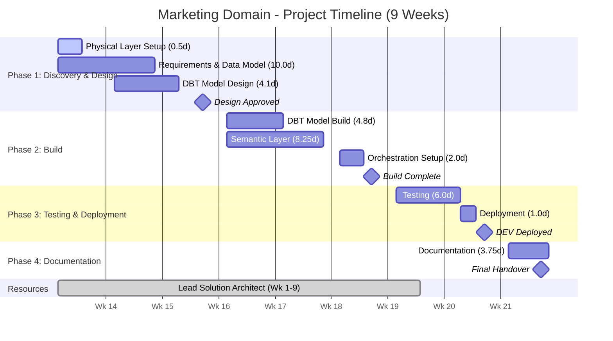
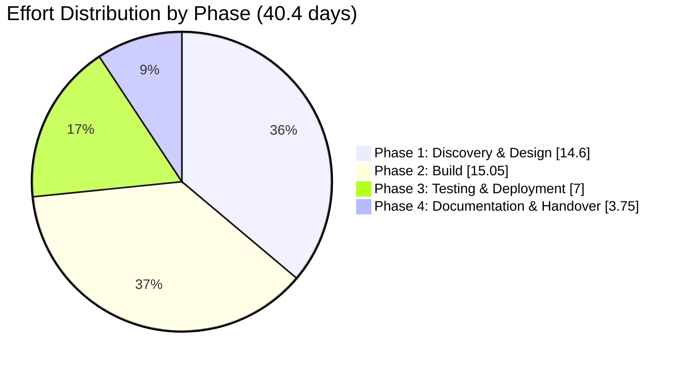

# Marketing Domain Data Pipeline - Scope of Work (INTERNAL)

**Client:** Canva  
**Domain:** Marketing  
**Prepared by:** Snowflake Professional Services  
**Date:** February 2026  
**Version:** 1.0 (DRAFT)  
**Document Status:** For Review

---

## Engagement Outcome

This outcome-based engagement will deliver a new data pipeline for the Marketplace Flow Pipeline within the Marketing Domain as part of Canva's enterprise data initiative. Snowflake will design and build a new Metrics layer data model for marketplace analytics, develop new DBT models for transformation logic, create semantic views for Snowflake Intelligence to answer key marketplace business questions, and configure orchestration through Airflow with daily refresh dependent on Discovery domain pipelines. This is a greenfield development (not a migration) that consumes upstream data from the Discovery and Foundation domains.

---

## Table of Contents

1. [In-Scope Pipelines](#1-in-scope-pipelines)
2. [Out of Scope](#2-out-of-scope)
3. [Effort Estimate](#3-effort-estimate)
   - 3.1 Assumptions Made on Estimate Calculation
   - 3.2 Effort Estimates - Detailed Breakdown
   - 3.3 Effort Summary
   - 3.4 Breakdown by Phase
   - 3.5 Phase-by-Phase Calculation
   - 3.6 Consolidated Effort Table
   - 3.7 Estimate Sensitivity
4. [High-Level Execution Plan](#4-high-level-execution-plan)
5. [Resourcing Needs](#5-resourcing-needs)
6. [Open Questions](#6-open-questions)
7. [Risks and Assumptions](#7-risks-and-assumptions)

---

## 1. In-Scope Pipelines

### 1.1 Data Pipelines

| Pipeline | Source Dependencies | Target State (Marketing Metrics Layer) | Description |
|----------|---------------------|----------------------------------------|-------------|
| **Marketplace Flow Pipeline** | Discovery metrics layer + Foundation metrics layer | Marketing Metrics layer dimensional model | New pipeline for marketplace analytics - session-level funnel tracking from landing through editor outcomes |

**Current State:** No existing DBT models to migrate from; initial business requirements documented  
**Target State:** New Metrics layer dimensional model specific to Marketplace Flow Pipeline

### 1.2 Business Metrics Requirements

The pipeline will support reporting on two primary areas:

#### A) Marketplace Landing Page (Discovery-owned interactions) - Session Level

| Metric | Description |
|--------|-------------|
| Marketplace landing sessions | Total distinct sessions on marketplace landing |
| Sessions with search bar interacted | Count of sessions where search bar was used |
| Sessions with search query submitted | Count of sessions where query was submitted |
| Ingredient impressions | Number of ingredients seen (total + unique) |
| Sessions with ingredient interacted | Sessions where user interacted with ingredient |
| Sessions with ingredient CTA clicked | Sessions where ingredient CTA was clicked |

#### B) Editor Outcomes (Post Marketplace Landing)

| Metric | Description |
|--------|-------------|
| Sessions with ingredient applied | Sessions where ingredient was applied in editor (requires Marketplace → Editor attribution) |
| Sessions with publish/share + ingredient applied | Sessions with publish/share event where ingredient was used |

### 1.3 Required Source Fields

| Category | Fields Required |
|----------|-----------------|
| **Core Keys** | session_id, event_id, event_timestamp, user_id, anonymous_id/client_id, is_logged_in, session_type, page_type/surface, page_url/path |
| **Marketplace Landing Events** | event_name/action_type, search_query, search_session_id, ingredient_id, interaction_type, cta_type |
| **Attribution Fields** | referrer_surface, origin_surface, navigation_source, entry_page_type |
| **Editor Events** | ingredient_id, design_id, event_name (apply/publish/share) |

### 1.4 Deliverables Summary

| # | Deliverable | Description |
|---|-------------|-------------|
| 1 | **Metrics Layer Data Model Design** | Design new dimensional model for Marketplace Flow Pipeline specific to marketing domain |
| 2 | **DBT Project Development** | Design and build new DBT models for transformation logic (consuming Discovery + Foundation metrics) |
| 3 | **Semantic Layer** | Create semantic views to answer 3 key business question areas for Snowflake Intelligence |
| 4 | **Orchestration** | Daily Airflow orchestration with dependency on Discovery domain pipelines |
| 5 | **Documentation** | Solution design, data architecture documentation |

---

## 2. Out of Scope

| Item | Rationale |
|------|-----------|
| **Data Migration** | No existing data to migrate - greenfield development |
| **Conformed Layer Design** | Upstream dependency from Discovery domain - conformed layer already exists |
| **Governance Implementation** | No governance changes required - new data uses marketing RBAC roles only |
| **Upstream Dependency Development** | Discovery and Foundation domain inputs assumed complete (ARR ticket raised) |
| **Downstream Consumer Re-pointing** | No existing consumers - new pipeline |
| **Parallel Run Support** | Not applicable - no existing process to replace |
| **Infrastructure Provisioning** | Platform team responsibility (databases, Airflow infrastructure) |
| **Productionization** | Handled by Canva internal team |
| **TEST/UAT & Production Deployment** | MH effort restricted to DEV environment only |

---

## 3. Effort Estimate

### 3.1 Assumptions Made on Estimate Calculation

#### 3.1.1 Discovery & Analysis Assumptions

| Assumption | Value | Source |
|------------|-------|--------|
| Upstream dependencies complete | Within 1 month | ARR ticket raised with Discovery team |
| Source metrics layer available | Discovery + Foundation | Meeting confirmed |
| No existing DBT models to migrate | Greenfield | Meeting confirmed |
| Business requirements documented | Initial thoughts available | Requirements document |
| Access to source data for business transformations | Available | Required for analysis |
| Data sources and tables from upstream dependencies | Available | Required for development |

#### 3.1.2 DBT Model Complexity Distribution (Estimated)

| Pipeline | Simple | Medium | Complex | Total |
|----------|--------|--------|---------|-------|
| **Marketplace Flow Pipeline** | 2 | 5 | 1 | 8 |

*Note: Estimated based on metrics requirements (2 primary areas, ~6-8 metrics per area). 4-5 tape models pending Discovery team creation.*

#### 3.1.3 Effort per Model by Complexity

| Complexity Level | Definition | Effort per Model (Design) | Effort per Model (Build) |
|------------------|------------|---------------------------|--------------------------|
| **Simple** | Direct SELECT, minimal joins, no macros | 0.25 days | 0.25 days |
| **Medium** | Multiple joins, CTEs, standard transformations | 0.4 days | 0.5 days |
| **Complex** | Macros, complex CTEs, window functions, business logic | 0.6 days | 1.0 days |

#### 3.1.4 Semantic Layer Requirements

| Business Question Area | Coverage |
|------------------------|----------|
| Logged-out traffic on marketplace pages | Session-level metrics |
| Authentication conversion rate across marketplace pages | Funnel analysis |
| Search interaction patterns | Multi-step journey analysis (search bar → view result → interact with thumbnail) |

*Note: 3 primary question areas identified for semantic layer coverage.*

#### 3.1.5 Other Key Assumptions

| Assumption | Value | Impact |
|------------|-------|--------|
| New DBT models required | ~8 models | Greenfield development |
| Semantic views required | 3 views | One per business question area |
| Refresh frequency | Daily | Dependent on Discovery domain pipelines |
| Target tables type | Native Snowflake tables | Marketing namespace |
| DBT version | DBT Core (open source) | Provided by platform team |
| SME availability | 4-6 hours/week | Based on expected commitment |
| Upstream dependencies complete | Within 1 month | ARR ticket with Discovery team |

---

### 3.2 Effort Estimates - Detailed Breakdown

#### 3.2.1 Physical Layer Setup

*Note: MH effort assumes DEV environment setup only.*

| Activity | Description | Effort (Days) |
|----------|-------------|---------------|
| Schema creation | Create marketing metrics schema in existing namespace | 0.25 |
| Access configuration | Configure marketing RBAC roles | 0.25 |
| **Subtotal** | | **0.5** |

#### 3.2.2 Requirements Discovery & Data Model Design

*Assumption: Design reviews are approved in a timely fashion.*

| Activity | Description | Calculation | Effort (Days) |
|----------|-------------|-------------|---------------|
| Business requirements analysis | Review metrics requirements, validate completeness | 2 areas | 1.0 |
| Source field mapping | Map required fields from Discovery + Foundation | | 1.5 |
| Dimensional model design | Design new Metrics layer model for Marketplace Flow | | 3.0 |
| Target model design | Design grain-appropriate fact and dimension tables | | 2.0 |
| Attribution logic design | Design Marketplace → Editor attribution approach | | 1.5 |
| Design review & iteration | Stakeholder review and refinement | | 1.0 |
| **Subtotal** | | | **10.0** |

#### 3.2.3 New DBT Model Design

| Activity | Description | Calculation | Effort (Days) |
|----------|-------------|-------------|---------------|
| Simple model design | Design simple DBT models | 2 models x 0.25 days | 0.5 |
| Medium model design | Design medium DBT models | 5 models x 0.4 days | 2.0 |
| Complex model design | Design complex DBT models | 1 model x 0.6 days | 0.6 |
| Design documentation | Technical specifications | | 1.0 |
| **Subtotal** | | | **4.1** |

#### 3.2.4 New DBT Model Build

| Activity | Description | Calculation | Effort (Days) |
|----------|-------------|-------------|---------------|
| Simple model build | Build simple DBT models | 2 models x 0.25 days | 0.5 |
| Medium model build | Build medium DBT models | 5 models x 0.5 days | 2.5 |
| Complex model build | Build complex DBT models | 1 model x 1.0 days | 1.0 |
| Model configuration | YAML configs, tests, documentation | 8 models x 0.1 days | 0.8 |
| **Subtotal** | | | **4.8** |

#### 3.2.5 Semantic Layer Development

| Activity | Description | Calculation | Effort (Days) |
|----------|-------------|-------------|---------------|
| Requirements discovery | Define AI/LLM use cases per question area | 3 areas x 0.5 days | 1.5 |
| Metric definition | Define metrics for semantic layer | | 1.5 |
| Semantic model design | Dimensions, measures, relationships, synonyms | 3 models x 0.75 days | 2.25 |
| Semantic view build | Create and validate semantic views | 3 views x 0.5 days | 1.5 |
| Snowflake Intelligence validation | Test with Cortex Analyst | | 1.5 |
| **Subtotal** | | | **8.25** |

*Note: Semantic layer coverage analysis - all 3 business question areas can be addressed by the transformation requirements:*
- *Q1 (Logged-out traffic): Covered by session_type/is_logged_in fields and session metrics*
- *Q2 (Authentication conversion): Covered by session-level funnel metrics with is_logged_in tracking*
- *Q3 (Search interaction patterns): Covered by search bar interaction, query submitted, and ingredient interaction metrics*

#### 3.2.6 Orchestration Setup

*Note: Orchestration restricted to 2 days maximum as per requirements.*

| Activity | Description | Effort (Days) |
|----------|-------------|---------------|
| Orchestration design | Daily pattern with Discovery dependency | 0.5 |
| Airflow DAG development | Add task dependencies for 1 pipeline (existing Airflow) | 1.0 |
| Testing & validation | End-to-end orchestration testing | 0.5 |
| **Subtotal** | | **2.0** |

#### 3.2.7 Testing

*Assumption: Deployment to UAT and production environments is not included in MH effort scope.*

| Activity | Description | Effort (Days) |
|----------|-------------|---------------|
| Unit test development | Tests for new models | 2.0 |
| Integration testing | End-to-end pipeline validation | 2.0 |
| Data quality testing | Accuracy, completeness, consistency | 2.0 |
| **Subtotal** | | **6.0** |

#### 3.2.8 Documentation

*Note: Migration guide not applicable - greenfield development.*

| Activity | Description | Effort (Days) |
|----------|-------------|---------------|
| Solution design document | Architecture and design documentation | 2.0 |
| Data architecture document | Data model specifications | 1.5 |
| Knowledge transfer | 1 session x 1 hour | 0.25 |
| **Subtotal** | | **3.75** |

#### 3.2.9 Deployment

*Note: MH effort is restricted to DEV environment only.*

| Activity | Description | Effort (Days) |
|----------|-------------|---------------|
| Development environment deployment | Initial deployment and validation | 1.0 |
| **Subtotal** | | **1.0** |

---

### 3.3 Effort Summary

| Category | Effort (Days) |
|----------|---------------|
| Physical Layer Setup | 0.5 |
| Requirements Discovery & Data Model Design | 10.0 |
| New DBT Model Design | 4.1 |
| New DBT Model Build | 4.8 |
| Semantic Layer Development | 8.25 |
| Orchestration Setup | 2.0 |
| Testing | 6.0 |
| Documentation | 3.75 |
| Deployment | 1.0 |
| **Total Base Effort** | **40.4 days** |
| **Contingency (15%)** | **6.1 days** |
| **Grand Total** | **46.5 days** |

---

### 3.4 Breakdown by Phase

| Phase | Activities Included | Effort (Days) |
|-------|---------------------|---------------|
| **Phase 1: Discovery & Design** | Physical layer setup, requirements discovery, data model design, DBT model design | 14.6 |
| **Phase 2: Build** | DBT model build, semantic layer, orchestration | 15.05 |
| **Phase 3: Testing & Deployment** | Testing, deployment | 7.0 |
| **Phase 4: Documentation & Handover** | Documentation, knowledge transfer | 3.75 |
| **Subtotal** | | **40.4** |
| **Contingency (15%)** | | **6.1** |
| **Grand Total** | | **46.5** |

---

### 3.5 Phase-by-Phase Calculation

#### Phase 1: Discovery & Design (14.6 days)

| Activity | Days | Calculation |
|----------|------|-------------|
| Schema creation | 0.25 | Marketing metrics schema |
| Access configuration | 0.25 | RBAC roles |
| Business requirements analysis | 1.0 | 2 areas |
| Source field mapping | 1.5 | Discovery + Foundation |
| Dimensional model design | 3.0 | Metrics layer model |
| Target model design | 2.0 | Grain-appropriate tables |
| Attribution logic design | 1.5 | Marketplace → Editor |
| Design review | 1.0 | Stakeholder iterations |
| Simple model design | 0.5 | 2 models x 0.25 days |
| Medium model design | 2.0 | 5 models x 0.4 days |
| Complex model design | 0.6 | 1 model x 0.6 days |
| Design documentation | 1.0 | Technical specifications |
| **Subtotal** | **14.6** | |

#### Phase 2: Build (15.05 days)

| Activity | Days | Calculation |
|----------|------|-------------|
| Simple model build | 0.5 | 2 models x 0.25 days |
| Medium model build | 2.5 | 5 models x 0.5 days |
| Complex model build | 1.0 | 1 model x 1.0 days |
| Model configuration | 0.8 | YAML, tests, docs |
| Semantic requirements discovery | 1.5 | 3 areas x 0.5 days |
| Metric definition | 1.5 | Metrics for semantic layer |
| Semantic model design | 2.25 | 3 models x 0.75 days |
| Semantic view build | 1.5 | 3 views x 0.5 days |
| Snowflake Intelligence validation | 1.5 | Cortex Analyst testing |
| Orchestration design | 0.5 | Daily pattern |
| Airflow DAG development | 1.0 | 1 pipeline |
| Orchestration testing | 0.5 | End-to-end validation |
| **Subtotal** | **15.05** | |

#### Phase 3: Testing & Deployment (7.0 days)

| Activity | Days | Calculation |
|----------|------|-------------|
| Unit test development | 2.0 | New model tests |
| Integration testing | 2.0 | End-to-end validation |
| Data quality testing | 2.0 | Accuracy, completeness |
| Dev environment deployment | 1.0 | Initial deployment |
| **Subtotal** | **7.0** | |

#### Phase 4: Documentation & Handover (3.75 days)

| Activity | Days | Calculation |
|----------|------|-------------|
| Solution design document | 2.0 | Architecture documentation |
| Data architecture document | 1.5 | Data model specs |
| Knowledge transfer | 0.25 | 1 session x 1 hour |
| **Subtotal** | **3.75** | |

---

### 3.6 Consolidated Effort Table

| Category | Phase | Activity | Effort (Days) | AI Scalable | Effort with AI | Calculation |
|----------|-------|----------|---------------|-------------|----------------|-------------|
| **Physical Layer Setup** | 1 | Schema creation | 0.25 | Yes | 0.175 | Marketing metrics schema |
| | 1 | Access configuration | 0.25 | No | 0.25 | RBAC roles |
| | | **Subtotal** | **0.5** | | **0.425** | |
| **Requirements & Design** | 1 | Business requirements analysis | 1.0 | No | 1.0 | 2 areas |
| | 1 | Source field mapping | 1.5 | No | 1.5 | Discovery + Foundation |
| | 1 | Dimensional model design | 3.0 | Yes | 2.1 | Metrics layer model |
| | 1 | Target model design | 2.0 | Yes | 1.4 | Grain-appropriate tables |
| | 1 | Attribution logic design | 1.5 | No | 1.5 | Marketplace → Editor |
| | 1 | Design review & iteration | 1.0 | No | 1.0 | Stakeholder review |
| | | **Subtotal** | **10.0** | | **8.5** | |
| **New DBT Model Design** | 1 | Simple model design | 0.5 | Yes | 0.35 | 2 models x 0.25 days |
| | 1 | Medium model design | 2.0 | Yes | 1.4 | 5 models x 0.4 days |
| | 1 | Complex model design | 0.6 | Yes | 0.42 | 1 model x 0.6 days |
| | 1 | Design documentation | 1.0 | No | 1.0 | Technical specifications |
| | | **Subtotal** | **4.1** | | **3.17** | |
| **New DBT Model Build** | 2 | Simple model build | 0.5 | Yes | 0.35 | 2 models x 0.25 days |
| | 2 | Medium model build | 2.5 | Yes | 1.75 | 5 models x 0.5 days |
| | 2 | Complex model build | 1.0 | Yes | 0.7 | 1 model x 1.0 days |
| | 2 | Model configuration | 0.8 | Yes | 0.56 | YAML, tests, docs |
| | | **Subtotal** | **4.8** | | **3.36** | |
| **Semantic Layer** | 2 | Requirements discovery | 1.5 | No | 1.5 | 3 areas x 0.5 days |
| | 2 | Metric definition | 1.5 | No | 1.5 | Metrics for semantic layer |
| | 2 | Semantic model design | 2.25 | Yes | 1.575 | 3 models x 0.75 days |
| | 2 | Semantic view build | 1.5 | Yes | 1.05 | 3 views x 0.5 days |
| | 2 | Snowflake Intelligence validation | 1.5 | No | 1.5 | Cortex Analyst testing |
| | | **Subtotal** | **8.25** | | **7.125** | |
| **Orchestration Setup** | 2 | Orchestration design | 0.5 | No | 0.5 | Daily pattern |
| | 2 | Airflow DAG development | 1.0 | Yes | 0.7 | Existing Airflow |
| | 2 | Testing & validation | 0.5 | No | 0.5 | End-to-end testing |
| | | **Subtotal** | **2.0** | | **1.7** | |
| **Testing** | 3 | Integration testing | 2.0 | No | 2.0 | End-to-end validation |
| | 3 | Data quality testing | 2.0 | No | 2.0 | Accuracy, completeness |
| | | **Subtotal** | **4.0** | | **4.0** | |
| **Deployment** | 3 | Dev environment deployment | 1.0 | No | 1.0 | Initial deployment |
| | | **Subtotal** | **1.0** | | **1.0** | |
| **Documentation** | 4 | Solution design document | 2.0 | Yes | 1.4 | Architecture documentation |
| | 4 | Data architecture document | 1.5 | Yes | 1.05 | Data model specs |
| | 4 | Knowledge transfer | 0.25 | No | 0.25 | 1 session x 1 hour |
| | | **Subtotal** | **3.75** | | **2.7** | |
| | | | | | | |
| **PHASE TOTALS** | | | | | | |
| | **Phase 1** | Discovery & Design | **14.6** | | **12.095** | |
| | **Phase 2** | Build | **15.05** | | **12.185** | |
| | **Phase 3** | Testing & Deployment | **5.0** | | **5.0** | |
| | **Phase 4** | Documentation & Handover | **3.75** | | **2.7** | |
| | | | | | | |
| | | **Total Base Effort** | **38.4** | | **31.98** | |
| | | **Contingency (15%)** | **5.76** | | **4.80** | |
| | | **Grand Total** | **44.16** | | **36.78** | |

---

### 3.7 Estimate Sensitivity

| If This Changes... | Impact on Estimate |
|--------------------|--------------------|
| DBT model count increases from 8 to 15 | +5-8 days |
| Additional business question areas for semantic layer | +3-4 days per area |
| Discovery/Foundation upstream dependency delayed | Blocks start; +10-15 days waiting |
| Attribution logic more complex than expected | +3-5 days design |
| SME availability drops to 2 hrs/week | +5-8 days (waiting time) |
| Additional metrics requirements identified | +2-4 days per metric area |
| Ingredient metadata dimension table required | +2-3 days |
| Documentation requirements increase | +2-3 days |

---

## 4. High-Level Execution Plan

### Phase 1: Discovery & Design (Weeks 1-3)

**Objectives:** Understand requirements, design target model, obtain approval

**Pre-requisite:** Upstream dependencies from Discovery and Foundation domains complete

| Week | Activities |
|------|------------|
| 1 | Physical layer setup, business requirements analysis, source field mapping |
| 2 | Dimensional model design, attribution logic design, target model design |
| 3 | DBT model design, design review with stakeholders, obtain sign-off |

**Key Milestones:**
- Source field mapping complete
- Metrics layer data model approved
- DBT model design signed off

### Phase 2: Build (Weeks 4-6)

**Objectives:** Develop all DBT models, semantic layer, orchestration

| Week | Activities |
|------|------------|
| 4 | Build DBT models (simple + medium) |
| 5 | Build complex models, semantic layer development |
| 6 | Semantic layer completion, orchestration setup |

**Key Milestones:**
- DBT models complete
- Semantic views deployed
- Daily orchestration operational

### Phase 3: Testing & Deployment (Weeks 7-8)

**Objectives:** Test thoroughly, deploy to DEV

| Week | Activities |
|------|------------|
| 7 | Unit testing, integration testing |
| 8 | Data quality testing, DEV deployment |

**Key Milestones:**
- All tests passing
- DEV deployment complete

### Phase 4: Documentation & Handover (Week 9)

**Objectives:** Document solution, transfer knowledge

| Week | Activities |
|------|------------|
| 9 | Documentation completion, knowledge transfer, final handover |

**Key Milestones:**
- Documentation delivered
- Knowledge transfer complete

### Timeline Diagram



### Effort by Phase



### Timeline Summary

```
═══════════════════════════════════════════════════════════════════════════════════════════════════════════
                                    MARKETING DOMAIN - PROJECT TIMELINE (9 WEEKS)
═══════════════════════════════════════════════════════════════════════════════════════════════════════════

WEEK     1    2    3    4    5    6    7    8    9
         │    │    │    │    │    │    │    │    │
─────────┴────┴────┴────┴────┴────┴────┴────┴────┘

╔═══════════════════════════════════════════════════════════════════════════════════════════════════════════╗
║ PHASE 1: DISCOVERY & DESIGN (14.6 days)                                                                   ║
╠═══════════════════════════════════════════════════════════════════════════════════════════════════════════╣
║ Week 1-3                                                                                                  ║
║ ┌─────────────────────────────────────────────┐                                                           ║
║ │ Physical Layer Setup (0.5d)                 │ Wk 1                                                      ║
║ │ ██                                          │                                                           ║
║ └─────────────────────────────────────────────┘                                                           ║
║ ┌─────────────────────────────────────────────────────────────────┐                                       ║
║ │ Requirements & Data Model Design (10.0d)                        │ Wk 1-2                                ║
║ │ ████████████████████████████████████████████████████            │                                       ║
║ └─────────────────────────────────────────────────────────────────┘                                       ║
║ ┌─────────────────────────────────────────────────────┐                                                   ║
║ │ New DBT Model Design (4.1d)                         │ Wk 2-3                                            ║
║ │ ████████████████████████████████████████            │                                                   ║
║ └─────────────────────────────────────────────────────┘                                                   ║
║                                                                                                           ║
║ MILESTONES:                                                                                               ║
║   ◆ Wk 1: Infrastructure ready, source mapping complete                                                   ║
║   ◆ Wk 3: Solution Design Document approved, Design sign-off                                              ║
╚═══════════════════════════════════════════════════════════════════════════════════════════════════════════╝

╔═══════════════════════════════════════════════════════════════════════════════════════════════════════════╗
║ PHASE 2: BUILD (15.05 days)                                                                               ║
╠═══════════════════════════════════════════════════════════════════════════════════════════════════════════╣
║ Week 4-6                                                                                                  ║
║                   ┌─────────────────────────────────────────┐                                             ║
║                   │ New DBT Model Build (4.8d)              │ Wk 4-5                                      ║
║                   │ ██████████████████████████████████████  │                                             ║
║                   └─────────────────────────────────────────┘                                             ║
║                   ┌─────────────────────────────────────────┐                                             ║
║                   │ Semantic Layer Development (8.25d)      │ Wk 4-6                                      ║
║                   │ ██████████████████████████████████████  │                                             ║
║                   └─────────────────────────────────────────┘                                             ║
║                   ┌───────────────────┐                                                                   ║
║                   │ Orchestration (2d)│ Wk 6                                                              ║
║                   │ ██████████████████│                                                                   ║
║                   └───────────────────┘                                                                   ║
║                                                                                                           ║
║ MILESTONES:                                                                                               ║
║   ◆ Wk 5: DBT models complete                                                                             ║
║   ◆ Wk 6: Semantic views deployed, Daily orchestration operational                                        ║
╚═══════════════════════════════════════════════════════════════════════════════════════════════════════════╝

╔═══════════════════════════════════════════════════════════════════════════════════════════════════════════╗
║ PHASE 3: TESTING & DEPLOYMENT (7.0 days)                                                                  ║
╠═══════════════════════════════════════════════════════════════════════════════════════════════════════════╣
║ Week 7-8                                                                                                  ║
║                               ┌─────────────────────────────────────┐                                     ║
║                               │ Testing (6.0d)                      │ Wk 7-8                              ║
║                               │ ████████████████████████████████████│                                     ║
║                               └─────────────────────────────────────┘                                     ║
║                               ┌───────────┐                                                               ║
║                               │Deploy(1d) │ Wk 8                                                          ║
║                               │ ██████████│                                                               ║
║                               └───────────┘                                                               ║
║                                                                                                           ║
║ MILESTONES:                                                                                               ║
║   ◆ Wk 8: All tests passing, DEV deployment complete                                                      ║
╚═══════════════════════════════════════════════════════════════════════════════════════════════════════════╝

╔═══════════════════════════════════════════════════════════════════════════════════════════════════════════╗
║ PHASE 4: DOCUMENTATION & HANDOVER (3.75 days)                                                             ║
╠═══════════════════════════════════════════════════════════════════════════════════════════════════════════╣
║ Week 9                                                                                                    ║
║                                       ┌─────────────────────────┐                                         ║
║                                       │ Documentation (3.75d)   │ Wk 9                                    ║
║                                       │ ██████████████████████  │                                         ║
║                                       └─────────────────────────┘                                         ║
║                                                                                                           ║
║ MILESTONES:                                                                                               ║
║   ◆ Wk 9: Documentation delivered, Knowledge transfer complete, Final handover                            ║
╚═══════════════════════════════════════════════════════════════════════════════════════════════════════════╝

═══════════════════════════════════════════════════════════════════════════════════════════════════════════════
                                              RESOURCE ALLOCATION
═══════════════════════════════════════════════════════════════════════════════════════════════════════════════

WEEK     1    2    3    4    5    6    7    8    9
         │    │    │    │    │    │    │    │    │

Lead SA  ██████████████████████████████████████████████████████████████████████████████████████████████
         Week 1 ─────────────────────────────────────────────────────────────────────────────► Week 9

═══════════════════════════════════════════════════════════════════════════════════════════════════════════════
                                              KEY MILESTONES SUMMARY
═══════════════════════════════════════════════════════════════════════════════════════════════════════════════

  Wk 1  ◆ Project kickoff, Infrastructure ready
  Wk 3  ◆ Solution Design Document approved
  Wk 5  ◆ DBT models complete
  Wk 6  ◆ Orchestration operational
  Wk 8  ◆ Testing complete, DEV deployed
  Wk 9  ◆ Final handover

═══════════════════════════════════════════════════════════════════════════════════════════════════════════════
```

**Total Duration:** ~9 weeks (2.25 months)

**Pre-requisite:** Upstream dependencies from Discovery and Foundation domains must be complete before start

---

## 5. Resourcing Needs

### 5.1 Snowflake Professional Services Team

| Role | FTE | Duration | Responsibilities | Required Skills & Expertise |
|------|-----|----------|------------------|----------------------------|
| **Lead Solution Architect** | 1.0 | Full engagement (9 weeks) | Solution architecture, DBT development, semantic layer, technical leadership, stakeholder management | DBT Core (advanced), Snowflake (advanced), Data modeling (advanced), SQL (advanced), Airflow, Semantic Views/Cortex Analyst, Solution design |

### 5.2 Canva Team Requirements

| Role | Commitment | Duration | Responsibilities |
|------|------------|----------|------------------|
| **Domain SME (Nessie)** | 4-6 hrs/week | Full engagement | Requirements clarification, metrics definition, model validation |
| **Technical Lead** | 2-4 hrs/week | Full engagement | Technical decisions, approvals, escalations |
| **Data Platform Team** | As needed | Full engagement | Airflow infrastructure, database provisioning |
| **Discovery Domain Team** | As needed | Pre-engagement | Provide upstream dependencies (metrics layer + dimensions) |
| **QA/Testing Resource** | 2-4 hrs/week | Weeks 7-8 | Testing execution, business validation |

### 5.3 Infrastructure Requirements

| Requirement | Owner | Timeline |
|-------------|-------|----------|
| Marketing namespace/schema in Snowflake | Platform Team | Week 1 |
| Development environment access | Platform Team | Week 1 |
| Airflow environment for orchestration | Platform Team | Week 6 |
| Discovery domain upstream dependencies | Discovery Team | Pre-engagement |
| Foundation domain upstream dependencies | Foundation Team | Pre-engagement |

---

## 6. Open Questions

| # | Question | Owner | Impact | Priority |
|---|----------|-------|--------|----------|
| 1 | When will Discovery team upstream dependencies be complete? | Nessie/Adrian | Blocks project start | High |
| 2 | Are all required source fields available from Discovery + Foundation? | Nessie | Impacts field mapping | High |
| 3 | Is ingredient metadata dimension table available? (banner/result/AI, pro/free, partner content) | Discovery Team | Nice-to-have segmentation | Medium |
| 4 | What is the exact attribution logic for Marketplace → Editor? | Nessie | Attribution design | High |
| 5 | Are the 3 business question areas comprehensive for semantic layer? | Nessie | Semantic layer scope | Medium |

---

## 7. Risks and Assumptions

### 7.1 Assumptions

| # | Assumption | Source |
|---|------------|--------|
| A1 | Upstream dependencies from Discovery and Foundation domains will be complete within 1 month | ARR ticket raised |
| A2 | No existing DBT models to migrate - greenfield development | Meeting confirmed |
| A3 | 4-5 tape models pending Discovery team creation or migration | Meeting confirmed |
| A4 | Daily refresh frequency dependent on Discovery domain pipelines | Meeting confirmed |
| A5 | DBT Core (open source) is the transformation platform | Meeting confirmed |
| A6 | All target tables are native Snowflake tables in marketing namespace | Meeting confirmed |
| A7 | New data model uses marketing RBAC roles only | Meeting confirmed |
| A8 | No governance changes required for this pipeline | Meeting confirmed |
| A9 | Platform team will provision infrastructure | Meeting confirmed |
| A10 | SME availability of 4-6 hours/week throughout engagement | Expected commitment |
| A11 | No parallel run support required - no existing process to replace | Meeting confirmed |
| A12 | Design reviews are approved in a timely fashion | MH effort assumption |
| A13 | Deployment to UAT and production environments is not included in MH effort scope | MH effort assumption |
| A14 | MH effort is restricted to DEV environment only | MH effort assumption |
| A15 | 3 semantic views sufficient to cover business question areas | Requirements analysis |
| A16 | Cortex Code can be connected to target Snowflake environment | Development tooling |
| A17 | Activities marked as "AI Scalable" are subject to 30% effort reduction when using AI-assisted development tools | Effort calculation assumption |
| A18 | Access to personnel with source data knowledge for target state model design is available | Required for analysis |

### 7.2 Risks

| # | Risk | Likelihood | Impact | Mitigation |
|---|------|------------|--------|------------|
| R1 | **Upstream dependency delay** - Discovery/Foundation inputs not ready | Medium | High | Early engagement with Discovery team; clear timeline from ARR ticket; escalation path |
| R2 | **Source field gaps** - Required fields not available from upstream | Medium | High | Early field mapping exercise; SME involvement; identify alternatives |
| R3 | **Attribution logic complexity** - Marketplace → Editor attribution harder than expected | Medium | Medium | Early design focus; proof of concept; iterative approach |
| R4 | **SME availability** - Nessie unavailable for required workshops | Medium | High | Identify backup SMEs; flexible scheduling; document decisions |
| R5 | **Scope creep** - Additional metrics identified during discovery | Medium | Medium | Strict change control; document all additions; separate backlog |
| R6 | **Semantic layer coverage gaps** - Business questions not fully covered | Low | Medium | Early requirements validation; iterative refinement |
| R7 | **Platform team capacity** - Infrastructure provisioning delays | Low | High | Early engagement; clear timeline commitments; escalation path |

---

**Document History:**

| Version | Date | Author | Changes |
|---------|------|--------|---------|
| 1.0 | February 2026 | Snowflake PS | Initial draft |

---

*This Scope of Work is based on information gathered during the Marketing Domain scoping meeting held on February 9, 2026, and the requirements document provided by Canva. Estimates are subject to refinement upon confirmation of upstream dependencies and detailed source field availability.*

---

## Appendix A: Semantic Layer Coverage Analysis

### Business Questions vs. Transformation Requirements

| Business Question | Covered By | Fields Required |
|-------------------|------------|-----------------|
| **Q1: What is the logged out traffic on marketplace pages?** | Session-level metrics | is_logged_in, session_type, page_type=marketplace_landing |
| **Q2: What is the authentication conversion rate across marketplace pages?** | Funnel metrics | is_logged_in before/after, session_id, conversion events |
| **Q3: Search interaction patterns** | Multi-step journey | search_bar_interacted, query_submitted, ingredient_interacted, search→view→interact pattern |

**Coverage Assessment:** All 3 business question areas can be fully addressed by the metrics defined in the transformation requirements. The semantic layer will provide natural language access to these metrics through Snowflake Intelligence / Cortex Analyst.
