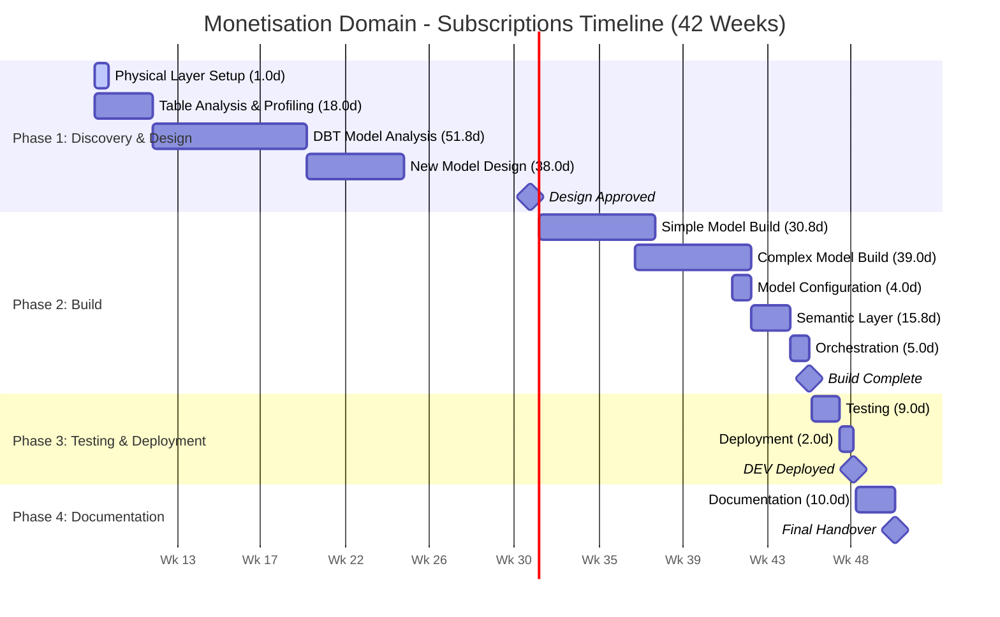
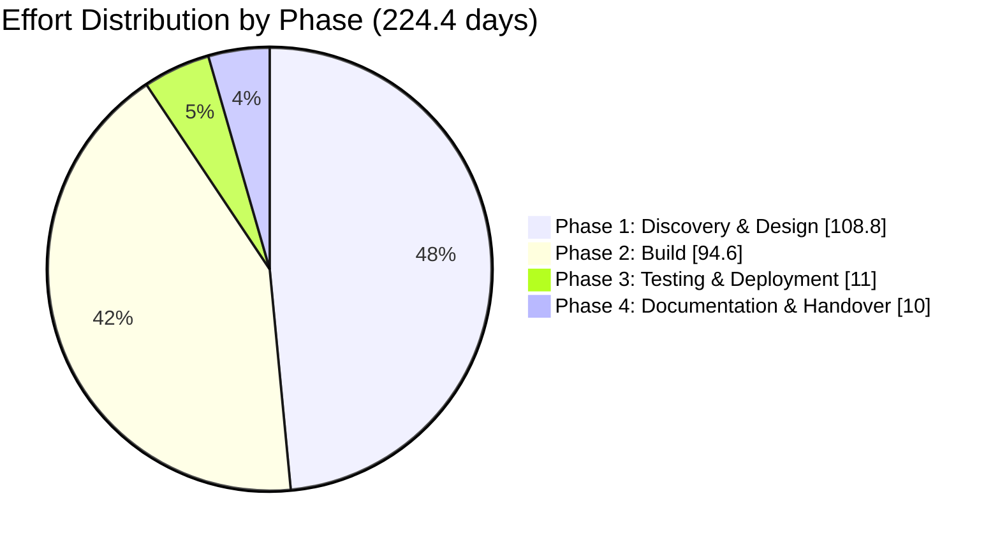

# Monetisation Domain - Subscriptions Data Migration - Scope of Work (INTERNAL)

**Client:** Canva  
**Domain:** Monetisation - Subscriptions  
**Prepared by:** Snowflake Professional Services  
**Date:** February 2026  
**Version:** 1.0 (DRAFT)  
**Document Status:** For Review

---

## Engagement Outcome

This outcome-based engagement will deliver a fully modernised data pipeline for the Monetisation Domain - Subscriptions as part of Canva's enterprise data migration initiative. Snowflake will analyse, redesign, and rebuild the existing legacy DBT project (~250 models) into a new three-layer architecture (Conformed, Metrics, Semantic), consolidate overlapping and duplicated models, establish 7 semantic views for Snowflake Intelligence covering subscription lifecycle, revenue, and conversion metrics, and configure orchestration through Airflow. This initiative will eliminate redundancy in the current state while creating a scalable, well-documented data foundation for subscription analytics.

---

## Table of Contents

1. [In-Scope Pipelines](#1-in-scope-pipelines)
2. [Out of Scope](#2-out-of-scope)
3. [Effort Estimate](#3-effort-estimate)
   - 3.1 Assumptions Made on Estimate Calculation
   - 3.2 Effort Estimates - Detailed Breakdown
   - 3.3 Effort Summary
   - 3.4 Breakdown by Phase
   - 3.5 Phase-by-Phase Calculation
   - 3.6 Consolidated Effort Table
   - 3.7 Estimate Sensitivity
4. [High-Level Execution Plan](#4-high-level-execution-plan)
5. [Resourcing Needs](#5-resourcing-needs)
6. [Open Questions](#6-open-questions)
7. [Risks and Assumptions](#7-risks-and-assumptions)

---

## 1. In-Scope Pipelines

### 1.1 Current State Overview

| Metric | Value | Notes |
|--------|-------|-------|
| **Total DBT Models** | ~250 | Includes significant overlap and duplication |
| **End-User Tables** | ~30 | DS_PROD tables owned by domain |
| **Model Complexity** | 70% Simple, 30% Complex | Based on domain owner assessment |
| **Current Architecture** | Legacy monolithic | No layered architecture exists |

### 1.2 Target State Architecture

| Layer | Description | Purpose |
|-------|-------------|---------|
| **Conformed Layer** | Reusable event-level facts and entity models | Standardised, grain-appropriate base tables |
| **Metrics Layer** | Star schema dimensional models | Business-ready aggregations and metrics |
| **Semantic Layer** | 7 semantic views for Snowflake Intelligence | AI-ready interface for natural language queries |

### 1.3 Semantic Layer Coverage

The semantic layer will enable natural language queries across the following business areas:

| Semantic View | Business Area | Key Metrics & Dimensions |
|---------------|---------------|-------------------------|
| 1 | **Revenue Analytics** | Revenue by country, plans, subscription types |
| 2 | **Subscription Lifecycle** | Subscription states, transitions, duration |
| 3 | **Churn Analysis** | Churn rates, reasons, cohort analysis |
| 4 | **Conversion Metrics** | Conversion rates, funnel progression |
| 5 | **Plan Performance** | Plan comparisons, upgrades, downgrades |
| 6 | **Cohort Analysis** | Cohort retention, LTV projections |
| 7 | **Billing & Payments** | Payment success, failures, recovery |

### 1.4 Upstream Dependencies (Not Migrating)

| Dependency | Description |
|------------|-------------|
| Foundation | Core entity data |
| Billing | Billing and payment data |
| Profile | User profile information |
| Analytics Events | User activity events |
| User Signups | Registration data |
| CTA Attribution | Attribution data |
| Resource Usage | Usage metrics |

*Note: These dependencies will be sourced directly from their original domains - no migration required.*

### 1.5 Deliverables Summary

| # | Deliverable | Description |
|---|-------------|-------------|
| 1 | **Physical Layer Setup** | Create 3 Snowflake databases (subscriptions_conformed, subscriptions_metrics, subscriptions_semantic) with schemas |
| 2 | **Data Model Analysis & Redesign** | Analyse ~250 DBT models and ~30 end-user tables; redesign into 3-layer architecture |
| 3 | **DBT Project Development** | Analyse, redesign, and build new DBT models with target 30% reduction |
| 4 | **Semantic Layer** | Create 7 semantic views for Snowflake Intelligence |
| 5 | **Orchestration** | Daily scheduled orchestration via Airflow |
| 6 | **Testing** | Integration tests, data quality tests |
| 7 | **Documentation** | Solution design, data architecture, migration guide for downstream consumers |

---

## 2. Out of Scope

| Item | Rationale |
|------|-----------|
| **Governance Implementation** | No governance requirement per domain owner confirmation |
| **Upstream Dependency Migration** | Source data consumed as-is from upstream domains |
| **Downstream Consumer Re-pointing** | Migration guide provided, but actual re-pointing is consumer responsibility |
| **Decommissioning Old Tables** | Not included; separate operational activity |
| **Historical Data Migration** | All source data available to rebuild - no migration required |
| **Source Data Ingestion** | All source data already available in Snowflake |
| **Infrastructure Provisioning** | Platform team responsibility (databases, Airflow infrastructure) |
| **Productionization** | Handled by Canva internal team |
| **Unit Test Development** | Not included in scope |

---

## 3. Effort Estimate

### 3.1 Assumptions Made on Estimate Calculation

#### 3.1.1 Discovery & Analysis Assumptions

| Assumption | Value | Source |
|------------|-------|--------|
| Time to analyse existing data model (per end-user table) | 0.5 days | Industry standard for documented models |
| Time per DBT model initial analysis | 0.15 days | Based on large model count |
| Time per DBT model detailed analysis (complex) | 0.3 days | For models with macros/complex CTEs |
| Current state documentation availability | None | No existing documentation; reverse engineering required |
| Reverse engineering required | Yes | No documentation exists |

#### 3.1.2 DBT Model Complexity Distribution

| Complexity | Count | Percentage | Analysis Effort | Build Effort |
|------------|-------|------------|-----------------|--------------|
| **Simple** | 175 | 70% | 0.15 days | 0.25 days |
| **Complex** | 75 | 30% | 0.3 days | 0.75 days |
| **Total** | **250** | **100%** | | |

#### 3.1.3 Effort per Model by Complexity

| Complexity Level | Definition | Effort per Model (Analysis) | Effort per Model (Build) |
|------------------|------------|-----------------------------|--------------------------| 
| **Simple** | Direct SELECT, minimal joins, no macros | 0.15 days | 0.25 days |
| **Complex** | Macros, complex CTEs, window functions, business logic | 0.3 days | 0.75 days |

#### 3.1.4 Target State Model Reduction

| Metric | Current State | Target State | Reduction |
|--------|--------------|--------------|-----------|
| **DBT Models** | 250 | 175 | 30% reduction |
| **End-User Tables** | 30 | ~25 | Consolidation |

*Note: Target 30% reduction through redesign, consolidation of overlapping models, and elimination of duplication.*

#### 3.1.5 Target State Complexity Distribution

| Complexity | Count | Percentage |
|------------|-------|------------|
| **Simple** | 123 | 70% |
| **Complex** | 52 | 30% |
| **Total** | **175** | **100%** |

#### 3.1.6 Other Key Assumptions

| Assumption | Value | Impact |
|------------|-------|--------|
| Total DBT models in scope (current state) | 250 | Confirmed in meeting |
| End-user tables | 30 | DS_PROD tables |
| Estimated new DBT models (target state) | 175 (~70% of current) | Target 30% reduction through redesign |
| Overall complexity rating | 70% simple, 30% complex | Confirmed by domain owner |
| Semantic views | 7 | Covering ~50 business questions |
| Refresh frequency | Daily scheduled | Via Airflow |
| Historical data migration | Not required | Source data available to rebuild |
| Target tables type | Native Snowflake tables | Confirmed |
| DBT version | DBT Core (open source) | Provided by platform team |
| SME availability | 4-6 hours/week | Based on expected commitment |
| No existing documentation | Reverse engineering required | Confirmed |
| Existing Airflow orchestration | Available | Similar to rest of monetization |

---

### 3.2 Effort Estimates - Detailed Breakdown

#### 3.2.1 Physical Layer Setup

*Note: MH effort assumes DEV environment setup only.*

| Activity | Description | Effort (Days) |
|----------|-------------|---------------|
| Database creation | Create 3 databases: subscriptions_conformed, subscriptions_metrics, subscriptions_semantic | 0.25 |
| Schema creation | Create schemas per database: source, internal, expose | 0.25 |
| Access configuration | Initial role grants and access setup | 0.5 |
| **Subtotal** | | **1.0** |

#### 3.2.2 Current State Analysis & Data Model Redesign

*Assumption: Design reviews are approved in a timely fashion.*

| Activity | Description | Calculation | Effort (Days) |
|----------|-------------|-------------|---------------|
| End-user table analysis | Analyse 30 end-user tables structure, relationships | | 5.0 |
| Data profiling | Volume, distribution, quality assessment | | 3.5 |
| Overlap & duplication analysis | Identify redundant models and consolidation opportunities | | 5.0 |
| Target model design | Design new 3-layer data model architecture | | 3.0 |
| Design review & iteration | Stakeholder review and refinement | | 1.5 |
| **Subtotal** | | | **18.0** |

#### 3.2.3 Transformation Layer Analysis (DBT Models)

| Activity | Description | Calculation | Effort (Days) |
|----------|-------------|-------------|---------------|
| Simple model analysis | Analyse simple DBT models | 175 models x 0.15 days | 26.3 |
| Complex model analysis | Analyse complex DBT models | 75 models x 0.3 days | 22.5 |
| Lineage documentation | Document model dependencies | | 3.0 |
| **Subtotal** | | | **51.8** |

#### 3.2.4 New DBT Model Design

*Assumption: The redesigned target state is estimated at 70% of the current model count (175 models), as the redesign exercise is expected to consolidate functionality and eliminate redundancy (target 30% reduction).*

| Activity | Description | Calculation | Effort (Days) |
|----------|-------------|-------------|---------------|
| New model design | Design 175 models for new 3-layer architecture | 175 models x 0.2 days | 35.0 |
| Design documentation | Technical specifications | | 3.0 |
| **Subtotal** | | | **38.0** |

#### 3.2.5 New DBT Model Build

*Assumption: Complexity distribution for new models follows similar proportions - Simple 123 (70%), Complex 52 (30%).*

| Activity | Description | Calculation | Effort (Days) |
|----------|-------------|-------------|---------------|
| Simple model build | Build simple DBT models | 123 models x 0.25 days | 30.8 |
| Complex model build | Build complex DBT models | 52 models x 0.75 days | 39.0 |
| Model configuration | YAML configs, tests, documentation | | 4.0 |
| **Subtotal** | | | **73.8** |

#### 3.2.6 Semantic Layer Development

| Activity | Description | Calculation | Effort (Days) |
|----------|-------------|-------------|---------------|
| Requirements discovery | Define AI/LLM use cases per semantic view | 7 views x 0.5 days | 3.5 |
| Semantic model design | Dimensions, measures, relationships, synonyms | 7 models x 0.5 days | 3.5 |
| Semantic view build | Create and validate semantic views | 7 views x 0.75 days | 5.3 |
| Snowflake Intelligence validation | Test with Cortex Analyst | 7 views x 0.5 days | 3.5 |
| **Subtotal** | | | **15.8** |

#### 3.2.7 Orchestration Setup

| Activity | Description | Effort (Days) |
|----------|-------------|---------------|
| Orchestration design | Daily scheduled patterns | 1.0 |
| Airflow DAG development | Add task dependencies (existing Airflow) | 3.0 |
| Testing & validation | End-to-end orchestration testing | 1.0 |
| **Subtotal** | | **5.0** |

#### 3.2.8 Testing

*Assumption: Deployment to UAT and production environments is not included in MH effort scope.*

| Activity | Description | Effort (Days) |
|----------|-------------|---------------|
| Integration testing | End-to-end pipeline validation | 5.0 |
| Data quality testing | Accuracy, completeness, consistency | 4.0 |
| **Subtotal** | | **9.0** |

#### 3.2.9 Documentation

| Activity | Description | Effort (Days) |
|----------|-------------|---------------|
| Solution design document | Architecture and design documentation | 4.0 |
| Data architecture document | Data model specifications | 3.0 |
| Knowledge transfer | Handover sessions | 3.0 |
| **Subtotal** | | **10.0** |

#### 3.2.10 Deployment

*Note: MH effort is restricted to DEV environment only.*

| Activity | Description | Effort (Days) |
|----------|-------------|---------------|
| Development environment deployment | Initial deployment and validation | 2.0 |
| **Subtotal** | | **2.0** |

---

### 3.3 Effort Summary

| Category | Effort (Days) |
|----------|---------------|
| Physical Layer Setup | 1.0 |
| Current State Analysis & Data Model Redesign | 18.0 |
| Transformation Layer Analysis (DBT) | 51.8 |
| New DBT Model Design | 38.0 |
| New DBT Model Build | 73.8 |
| Semantic Layer Development | 15.8 |
| Orchestration Setup | 5.0 |
| Testing | 9.0 |
| Documentation | 10.0 |
| Deployment | 2.0 |
| **Total Base Effort** | **224.4 days** |
| **Contingency (15%)** | **33.7 days** |
| **Grand Total** | **258.1 days** |

---

### 3.4 Breakdown by Phase

| Phase | Activities Included | Effort (Days) |
|-------|---------------------|---------------|
| **Phase 1: Discovery & Design** | Physical layer setup, current state analysis, transformation analysis, new model design | 108.8 |
| **Phase 2: Build** | DBT model build, semantic layer, orchestration | 94.6 |
| **Phase 3: Testing & Deployment** | Testing, deployment | 11.0 |
| **Phase 4: Documentation & Handover** | Documentation, knowledge transfer | 10.0 |
| **Subtotal** | | **224.4** |
| **Contingency (15%)** | | **33.7** |
| **Grand Total** | | **258.1** |

---

### 3.5 Phase-by-Phase Calculation

#### Phase 1: Discovery & Design (108.8 days)

| Activity | Days | Calculation |
|----------|------|-------------|
| Physical layer setup | 1.0 | 3 DBs + schemas + access |
| End-user table analysis | 5.0 | 30 tables |
| Data profiling | 3.5 | 30 tables |
| Overlap & duplication analysis | 5.0 | Consolidation opportunities |
| Target model design | 3.0 | 3-layer architecture |
| Design review | 1.5 | Stakeholder iterations |
| Simple model analysis | 26.3 | 175 models x 0.15 days |
| Complex model analysis | 22.5 | 75 models x 0.3 days |
| Lineage documentation | 3.0 | Model dependency mapping |
| New model design | 35.0 | 175 models x 0.2 days |
| Design documentation | 3.0 | Technical specifications |
| **Subtotal** | **108.8** | |

#### Phase 2: Build (94.6 days)

| Activity | Days | Calculation |
|----------|------|-------------|
| Simple model build | 30.8 | 123 models x 0.25 days |
| Complex model build | 39.0 | 52 models x 0.75 days |
| Model configuration | 4.0 | 175 models (YAML, tests) |
| Semantic requirements discovery | 3.5 | 7 views x 0.5 days |
| Semantic model design | 3.5 | 7 models x 0.5 days |
| Semantic view build | 5.3 | 7 views x 0.75 days |
| Snowflake Intelligence validation | 3.5 | 7 views x 0.5 days |
| Orchestration design | 1.0 | Daily patterns |
| Airflow DAG development | 3.0 | Task dependencies |
| Orchestration testing | 1.0 | End-to-end validation |
| **Subtotal** | **94.6** | |

#### Phase 3: Testing & Deployment (11.0 days)

| Activity | Days | Calculation |
|----------|------|-------------|
| Integration testing | 5.0 | End-to-end validation |
| Data quality testing | 4.0 | Accuracy, completeness |
| Dev environment deployment | 2.0 | Initial deployment |
| **Subtotal** | **11.0** | |

#### Phase 4: Documentation & Handover (10.0 days)

| Activity | Days | Calculation |
|----------|------|-------------|
| Solution design document | 4.0 | Architecture documentation |
| Data architecture document | 3.0 | Data model specs |
| Knowledge transfer | 3.0 | Handover sessions |
| **Subtotal** | **10.0** | |

---

### 3.6 Consolidated Effort Table

| Category | Phase | Activity | Effort (Days) | Calculation |
|----------|-------|----------|---------------|-------------|
| **Physical Layer Setup** | 1 | Database creation | 0.25 | 3 databases |
| | 1 | Schema creation | 0.25 | Schemas per database |
| | 1 | Access configuration | 0.5 | Initial role grants |
| | | **Subtotal** | **1.0** | |
| **Current State Analysis** | 1 | End-user table analysis | 5.0 | 30 tables |
| | 1 | Data profiling | 3.5 | 30 tables |
| | 1 | Overlap & duplication analysis | 5.0 | Consolidation opportunities |
| | 1 | Target model design | 3.0 | 3-layer architecture |
| | 1 | Design review & iteration | 1.5 | Stakeholder review |
| | | **Subtotal** | **18.0** | |
| **Transformation Analysis** | 1 | Simple model analysis | 26.3 | 175 models x 0.15 days |
| | 1 | Complex model analysis | 22.5 | 75 models x 0.3 days |
| | 1 | Lineage documentation | 3.0 | Model dependencies |
| | | **Subtotal** | **51.8** | |
| **New DBT Model Design** | 1 | New model design | 35.0 | 175 models x 0.2 days |
| | 1 | Design documentation | 3.0 | Technical specifications |
| | | **Subtotal** | **38.0** | |
| **New DBT Model Build** | 2 | Simple model build | 30.8 | 123 models x 0.25 days |
| | 2 | Complex model build | 39.0 | 52 models x 0.75 days |
| | 2 | Model configuration | 4.0 | YAML, tests, docs |
| | | **Subtotal** | **73.8** | |
| **Semantic Layer** | 2 | Requirements discovery | 3.5 | 7 views x 0.5 days |
| | 2 | Semantic model design | 3.5 | 7 models x 0.5 days |
| | 2 | Semantic view build | 5.3 | 7 views x 0.75 days |
| | 2 | Snowflake Intelligence validation | 3.5 | Cortex Analyst testing |
| | | **Subtotal** | **15.8** | |
| **Orchestration Setup** | 2 | Orchestration design | 1.0 | Daily patterns |
| | 2 | Airflow DAG development | 3.0 | Existing Airflow |
| | 2 | Testing & validation | 1.0 | End-to-end testing |
| | | **Subtotal** | **5.0** | |
| **Testing** | 3 | Integration testing | 5.0 | End-to-end validation |
| | 3 | Data quality testing | 4.0 | Accuracy, completeness |
| | | **Subtotal** | **9.0** | |
| **Deployment** | 3 | Dev environment deployment | 2.0 | Initial deployment |
| | | **Subtotal** | **2.0** | |
| **Documentation** | 4 | Solution design document | 4.0 | Architecture documentation |
| | 4 | Data architecture document | 3.0 | Data model specs |
| | 4 | Knowledge transfer | 3.0 | Handover sessions |
| | | **Subtotal** | **10.0** | |
| | | | | |
| **PHASE TOTALS** | | | | |
| | **Phase 1** | Discovery & Design | **108.8** | |
| | **Phase 2** | Build | **94.6** | |
| | **Phase 3** | Testing & Deployment | **11.0** | |
| | **Phase 4** | Documentation & Handover | **10.0** | |
| | | | | |
| | | **Total Base Effort** | **224.4** | |
| | | **Contingency (15%)** | **33.7** | |
| | | **Grand Total** | **258.1** | |

---

### 3.7 Estimate Sensitivity

| If This Changes... | Impact on Estimate |
|--------------------|--------------------|
| DBT model count increases from 250 to 300 | +30-40 days |
| Complexity distribution shifts to 50% complex | +40-50 days |
| SME availability drops to 2 hrs/week | +15-25 days (waiting time) |
| Additional semantic views beyond 7 | +3-5 days per view |
| Target state reduction less than 30% | +15-25 days |
| Upstream dependency issues discovered | +10-15 days (investigation) |
| Documentation requirements increase | +5-8 days |
| More end-user tables discovered | +2-3 days per table |
| Overlapping models more complex than expected | +10-20 days |
| Design approval cycles extended | +5-10 days (waiting time) |

---

## 4. High-Level Execution Plan

### Phase 1: Discovery & Design (Weeks 1-22)

**Objectives:** Understand current state, design target architecture, obtain approval

| Week | Activities |
|------|------------|
| 1-2 | Physical layer setup, begin end-user table analysis |
| 3-4 | Complete table analysis, data profiling, overlap analysis |
| 5-12 | Simple and complex DBT model analysis (250 models) |
| 13-17 | Lineage documentation, new model design |
| 18-22 | Design documentation, stakeholder review |

**Key Milestones:**
- Week 4: Current state analysis complete
- Week 12: Transformation analysis complete
- Week 22: Solution Design Document approved, target state signed off

### Phase 2: Build (Weeks 23-38)

**Objectives:** Develop all DBT models, semantic layer, orchestration

| Week | Activities |
|------|------------|
| 23-28 | Build simple DBT models (123 models) |
| 29-34 | Build complex DBT models (52 models), model configuration |
| 35-36 | Semantic layer development (7 semantic views) |
| 37-38 | Orchestration setup, semantic validation |

**Key Milestones:**
- Week 34: DBT model build complete
- Week 36: Semantic views deployed
- Week 38: Orchestration operational

### Phase 3: Testing & Deployment (Weeks 39-40)

**Objectives:** Test thoroughly, deploy to DEV

| Week | Activities |
|------|------------|
| 39 | Integration testing, data quality testing |
| 40 | DEV deployment, validation |

**Key Milestones:**
- Week 39: All tests passing
- Week 40: DEV deployment complete

### Phase 4: Documentation & Handover (Weeks 41-42)

**Objectives:** Document solution, transfer knowledge

| Week | Activities |
|------|------------|
| 41 | Documentation completion (solution design, data architecture) |
| 42 | Knowledge transfer sessions, final handover |

**Key Milestones:**
- Week 41: Documentation delivered
- Week 42: Knowledge transfer complete

### Timeline Diagram

### Effort by Phase

**Total Duration:** ~42 weeks (~10 months)

---

## 5. Resourcing Needs

### 5.1 Snowflake Professional Services Team

| Role | FTE | Duration | Responsibilities | Required Skills & Expertise |
|------|-----|----------|------------------|----------------------------|
| **Lead Solution Architect** | 1.0 | Full engagement (42 weeks) | Solution architecture, data model redesign, complex DBT development, technical leadership, stakeholder management | DBT Core (advanced), Snowflake (advanced), Data modeling (advanced), SQL (advanced), Airflow, Semantic Views/Cortex Analyst, Solution design |
| **Senior Solution Architect** | 1.0 | Weeks 5-40 (36 weeks) | DBT model analysis, DBT model development, testing | DBT Core (advanced), Snowflake, SQL (advanced), Python, Testing frameworks |

### 5.2 Canva Team Requirements

| Role | Commitment | Duration | Responsibilities |
|------|------------|----------|------------------|
| **Domain SME (Aiden)** | 4-6 hrs/week | Full engagement | Requirements clarification, model knowledge, design validation |
| **Technical Lead** | 2-4 hrs/week | Full engagement | Technical decisions, approvals, escalations |
| **Data Platform Team** | As needed | Full engagement | Airflow infrastructure, database provisioning |
| **QA/Testing Resource** | 2-4 hrs/week | Weeks 39-40 | Testing execution, business validation |

### 5.3 Infrastructure Requirements

| Requirement | Owner | Timeline |
|-------------|-------|----------|
| Subscriptions layer databases/schemas | Platform Team | Week 1 |
| Development environment access | Platform Team | Week 1 |
| Airflow environment for orchestration | Platform Team | Week 37 |
| Access to existing DBT models | Aiden | Week 1 |
| Access to source data | Platform Team | Week 1 |
| Design review/approval process | Canva Stakeholders | Weeks 19-22 |

---

## 6. Open Questions

| # | Question | Owner | Impact | Priority |
|---|----------|-------|--------|----------|
| 1 | Can we get access to the full list of 250 DBT models for analysis? | Aiden | Blocks analysis phase | High |
| 2 | What are the exact metrics and dimensions for the 7 semantic views? | Aiden | Semantic layer design | High |
| 3 | Are there any models in the top 35 (70% of queries) that should be prioritised? | Aiden | Phasing strategy | Medium |
| 4 | What is the exact list of upstream dependencies to source from? | Aiden | Dependency mapping | Medium |
| 5 | Are there any existing data quality rules or business rules documented? | Aiden | Testing strategy | Medium |
| 6 | What are the performance requirements for the daily refresh? | Technical Lead | Orchestration design | Medium |
| 7 | Are there any planned changes to subscription/billing in the next 6-12 months? | Aiden | Design considerations | Medium |

---

## 7. Risks and Assumptions

### 7.1 Assumptions

| # | Assumption | Source |
|---|------------|--------|
| A1 | All source data is currently available in Snowflake | Meeting confirmed |
| A2 | Total DBT models in scope is 250 | Meeting confirmed |
| A3 | End-user tables (DS_PROD) is 30 | Meeting confirmed |
| A4 | Complexity distribution is 70% simple, 30% complex | Domain owner assessment |
| A5 | Target 30% reduction in model count through redesign | Standard consolidation assumption |
| A6 | No historical data migration required | Source data available to rebuild |
| A7 | DBT Core (open source) is the transformation platform | Meeting confirmed |
| A8 | Daily scheduled execution via Airflow | Meeting confirmed |
| A9 | No governance/masking requirements | User confirmed |
| A10 | No tables will be removed from scope | User confirmed |
| A11 | Platform team will provision databases and Airflow infrastructure | Standard assumption |
| A12 | SME availability of 4-6 hours/week throughout engagement | Expected commitment |
| A13 | Design reviews are approved in a timely fashion | MH effort assumption |
| A14 | Deployment to UAT and production environments is not included in MH effort scope | MH effort assumption |
| A15 | MH effort is restricted to DEV environment only | Standard assumption |
| A16 | 7 semantic views will cover ~50 business questions | Meeting estimate |
| A17 | Upstream dependencies do not need to be migrated | Meeting confirmed |
| A18 | Kai has set up layers for monetization but no subscription models built yet | Meeting confirmed |
| A19 | Access to existing DBT models and source data is available | Expected |
| A20 | Cortex Code can be connected to target Snowflake environment | Development tooling |

### 7.2 Risks

| # | Risk | Likelihood | Impact | Mitigation |
|---|------|------------|--------|------------|
| R1 | **Model complexity underestimated** - More complex models than expected | Medium | High | Early detailed analysis; buffer in estimates; iterative approach |
| R2 | **Overlap analysis complexity** - Identifying consolidation opportunities harder than expected | Medium | Medium | Early discovery; SME involvement; document dependencies thoroughly |
| R3 | **SME availability** - Domain expert unavailable for required sessions | Medium | High | Identify backup SMEs; flexible scheduling; document decisions |
| R4 | **Design approval delays** - Stakeholder reviews take longer than expected | Medium | High | Clear approval process; scheduled review sessions; escalation path |
| R5 | **Hidden dependencies** - Undocumented dependencies between models | High | Medium | Thorough lineage analysis; dependency mapping; stakeholder validation |
| R6 | **Scope creep** - Additional models or requirements discovered | Medium | High | Strict change control; document all additions; separate backlog |
| R7 | **Platform team capacity** - Infrastructure provisioning delays | Low | High | Early engagement; clear timeline commitments; escalation path |
| R8 | **Upstream dependency issues** - Source data quality or availability problems | Medium | High | Early data profiling; dependency validation; issue escalation |
| R9 | **Performance requirements unclear** - SLAs not defined until late | Medium | Medium | Define performance expectations in design phase |
| R10 | **30% reduction target not achievable** - Less consolidation possible | Medium | Medium | Validate consolidation opportunities early; adjust estimates if needed |

---

**Document History:**

| Version | Date | Author | Changes |
|---------|------|--------|---------|
| 1.0 | February 2026 | Snowflake PS | Initial draft |

---

*This Scope of Work is based on information gathered during the Monetisation Domain - Subscriptions scoping meeting held on February 11, 2026, and supporting documentation provided by Canva. Estimates are subject to refinement upon receipt of access to DBT models and detailed analysis of current state complexity.*
