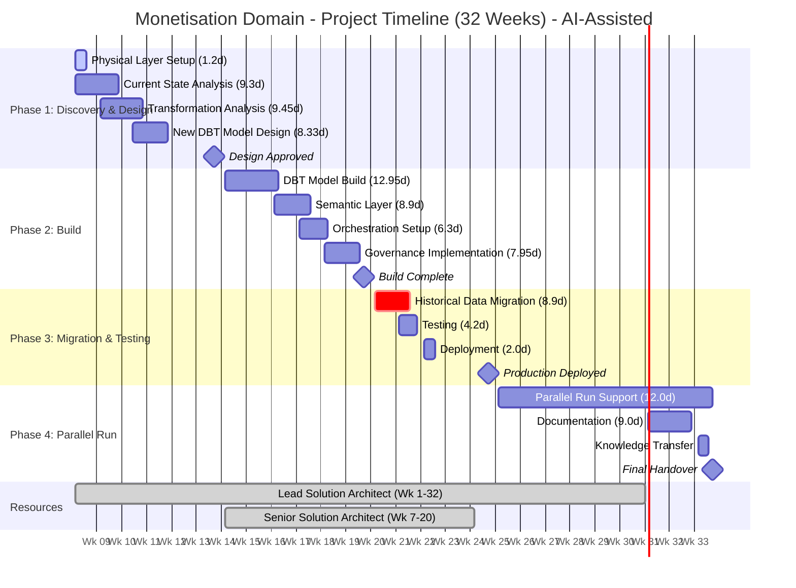
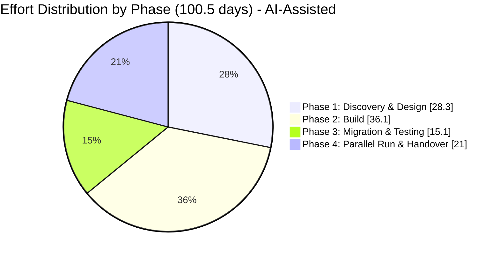

# Monetisation Domain Data Migration - Scope of Work (INTERNAL)

**Client:** Canva  
**Domain:** Monetisation  
**Prepared by:** Snowflake Professional Services  
**Date:** February 2026  
**Version:** 1.0 (DRAFT)  
**Document Status:** For Review

---

## Engagement Outcome

This outcome-based engagement will deliver a fully modernised data pipeline for the Monetisation Domain as part of Canva's enterprise data migration initiative. Snowflake will analyse, redesign, and rebuild the existing DBT project into a new three-layer architecture (Conformed, Metrics, Semantic), establish semantic views for Snowflake Intelligence, configure orchestration through Airflow, migrate historical data with validation, implement data governance, and deliver complete documentation—all validated through a 3-month parallel run period.

---

## Table of Contents

1. [In-Scope Pipelines](#1-in-scope-pipelines)
2. [Out of Scope](#2-out-of-scope)
3. [Effort Estimate](#3-effort-estimate)
   - 3.1 Assumptions Made on Estimate Calculation
   - 3.2 Effort Estimates - Detailed Breakdown
   - 3.3 Effort Summary
   - 3.4 Breakdown by Phase
   - 3.5 Phase-by-Phase Calculation
   - 3.6 Consolidated Effort Table
   - 3.7 Estimate Sensitivity
4. [High-Level Execution Plan](#4-high-level-execution-plan)
5. [Resourcing Needs](#5-resourcing-needs)
6. [Open Questions](#6-open-questions)
7. [Risks and Assumptions](#7-risks-and-assumptions)

---

## 1. In-Scope Pipelines

### 1.1 Data Pipelines

| Pipeline | Target Tables | Description |
|----------|---------------|-------------|
| **Merchant Fee / Transaction Reporting** | gateway_transaction_summary_by_date, gateway_fees_summary_by_date | Payment gateway transaction summaries and fee calculations |
| **Payout Reporting** | payout_brand_earnings_by_month, payout_payment_by_date, developer_portal_premium_app_payouts, revenue_cash_rec_payout_report | Creator/contributor earnings and payout processing |
| **Coupon & Offer Reporting** | coupon_subscriptions_and_activity_member, fact_subscription_coupon_redemption, fact_subscription_offer_redemption | Promotional campaign tracking and redemption analytics |
| **Refund & Dispute Reporting** | fact_refund, fact_refund_enriched, dispute_summary_by_date, dispute_scheme_monitoring_by_date, dispute_scheme_monitoring_alerts | Customer refunds and chargeback/dispute management |

**Total Tables:** 14 tables across 4 reporting pipelines

### 1.2 Deliverables Summary

| # | Deliverable | Description |
|---|-------------|-------------|
| 1 | **Physical Layer Setup** | Create 3 Snowflake databases (Conformed, Metrics, Semantic) with schemas (source, internal, expose) |
| 2 | **Data Model Analysis & Redesign** | Analyse current 14 tables and redesign into 3-layer architecture |
| 3 | **DBT Project Development** | Analyse, redesign, and build 31 DBT models in new namespace |
| 4 | **Semantic Layer** | Create 4 semantic views and models (one per reporting area) for Snowflake Intelligence |
| 5 | **Orchestration** | Event-based and scheduled orchestration via Airflow |
| 6 | **Historical Data Migration** | Full historical data migration with validation |
| 7 | **Governance Implementation** | Data classifications, masking policies, RAP, RBAC |
| 8 | **Testing** | Data quality tests, unit tests, integration tests, parallel run validation |
| 9 | **Documentation** | Solution design, data architecture, migration guide for downstream consumers |

---

## 2. Out of Scope

| Item | Rationale |
|------|-----------|
| **Subscription Data Transformation Pipeline** | Requires separate workshop with Aiden Guerin; documentation not yet available |
| **Upstream Dependency Migration** | Foundation domain tables consumed as-is from current location |
| **Downstream Consumer Re-pointing** | Migration guide provided, but actual re-pointing is consumer responsibility |
| **Decommissioning Old Tables** | Not included; old tables remain during and after parallel run |
| **Metrics Alerts** | Pending confirmation from Nicholas Prima |
| **Source Data Ingestion** | All source data already available in Snowflake |
| **Infrastructure Provisioning** | Platform team responsibility (databases, Airflow infrastructure) |

---

## 3. Effort Estimate

### 3.1 Assumptions Made on Estimate Calculation

#### 3.1.1 Discovery & Analysis Assumptions

| Assumption | Value | Source |
|------------|-------|--------|
| Time to analyse existing data model (per table) | 0.5 days | Industry standard for documented models |
| Time per DBT model initial analysis | 0.25 days | Based on YAML documentation availability |
| Time per DBT model detailed analysis (complex) | 0.5 days | For models with macros/complex CTEs |
| Current state documentation availability | Partial | YAML files exist; no architecture diagram |
| Reverse engineering required | Minimal | DBT YAML files available for each model |

#### 3.1.2 DBT Model Complexity Distribution (Confirmed)

| Pipeline | Simple | Medium | Complex | Total |
|----------|--------|--------|---------|-------|
| **Merchant Fees Reporting** | 1 | 7 | 5 | 13 |
| **Payout, Offer & Coupon, Dispute & Refund Reporting** | 4 | 8 | 6 | 18 |
| **Total** | **5 (16%)** | **15 (48%)** | **11 (35%)** | **31** |

#### 3.1.3 Effort per Model by Complexity

| Complexity Level | Definition | Effort per Model (Analysis) | Effort per Model (Build) |
|------------------|------------|-----------------------------|--------------------------| 
| **Simple** | Direct SELECT, minimal joins, no macros | 0.15 days | 0.25 days |
| **Medium** | Multiple joins, CTEs, standard transformations | 0.25 days | 0.5 days |
| **Complex** | Macros, complex CTEs, window functions, business logic | 0.5 days | 1.0 days |

#### 3.1.4 Model Distribution Across Layers

| Layer | Estimated Model Count | Rationale |
|-------|----------------------|-----------|
| Conformed Layer | TBD | To be determined during discovery - current state does not have 3-layer architecture |
| Metrics Layer | TBD | To be determined during discovery - current state does not have 3-layer architecture |
| Semantic Layer | 4 semantic views | One per reporting area (not DBT models) |

*Note: The current state architecture does not have the three-layer structure (Conformed, Metrics, Semantic). The distribution of DBT models across the new layers will be determined during the Discovery & Design phase.*

#### 3.1.5 Other Key Assumptions

| Assumption | Value | Impact |
|------------|-------|--------|
| Total DBT models in scope (current state) | 31 | Confirmed by Kaihao (post-workshop) |
| Estimated new DBT models (target state) | 23 (~75% of current) | Assumes redesign consolidates functionality |
| Overall complexity rating | 6-7 out of 10 | Confirmed by Kaihao |
| Data volume | Gigabytes range | Manageable for full historical migration |
| Parallel run duration | 3 months | Confirmed requirement |
| Refresh frequency | Event-based + Daily scheduled | Mixed orchestration |
| Target tables type | Native Snowflake tables | No external/transient tables |
| DBT version | DBT Core (open source) | Provided by platform team |
| SME availability | 4-6 hours/week | Based on workshop commitment |
| Code sharing | Via compliant mechanism | Pending platform team setup |
| Upstream dependencies complete | Prior to initiative start | Internal team to deliver remaining models before migration begins |

---

### 3.2 Effort Estimates - Detailed Breakdown

#### 3.2.1 Physical Layer Setup

*Note: Effort assumes DEV environment setup only. Values reflect AI-assisted scaling where applicable.*

| Activity | Description | Effort (Days) |
|----------|-------------|---------------|
| Database creation | Create 3 databases: monetisation_conformed, monetisation_metrics, monetisation_semantic | 0.35 |
| Schema creation | Create schemas per database: source, internal, expose | 0.35 |
| Access configuration | Initial role grants and access setup | 0.5 |
| Environment setup | Dev/Test/Prod environment configuration | 0 |
| **Subtotal** | | **1.2** |

#### 3.2.2 Current State Analysis & Data Model Redesign

*Assumption: Design reviews are approved in a timely fashion.*

| Activity | Description | Calculation | Effort (Days) |
|----------|-------------|-------------|---------------|
| Table analysis | Analyse 14 current tables structure and relationships | 14 tables x 0.5 days | 2.1 |
| Data profiling | Volume, distribution, quality assessment | 14 tables x 0.25 days | 1.4 |
| Dependency mapping | Document upstream/downstream dependencies | | 2.0 |
| Target model design | Design new 3-layer data model architecture | | 2.8 |
| Design review & iteration | Stakeholder review and refinement | | 1.0 |
| **Subtotal** | | | **9.3** |

#### 3.2.3 Transformation Layer Analysis (DBT Models)

| Activity | Description | Calculation | Effort (Days) |
|----------|-------------|-------------|---------------|
| Simple model analysis | Analyse simple DBT models | 5 models x 0.15 days | 0.525 |
| Medium model analysis | Analyse medium DBT models | 15 models x 0.25 days | 2.625 |
| Complex model analysis | Analyse complex DBT models | 11 models x 0.5 days | 3.85 |
| Macro/reusable component identification | Identify common patterns | | 1.4 |
| Lineage documentation | Document model dependencies | | 1.05 |
| **Subtotal** | | | **9.45** |

#### 3.2.4 New DBT Model Design

*Assumption: The redesigned target state is estimated at 75% of the current model count (23 models), as the redesign exercise is expected to consolidate functionality and eliminate redundancy.*

| Activity | Description | Calculation | Effort (Days) |
|----------|-------------|-------------|---------------|
| New model design | Design 23 models for new 3-layer architecture | 23 models x 0.3 days | 4.83 |
| Reusable component design | Design macros and shared logic | | 2.1 |
| Design documentation | Technical specifications | | 1.4 |
| **Subtotal** | | | **8.33** |

#### 3.2.5 New DBT Model Build

*Assumption: Complexity distribution for new models follows similar proportions - Simple 4 (17%), Medium 11 (48%), Complex 8 (35%).*

| Activity | Description | Calculation | Effort (Days) |
|----------|-------------|-------------|---------------|
| Simple model build | Build simple DBT models | 4 models x 0.25 days | 0.7 |
| Medium model build | Build medium DBT models | 11 models x 0.5 days | 3.85 |
| Complex model build | Build complex DBT models | 8 models x 1.0 days | 5.6 |
| Macro/reusable component build | Build shared components | | 2.1 |
| Model configuration | YAML configs, tests, documentation | 23 models x 0.1 days | 0.7 |
| **Subtotal** | | | **12.95** |

#### 3.2.6 Semantic Layer Development

| Activity | Description | Calculation | Effort (Days) |
|----------|-------------|-------------|---------------|
| Requirements discovery | Define AI/LLM use cases per area | 4 areas x 0.5 days | 2.0 |
| Semantic model design | Dimensions, measures, relationships, synonyms | 4 models x 1.0 days | 2.8 |
| Semantic view build | Create and validate semantic views | 4 views x 0.75 days | 2.1 |
| Snowflake Intelligence validation | Test with Cortex Analyst | | 2.0 |
| **Subtotal** | | | **8.9** |

#### 3.2.7 Orchestration Setup

| Activity | Description | Effort (Days) |
|----------|-------------|---------------|
| Orchestration design | Event-based + scheduled trigger patterns | 2.0 |
| Airflow DAG development | Build DAGs for 4 pipelines | 2.8 |
| Event trigger configuration | Configure foundation layer triggers | 0 |
| Schedule configuration | Daily refresh schedules | 0 |
| Testing & validation | End-to-end orchestration testing | 1.5 |
| **Subtotal** | | **6.3** |

#### 3.2.8 Historical Data Migration

| Activity | Description | Calculation | Effort (Days) |
|----------|-------------|-------------|---------------|
| Migration script development | Scripts for 14 tables | 14 tables x 0.5 days | 4.9 |
| Data extraction & load | Execute full historical migration | | 0 |
| Data reconciliation | Row counts, checksums, sampling | 14 tables x 0.25 days | 2.0 |
| Issue resolution | Address migration discrepancies | | 2.0 |
| **Subtotal** | | | **8.9** |

#### 3.2.9 Governance Implementation

| Activity | Description | Effort (Days) |
|----------|-------------|---------------|
| Data classification | Apply classifications to new objects | 2.0 |
| Masking policies | Implement data masking rules | 1.4 |
| Row access policies | Configure RAP on sensitive tables | 1.05 |
| RBAC design & implementation | Role hierarchy and grants | 2.5 |
| Governance validation | Audit and testing | 1.0 |
| **Subtotal** | | **7.95** |

#### 3.2.10 Testing

*Assumption: Deployment to UAT and production environments is not included in MH effort scope.*

| Activity | Description | Effort (Days) |
|----------|-------------|---------------|
| Unit test migration | Migrate existing DBT tests | 2.1 |
| Unit test development | New tests for new models | 0 |
| Integration testing | End-to-end pipeline validation | 0 |
| Data quality testing | Accuracy, completeness, consistency | 2.1 |
| UAT support | Business user acceptance testing | 0 |
| **Subtotal** | | **4.2** |

#### 3.2.11 Parallel Run Support

*Effort: 1 day per week for 12 weeks (3-month parallel run period).*

| Activity | Description | Effort (Days) |
|----------|-------------|---------------|
| Parallel Run Support | Weekly monitoring, validation, and issue resolution | 12.0 |
| **Subtotal** | | **12.0** |

#### 3.2.12 Documentation

| Activity | Description | Effort (Days) |
|----------|-------------|---------------|
| Solution design document | Architecture and design documentation | 3.0 |
| Data architecture document | Data model specifications | 2.0 |
| Migration guide | Downstream consumer re-pointing guide | 2.0 |
| Runbooks | Operational procedures | 1.5 |
| Knowledge transfer | 4 sessions (1 per reporting area) x 1 hour | 0.5 |
| **Subtotal** | | **9.0** |

#### 3.2.13 Deployment

*Note: MH effort is restricted to DEV environment only. Deployment to TEST/UAT and Production environments is not included.*

| Activity | Description | Effort (Days) |
|----------|-------------|---------------|
| Development environment deployment | Initial deployment and validation | 2.0 |
| Test environment deployment | Staging deployment | 0 |
| Production deployment | Go-live deployment | 0 |
| Post-deployment validation | Smoke testing and monitoring | 0 |
| **Subtotal** | | **2.0** |

---

### 3.3 Effort Summary

| Category | Effort (Days) |
|----------|---------------|
| Physical Layer Setup | 1.2 |
| Current State Analysis & Data Model Redesign | 9.3 |
| Transformation Layer Analysis (DBT) | 9.45 |
| New DBT Model Design | 8.33 |
| New DBT Model Build | 12.95 |
| Semantic Layer Development | 8.9 |
| Orchestration Setup | 6.3 |
| Historical Data Migration | 8.9 |
| Governance Implementation | 7.95 |
| Testing | 4.2 |
| Parallel Run Support | 12.0 |
| Documentation | 9.0 |
| Deployment | 2.0 |
| **Total Base Effort** | **100.5 days** |
| **Contingency (15%)** | **15.1 days** |
| **Grand Total** | **115.6 days** |

---

### 3.4 Breakdown by Phase

| Phase | Activities Included | Effort (Days) |
|-------|---------------------|---------------|
| **Phase 1: Discovery & Design** | Physical layer setup, current state analysis, transformation analysis, new model design | 28.3 |
| **Phase 2: Build** | DBT model build, semantic layer, orchestration, governance | 36.1 |
| **Phase 3: Migration & Testing** | Historical migration, testing, deployment to dev | 15.1 |
| **Phase 4: Parallel Run & Handover** | Parallel run support, documentation | 21.0 |
| **Subtotal** | | **100.5** |
| **Contingency (15%)** | | **15.1** |
| **Grand Total** | | **115.6** |

---

### 3.5 Phase-by-Phase Calculation

#### Phase 1: Discovery & Design (28.3 days)

| Activity | Days | Calculation |
|----------|------|-------------|
| Physical layer setup | 1.2 | 3 DBs + schemas + access |
| Table analysis | 2.1 | 14 tables (AI-assisted) |
| Data profiling | 1.4 | 14 tables (AI-assisted) |
| Dependency mapping | 2.0 | Cross-domain and internal dependencies |
| Target model design | 2.8 | 3-layer architecture design (AI-assisted) |
| Design review | 1.0 | Stakeholder iterations |
| Simple model analysis | 0.525 | 5 models (AI-assisted) |
| Medium model analysis | 2.625 | 15 models (AI-assisted) |
| Complex model analysis | 3.85 | 11 models (AI-assisted) |
| Macro identification | 1.4 | Common pattern analysis (AI-assisted) |
| Lineage documentation | 1.05 | Model dependency mapping (AI-assisted) |
| New model design | 4.83 | 23 models (AI-assisted) |
| Reusable component design | 2.1 | Macros and shared logic (AI-assisted) |
| Design documentation | 1.4 | Technical specifications (AI-assisted) |
| **Subtotal** | **28.3** | |

#### Phase 2: Build (36.1 days)

| Activity | Days | Calculation |
|----------|------|-------------|
| Simple model build | 0.7 | 4 models (AI-assisted) |
| Medium model build | 3.85 | 11 models (AI-assisted) |
| Complex model build | 5.6 | 8 models (AI-assisted) |
| Macro build | 2.1 | Shared components (AI-assisted) |
| Model configuration | 0.7 | YAML, tests (AI-assisted) |
| Semantic requirements discovery | 2.0 | 4 areas x 0.5 days |
| Semantic model design | 2.8 | 4 models (AI-assisted) |
| Semantic view build | 2.1 | 4 views (AI-assisted) |
| Snowflake Intelligence validation | 2.0 | Cortex Analyst testing |
| Orchestration design | 2.0 | Event + scheduled patterns |
| Airflow DAG development | 2.8 | 4 pipeline DAGs (AI-assisted) |
| Orchestration testing | 1.5 | End-to-end validation |
| Data classification | 2.0 | Apply to new objects |
| Masking policies | 1.4 | Implement masking rules (AI-assisted) |
| Row access policies | 1.05 | RAP configuration (AI-assisted) |
| RBAC implementation | 2.5 | Role hierarchy and grants |
| Governance validation | 1.0 | Audit and testing |
| **Subtotal** | **36.1** | |

#### Phase 3: Migration & Testing (15.1 days)

| Activity | Days | Calculation |
|----------|------|-------------|
| Migration script development | 4.9 | 14 tables (AI-assisted) |
| Data reconciliation | 2.0 | 14 tables |
| Issue resolution | 2.0 | Migration discrepancies |
| Unit test migration | 2.1 | Existing DBT tests (AI-assisted) |
| Data quality testing | 2.1 | Accuracy, completeness (AI-assisted) |
| Dev environment deployment | 2.0 | Initial deployment |
| **Subtotal** | **15.1** | |

#### Phase 4: Parallel Run & Handover (21.0 days)

| Activity | Days | Calculation |
|----------|------|-------------|
| Parallel run support | 12.0 | 1 day x 12 weeks |
| Solution design document | 3.0 | Architecture documentation |
| Data architecture document | 2.0 | Data model specs |
| Migration guide | 2.0 | Downstream consumer guide |
| Runbooks | 1.5 | Operational procedures |
| Knowledge transfer | 0.5 | 4 sessions x 1 hour |
| **Subtotal** | **21.0** | |

---

### 3.6 Consolidated Effort Table

| Category | Phase | Activity | Effort (Days) | Calculation |
|----------|-------|----------|---------------|-------------|
| **Physical Layer Setup** | 1 | Database creation | 0.35 | 3 databases (AI-assisted) |
| | 1 | Schema creation | 0.35 | Schemas per database (AI-assisted) |
| | 1 | Access configuration | 0.5 | Initial role grants |
| | | **Subtotal** | **1.2** | |
| **Current State Analysis** | 1 | Table analysis | 2.1 | 14 tables (AI-assisted) |
| | 1 | Data profiling | 1.4 | 14 tables (AI-assisted) |
| | 1 | Dependency mapping | 2.0 | Cross-domain dependencies |
| | 1 | Target model design | 2.8 | 3-layer architecture (AI-assisted) |
| | 1 | Design review & iteration | 1.0 | Stakeholder review |
| | | **Subtotal** | **9.3** | |
| **Transformation Analysis** | 1 | Simple model analysis | 0.525 | 5 models (AI-assisted) |
| | 1 | Medium model analysis | 2.625 | 15 models (AI-assisted) |
| | 1 | Complex model analysis | 3.85 | 11 models (AI-assisted) |
| | 1 | Macro identification | 1.4 | Common patterns (AI-assisted) |
| | 1 | Lineage documentation | 1.05 | Model dependencies (AI-assisted) |
| | | **Subtotal** | **9.45** | |
| **New DBT Model Design** | 1 | New model design | 4.83 | 23 models (AI-assisted) |
| | 1 | Reusable component design | 2.1 | Macros and shared logic (AI-assisted) |
| | 1 | Design documentation | 1.4 | Technical specifications (AI-assisted) |
| | | **Subtotal** | **8.33** | |
| **New DBT Model Build** | 2 | Simple model build | 0.7 | 4 models (AI-assisted) |
| | 2 | Medium model build | 3.85 | 11 models (AI-assisted) |
| | 2 | Complex model build | 5.6 | 8 models (AI-assisted) |
| | 2 | Macro/component build | 2.1 | Shared components (AI-assisted) |
| | 2 | Model configuration | 0.7 | YAML, tests, docs (AI-assisted) |
| | | **Subtotal** | **12.95** | |
| **Semantic Layer** | 2 | Requirements discovery | 2.0 | 4 areas x 0.5 days |
| | 2 | Semantic model design | 2.8 | 4 models (AI-assisted) |
| | 2 | Semantic view build | 2.1 | 4 views (AI-assisted) |
| | 2 | Snowflake Intelligence validation | 2.0 | Cortex Analyst testing |
| | | **Subtotal** | **8.9** | |
| **Orchestration Setup** | 2 | Orchestration design | 2.0 | Event + scheduled patterns |
| | 2 | Airflow DAG development | 2.8 | 4 pipeline DAGs (AI-assisted) |
| | 2 | Testing & validation | 1.5 | End-to-end testing |
| | | **Subtotal** | **6.3** | |
| **Governance** | 2 | Data classification | 2.0 | Apply to new objects |
| | 2 | Masking policies | 1.4 | Implement masking rules (AI-assisted) |
| | 2 | Row access policies | 1.05 | RAP configuration (AI-assisted) |
| | 2 | RBAC implementation | 2.5 | Role hierarchy and grants |
| | 2 | Governance validation | 1.0 | Audit and testing |
| | | **Subtotal** | **7.95** | |
| **Historical Data Migration** | 3 | Migration script development | 4.9 | 14 tables (AI-assisted) |
| | 3 | Data reconciliation | 2.0 | 14 tables |
| | 3 | Issue resolution | 2.0 | Migration discrepancies |
| | | **Subtotal** | **8.9** | |
| **Testing** | 3 | Unit test migration | 2.1 | Existing DBT tests (AI-assisted) |
| | 3 | Data quality testing | 2.1 | Accuracy, completeness (AI-assisted) |
| | | **Subtotal** | **4.2** | |
| **Deployment** | 3 | Dev environment deployment | 2.0 | Initial deployment |
| | | **Subtotal** | **2.0** | |
| **Parallel Run Support** | 4 | Parallel run support | 12.0 | 1 day x 12 weeks |
| | | **Subtotal** | **12.0** | |
| **Documentation** | 4 | Solution design document | 3.0 | Architecture documentation |
| | 4 | Data architecture document | 2.0 | Data model specs |
| | 4 | Migration guide | 2.0 | Downstream consumer guide |
| | 4 | Runbooks | 1.5 | Operational procedures |
| | 4 | Knowledge transfer | 0.5 | 4 sessions x 1 hour |
| | | **Subtotal** | **9.0** | |
| | | | | |
| **PHASE TOTALS** | | | | |
| | **Phase 1** | Discovery & Design | **28.3** | |
| | **Phase 2** | Build | **36.1** | |
| | **Phase 3** | Migration & Testing | **15.1** | |
| | **Phase 4** | Parallel Run & Handover | **21.0** | |
| | | | | |
| | | **Total Base Effort** | **100.5** | |
| | | **Contingency (15%)** | **15.1** | |
| | | **Grand Total** | **115.6** | |

---

### 3.7 Estimate Sensitivity

| If This Changes... | Impact on Estimate |
|--------------------|--------------------|
| DBT model count increases from 31 to 50 | +15-20 days |
| Complexity distribution shifts further toward complex | +5-10 days |
| Additional tables identified beyond 14 | +2-3 days per table |
| SME availability drops to 2 hrs/week | +8-12 days (waiting time) |
| Code sharing mechanism delayed by 4+ weeks | +8-12 days (rework/discovery) |
| Parallel run extended beyond 3 months | +2 days per additional month |
| Semantic views increase from 4 to 8 | +8-10 days |
| Additional governance policies required | +3-5 days |
| Historical data volume larger than expected (TBs) | +5-8 days migration |
| Foundation domain dependency issues | +5-10 days (investigation/workarounds) |
| Orchestration complexity (hourly instead of daily) | +5-8 days |
| Major downstream consumer count (>10 critical) | +3-5 days documentation |

---

## 4. High-Level Execution Plan

### Phase 1: Discovery & Design (Weeks 1-6)

**Objectives:** Understand current state, design target architecture, obtain approval

| Week | Activities |
|------|------------|
| 1-2 | Physical layer setup, receive sample DBT models, begin table analysis |
| 3-4 | Complete data profiling, dependency mapping, DBT model analysis |
| 5-6 | Target model design, design review with stakeholders, obtain sign-off |

**Key Milestones:**
- Solution Design Document approved
- DBT model complexity breakdown confirmed
- Target data model design signed off

### Phase 2: Build (Weeks 7-14)

**Objectives:** Develop all DBT models, semantic layer, orchestration, governance

| Week | Activities |
|------|------------|
| 7-8 | Build Conformed layer DBT models, reusable macros |
| 9-10 | Build Metrics layer DBT models |
| 11-12 | Semantic layer development, orchestration setup |
| 13-14 | Governance implementation, model configuration |

**Key Milestones:**
- Conformed layer models complete
- Metrics layer models complete
- Semantic views deployed
- Orchestration operational

### Phase 3: Migration & Testing (Weeks 15-20)

**Objectives:** Migrate data, test thoroughly, deploy to production

| Week | Activities |
|------|------------|
| 15-16 | Migration script development, test migration |
| 17-18 | Full historical migration, data reconciliation |
| 19 | Integration testing, data quality testing |
| 20 | UAT, production deployment |

**Key Milestones:**
- Historical data migrated and validated
- All tests passing
- Production deployment complete

### Phase 4: Parallel Run & Handover (Weeks 21-32)

**Objectives:** Validate in production, document, transfer knowledge

| Week | Activities |
|------|------------|
| 21-24 | Active parallel run monitoring, weekly validation |
| 25-28 | Continued monitoring, discrepancy resolution |
| 29-30 | Documentation completion, migration guide |
| 31-32 | Knowledge transfer, final handover |

**Key Milestones:**
- Parallel run validation complete
- Documentation delivered
- Knowledge transfer complete

### Timeline Diagram



### Effort by Phase



### Timeline Summary

```
Week:  1  2  3  4  5  6 | 7  8  9 10 11 12 13 14 | 15 16 17 18 19 20 | 21 22 23 24 25 26 27 28 29 30 31 32
       |--Discovery &---|-------Build------------|--Migration &------|--------Parallel Run & Handover--------|
       |    Design      |                        |    Testing        |                                       |

Lead Solution Architect:
       |===========================================================================================================|
       Week 1-32 (Full engagement)

Senior Solution Architect:
                         |===========================================|
                         Week 7-20 (Build + Migration & Testing)
```

**Total Duration:** ~32 weeks (8 months) including 3-month parallel run

---

## 5. Resourcing Needs

### 5.1 Snowflake Professional Services Team

| Role | FTE | Duration | Responsibilities | Required Skills & Expertise |
|------|-----|----------|------------------|----------------------------|
| **Lead Solution Architect** | 1.0 | Full engagement (32 weeks) | Solution architecture, complex DBT development, technical leadership, stakeholder management | DBT Core (advanced), Snowflake (advanced), Data modeling (advanced), SQL (advanced), Airflow, Semantic Views/Cortex Analyst, Solution design |
| **Senior Solution Architect** | 1.0 | Weeks 7-20 (14 weeks) | DBT model development, migration scripts, testing | DBT Core (advanced), Snowflake, SQL (advanced), Python, Data migration, Testing frameworks |

### 5.2 Canva Team Requirements

| Role | Commitment | Duration | Responsibilities |
|------|------------|----------|------------------|
| **Domain SME (Kaihao Wang)** | 4-6 hrs/week | Full engagement | Requirements clarification, metrics definition, model validation, complexity breakdown |
| **Technical Lead (Aiden Guerin)** | 2-4 hrs/week | Full engagement | Technical decisions, approvals, escalations |
| **Data Platform Team** | As needed | Full engagement | Airflow infrastructure, code sharing mechanism, event triggers, database provisioning |
| **QA/Testing Resource** | 2-4 hrs/week | Weeks 15-20 | UAT execution, business validation |
| **Downstream Consumers** | As needed | Weeks 21-32 | Migration testing, feedback on new models |

### 5.3 Infrastructure Requirements

| Requirement | Owner | Timeline |
|-------------|-------|----------|
| 3 Snowflake databases (Conformed, Metrics, Semantic) | Platform Team | Week 1 |
| Development environment access | Platform Team | Week 1 |
| Airflow environment for orchestration | Platform Team | Week 11 |
| Compliant code sharing mechanism | Platform Team | Week 1-2 |
| Access to existing DBT models and YAML files | Kaihao Wang | Week 1 |

---

## 6. Open Questions

| # | Question | Owner | Impact | Priority |
|---|----------|-------|--------|----------|
| 1 | Can sample DBT models be shared via compliant mechanism? Timeline? | Platform Team | Blocks detailed design phase | High |
| 2 | Are there additional tables beyond the 14 listed that produce the target reports? | Kaihao Wang | Potential scope increase | High |
| 3 | What are the specific semantic layer requirements for each reporting area? | Aiden Guerin / Alex Hruska | Impacts semantic layer effort | Medium |
| 4 | Should metrics alerts be included in migration scope? | Nicholas Prima | Potential scope addition | Medium |
| 5 | What is the exact refresh frequency for each pipeline (event vs scheduled)? | Kaihao Wang | Orchestration design | Medium |
| 6 | Who are the critical downstream consumers requiring migration notification? | Kaihao Wang | Documentation scope | Medium |
| 7 | What are the specific data masking requirements for financial data? | Kaihao Wang | Governance complexity | Medium |
| 8 | Will views mimicking old table signatures be required for backward compatibility? | Aiden Guerin | Additional development | Medium |
| 9 | What is the rollback strategy if parallel run validation fails? | Joint decision | Risk mitigation | Low |
| 10 | Is Airflow hourly execution possible, or must we start with daily? | Platform Team | Orchestration design | Low |
| 11 | What is the acceptable variance threshold for parallel run validation? | Business stakeholders | Testing criteria | Low |

---

## 7. Risks and Assumptions

### 7.1 Assumptions

| # | Assumption | Source |
|---|------------|--------|
| A1 | All source data is currently available in Snowflake; no new ingestion required | Workshop confirmed |
| A2 | Total DBT models in scope is 31 (5 simple, 15 medium, 11 complex) | Confirmed by Kaihao (post-workshop) |
| A3 | DBT complexity rating is 6-7 out of 10 | Kaihao (workshop) |
| A4 | Data volume is in gigabytes range | Workshop confirmed |
| A5 | DBT Core (open source) is the transformation platform | Workshop confirmed |
| A6 | All 14 target tables are native Snowflake tables | Workshop confirmed |
| A7 | Foundation domain dependencies will remain available as-is | Workshop confirmed |
| A8 | Platform team will provision databases and Airflow infrastructure | Workshop confirmed |
| A9 | 3-month parallel run is required | Workshop confirmed |
| A10 | Existing DBT YAML files provide adequate documentation | Workshop confirmed |
| A11 | Metric definitions exist for Merchant Fee reporting; others require SME input | Workshop confirmed |
| A12 | Compliant code sharing mechanism will be established within 2 weeks | Pending platform team |
| A13 | SME availability of 4-6 hours/week throughout engagement | Workshop commitment |
| A14 | No major changes to source models during migration period | Workshop understanding |
| A15 | Upstream dependencies (remaining internal models) complete prior to initiative start | Domain owner confirmation |
| A16 | Design reviews are approved in a timely fashion | MH effort assumption |
| A17 | Deployment to UAT and production environments is not included in MH effort scope | MH effort assumption |
| A18 | MH effort is restricted to DEV environment only | MH effort assumption |
| A19 | Access to entire monolithic DBT project granted to understand cross-domain dependencies | Required for discovery |
| A20 | Cortex Code CLI (or later version) can be connected to target Snowflake environment | Development tooling |

### 7.2 Risks

| # | Risk | Likelihood | Impact | Mitigation |
|---|------|------------|--------|------------|
| R1 | **Code sharing delays** - Compliant mechanism not established in time | Medium | High | Early engagement with Platform Team; fallback to detailed documentation review; escalate if delayed beyond Week 2 |
| R2 | **Scope creep** - Additional tables/models identified during discovery | Medium | High | Strict change control; document all additions; separate backlog for Phase 2 |
| R3 | **Model complexity higher than estimated** - More complex models than 6-7/10 rating | Medium | High | Request complexity breakdown before engagement; buffer in estimates |
| R4 | **SME availability** - Kaihao/Aiden unavailable for required workshops | Medium | High | Identify backup SMEs; flexible scheduling; document decisions |
| R5 | **Source model changes during migration** - Bug fixes break alignment | Medium | Medium | Communication protocol; change notification process; weekly sync |
| R6 | **Parallel run discrepancies** - Data mismatches difficult to reconcile | Medium | High | Clear validation criteria upfront; acceptance thresholds defined; root cause process |
| R7 | **Foundation domain dependency issues** - Upstream data quality or availability | Low | High | Early dependency validation; escalation path to Foundation team |
| R8 | **Semantic layer requirements unclear** - AI consumption needs not defined | Medium | Medium | Discovery workshop with stakeholders; phased semantic delivery |
| R9 | **Downstream consumer migration delays** - Users slow to adopt new models | Low | Medium | Early communication; migration guide; extended parallel run if needed |
| R10 | **Governance complexity** - RBAC/masking requirements more complex than expected | Low | Medium | Early governance assessment; involve security team |
| R11 | **Platform team capacity** - Infrastructure provisioning delays | Low | High | Early engagement; clear timeline commitments; escalation path |
| R12 | **Subscription pipeline dependency** - Hidden dependencies with out-of-scope pipeline | Low | Medium | Explicit interface definition; separate engagement tracking |
| R13 | **Upstream dependencies not ready** - Internal team models incomplete at kickoff | Medium | High | Confirm delivery status before engagement start; delay kickoff if dependencies not met |

---

**Document History:**

| Version | Date | Author | Changes |
|---------|------|--------|---------|
| 1.0 | February 2026 | Snowflake PS | Initial draft |

---

*This Scope of Work is based on information gathered during the Monetisation Domain workshop held on February 3, 2026, and supporting documentation provided by Canva. Estimates are subject to refinement upon receipt of DBT model complexity breakdown and sample model review.*
