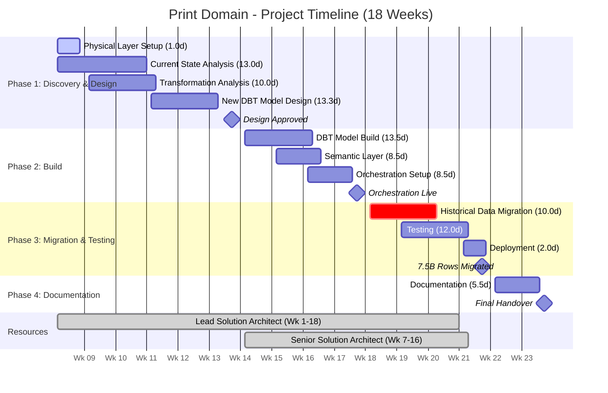
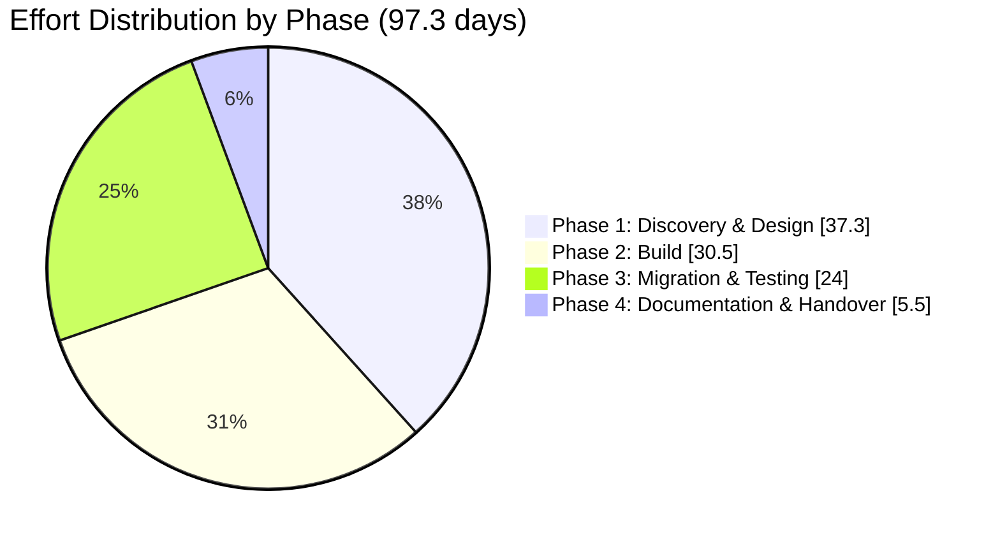

# Print Domain Data Migration - Scope of Work (INTERNAL)

**Client:** Canva  
**Domain:** Print  
**Prepared by:** Snowflake Professional Services  
**Date:** February 2026  
**Version:** 1.0 (DRAFT)  
**Document Status:** For Review

---

## Engagement Outcome

This outcome-based engagement will deliver a fully modernised data pipeline for the Print Domain as part of Canva's enterprise data migration initiative. Snowflake will analyse, redesign, and rebuild the existing DBT project into a new three-layer architecture (Conformed, Metrics, Semantic), restructure the monolithic fact tables into grain-appropriate models, establish semantic views for Snowflake Intelligence, configure orchestration through Airflow (including 2-hour near real-time refresh), migrate 7.5 billion rows of historical fact_print_funnel data with validation, and deliver complete documentation.

---

## Table of Contents

1. [In-Scope Pipelines](#1-in-scope-pipelines)
2. [Out of Scope](#2-out-of-scope)
3. [Effort Estimate](#3-effort-estimate)
   - 3.1 Assumptions Made on Estimate Calculation
   - 3.2 Effort Estimates - Detailed Breakdown
   - 3.3 Effort Summary
   - 3.4 Breakdown by Phase
   - 3.5 Phase-by-Phase Calculation
   - 3.6 Consolidated Effort Table
   - 3.7 Estimate Sensitivity
4. [High-Level Execution Plan](#4-high-level-execution-plan)
5. [Resourcing Needs](#5-resourcing-needs)
6. [Open Questions](#6-open-questions)
7. [Risks and Assumptions](#7-risks-and-assumptions)

---

## 1. In-Scope Pipelines

### 1.1 Data Pipelines

| Pipeline | Current Tables | Future State (Conformed Layer) | Description |
|----------|----------------|--------------------------------|-------------|
| **Fact Print Funnel** | fact_print_funnel (50+ event types) | fact_print_cart_phase_metrics, fact_print_proofing_phase_metrics, fact_print_checkout_phase_metrics, fact_print_fulfillment_phase_metrics | Print funnel event tracking - remodeled from single event-level table to phase-based analytical models |
| **Fact Print Ordered** | fact_print_ordered (monolithic) | fact_print_order_item, fact_invoice_print_product_revenue, fact_invoice_print_shipment_revenue, fact_print_shipment, bridge_order_item_shipment | Order data - decomposed from monolithic table to grain-specific fact tables |

**Current State Tables:** 2 monolithic tables  
**Target State Tables:** ~9 grain-appropriate fact tables plus bridge tables

### 1.2 Current Data Volumes

| Table | Rows | Storage | Migration Required |
|-------|------|---------|-------------------|
| **fact_print_funnel** | 7.5 billion | 2.5 TB | Yes - full historical migration |
| **fact_print_ordered** | 30 million | Modest | No - rebuild from source (small volume) |

### 1.3 Deliverables Summary

| # | Deliverable | Description |
|---|-------------|-------------|
| 1 | **Physical Layer Setup** | Create 3 Snowflake databases (print_conformed, print_metrics, print_semantic) with schemas (source, internal, expose) |
| 2 | **Data Model Analysis & Redesign** | Analyse current 2 monolithic tables and ~30 DBT models; redesign into 3-layer architecture with grain-appropriate tables |
| 3 | **DBT Project Development** | Analyse, redesign, and build ~21 DBT models in new namespace (target 30% reduction) |
| 4 | **Semantic Layer** | Create 2 semantic views and models (Print Funnel, Print Ordered) for Snowflake Intelligence |
| 5 | **Orchestration** | Event-based (2-hour) orchestration for Fact Print Ordered; daily scheduled for Fact Print Funnel via Airflow |
| 6 | **Historical Data Migration** | Full historical data migration for fact_print_funnel (7.5B rows, 2.5TB) with validation |
| 7 | **Testing** | Data quality tests, unit tests, integration tests |
| 8 | **Documentation** | Solution design, data architecture, migration guide for downstream consumers |

---

## 2. Out of Scope

| Item | Rationale |
|------|-----------|
| **Governance Implementation** | No policies or classifications to be migrated per domain owner confirmation |
| **Upstream Dependency Migration** | Source data consumed as-is from current location (4 source services) |
| **Downstream Consumer Re-pointing** | Migration guide provided, but actual re-pointing is consumer responsibility |
| **Decommissioning Old Tables** | Not included; separate operational activity |
| **Source Data Ingestion** | All source data already available in Snowflake |
| **Infrastructure Provisioning** | Platform team responsibility (databases, Airflow infrastructure) |
| **Productionization** | Handled by Canva internal team |
| **Fact Print Ordered Data Migration** | Not required due to small data volume (30M rows - can rebuild from source) |
| **Other Domain Dependencies** | Kevin to communicate with other domain owners about intermediary table usage |

---

## 3. Effort Estimate

### 3.1 Assumptions Made on Estimate Calculation

#### 3.1.1 Discovery & Analysis Assumptions

| Assumption | Value | Source |
|------------|-------|--------|
| Time to analyse existing data model (per table) | 0.5 days | Industry standard for documented models |
| Time per DBT model initial analysis | 0.25 days | Based on YAML documentation availability |
| Time per DBT model detailed analysis (complex) | 0.5 days | For models with macros/complex CTEs |
| Current state documentation availability | None | No existing documentation; reverse engineering required |
| Reverse engineering required | Yes | No documentation exists |

#### 3.1.2 DBT Model Complexity Distribution (Confirmed)

| Pipeline | Simple | Medium | Complex | Total |
|----------|--------|--------|---------|-------|
| **Fact Print Funnel** | 0 | 16 | 4 | 20 |
| **Fact Print Ordered** | 0 | 8 | 2 | 10 |
| **Total** | **0 (0%)** | **24 (80%)** | **6 (20%)** | **30** |

*Note: 80% medium, 20% complex as confirmed by Kevin.*

#### 3.1.3 Effort per Model by Complexity

| Complexity Level | Definition | Effort per Model (Analysis) | Effort per Model (Build) |
|------------------|------------|-----------------------------|--------------------------| 
| **Simple** | Direct SELECT, minimal joins, no macros | 0.15 days | 0.25 days |
| **Medium** | Multiple joins, CTEs, standard transformations | 0.25 days | 0.5 days |
| **Complex** | Macros, complex CTEs, window functions, business logic | 0.5 days | 1.0 days |

#### 3.1.4 Model Distribution Across Layers

| Layer | Estimated Model Count | Rationale |
|-------|----------------------|-----------|
| Conformed Layer | TBD | To be determined during discovery - current state does not have 3-layer architecture |
| Metrics Layer | TBD | To be determined during discovery - current state does not have 3-layer architecture |
| Semantic Layer | 2 semantic views | One per major fact table area (not DBT models) |

*Note: The current state architecture does not have the three-layer structure (Conformed, Metrics, Semantic). The distribution of DBT models across the new layers will be determined during the Discovery & Design phase.*

#### 3.1.5 Other Key Assumptions

| Assumption | Value | Impact |
|------------|-------|--------|
| Total DBT models in scope (current state) | ~30 | Confirmed by Kevin (~20 for funnel, ~10 for ordered) |
| Estimated new DBT models (target state) | ~21 (~70% of current) | Target 30% reduction through redesign consolidation |
| Overall complexity rating | 80% medium, 20% complex | Confirmed by Kevin |
| Data volume - fact_print_funnel | 7.5 billion rows, 2.5 TB | Requires full historical migration |
| Data volume - fact_print_ordered | 30 million rows | No migration needed - rebuild from source |

| Refresh frequency - fact_print_ordered | Event-based (2-hour) | Near real-time requirement |
| Refresh frequency - fact_print_funnel | Daily scheduled | Offline daily process |
| Target tables type | Native Snowflake tables | Confirmed |
| DBT version | DBT Core (open source) | Provided by platform team |
| SME availability | 4-6 hours/week | Based on expected commitment |
| Upstream dependencies complete | Prior to initiative start | 4 source services; mostly from different print services, some from foundations |
| No existing documentation | Reverse engineering required | Confirmed - no documentation exists |
| Problem with intermediary tables | May be used by other domains | Kevin to communicate with other domain owners |
| Revenue allocation rules | To be explored during design | Complex challenge for Print Ordered |

---

### 3.2 Effort Estimates - Detailed Breakdown

#### 3.2.1 Physical Layer Setup

*Note: MH effort assumes DEV environment setup only.*

| Activity | Description | Effort (Days) |
|----------|-------------|---------------|
| Database creation | Create 3 databases: print_conformed, print_metrics, print_semantic | 0.25 |
| Schema creation | Create schemas per database: source, internal, expose | 0.25 |
| Access configuration | Initial role grants and access setup | 0.5 |
| **Subtotal** | | **1.0** |

#### 3.2.2 Current State Analysis & Data Model Redesign

*Assumption: Design reviews are approved in a timely fashion.*

| Activity | Description | Calculation | Effort (Days) |
|----------|-------------|-------------|---------------|
| Table analysis | Analyse 2 current monolithic tables structure, relationships | 2 tables | 1.0 |
| Data profiling | Volume, distribution, quality assessment | 2 tables x 0.5 days | 1.0 |
| Event type & grain analysis | Analyse 50+ event types for phase mapping and grain mismatches | | 4.0 |
| Target model design | Design new 3-layer data model architecture (grain-appropriate tables) | | 5.0 |
| Revenue allocation design | Design revenue allocation rules for Print Ordered | | 1.0 |
| Design review & iteration | Stakeholder review and refinement | | 1.0 |
| **Subtotal** | | | **13.0** |

#### 3.2.3 Transformation Layer Analysis (DBT Models)

| Activity | Description | Calculation | Effort (Days) |
|----------|-------------|-------------|---------------|
| Medium model analysis | Analyse medium DBT models | 24 models x 0.25 days | 6.0 |
| Complex model analysis | Analyse complex DBT models | 6 models x 0.5 days | 3.0 |
| Lineage documentation | Document model dependencies | | 1.0 |
| **Subtotal** | | | **10.0** |

#### 3.2.4 New DBT Model Design

*Assumption: The redesigned target state is estimated at 70% of the current model count (21 models), as the redesign exercise is expected to consolidate functionality and eliminate redundancy (target 30% reduction).*

| Activity | Description | Calculation | Effort (Days) |
|----------|-------------|-------------|---------------|
| New model design | Design 21 models for new 3-layer architecture | 21 models x 0.3 days | 6.3 |
| Phase-based model design | Design phase-specific models for Print Funnel | | 2.0 |
| Grain-specific model design | Design grain-appropriate models for Print Ordered | | 2.0 |
| Bridge table design | Design many-to-many relationship tables | | 1.0 |
| Design documentation | Technical specifications | | 2.0 |
| **Subtotal** | | | **13.3** |

#### 3.2.5 New DBT Model Build

*Assumption: Complexity distribution for new models follows similar proportions - Medium 17 (80%), Complex 4 (20%).*

| Activity | Description | Calculation | Effort (Days) |
|----------|-------------|-------------|---------------|
| Medium model build | Build medium DBT models | 17 models x 0.5 days | 8.5 |
| Complex model build | Build complex DBT models | 4 models x 1.0 days | 4.0 |
| Model configuration | YAML configs, tests, documentation | 21 models x 0.1 days | 1.0 |
| **Subtotal** | | | **13.5** |

#### 3.2.6 Semantic Layer Development

| Activity | Description | Calculation | Effort (Days) |
|----------|-------------|-------------|---------------|
| Requirements discovery | Define AI/LLM use cases per area | 2 areas x 0.5 days | 1.0 |
| Metric definition | Define metrics for semantic layer (TBC by Kevin) | | 2.0 |
| Semantic model design | Dimensions, measures, relationships, synonyms | 2 models x 1.0 days | 2.0 |
| Semantic view build | Create and validate semantic views | 2 views x 0.75 days | 1.5 |
| Snowflake Intelligence validation | Test with Cortex Analyst | | 2.0 |
| **Subtotal** | | | **8.5** |

#### 3.2.7 Orchestration Setup

| Activity | Description | Effort (Days) |
|----------|-------------|---------------|
| Orchestration design | Event-based (2-hour) + daily scheduled patterns | 2.0 |
| Airflow DAG development | Add task dependencies for 2 pipelines (existing Airflow) | 2.0 |
| Event trigger configuration | Configure 2-hour event triggers for Print Ordered | 2.0 |
| Schedule configuration | Daily refresh schedules for Print Funnel | 1.0 |
| Testing & validation | End-to-end orchestration testing | 1.5 |
| **Subtotal** | | **8.5** |

#### 3.2.8 Historical Data Migration (fact_print_funnel only)

*Note: fact_print_ordered does not require migration due to small volume (30M rows).*

| Activity | Description | Calculation | Effort (Days) |
|----------|-------------|-------------|---------------|
| Migration strategy design | Design approach for 7.5B row, 2.5TB migration | | 1.5 |
| Migration script development | Scripts for phase-based target tables | | 3.0 |
| Data extraction & load | Execute full historical migration | Large volume - extended time | 3.0 |
| Data reconciliation | Row counts, checksums, sampling | | 1.5 |
| Issue resolution | Address migration discrepancies | | 1.0 |
| **Subtotal** | | | **10.0** |

#### 3.2.9 Testing

*Assumption: Deployment to UAT and production environments is not included in MH effort scope. Large volume validation covered in migration section 3.2.8. UAT support not included in scope.*

| Activity | Description | Effort (Days) |
|----------|-------------|---------------|
| Unit test development | New tests for new models | 4.0 |
| Integration testing | End-to-end pipeline validation | 4.0 |
| Data quality testing | Accuracy, completeness, consistency | 4.0 |
| **Subtotal** | | **12.0** |

#### 3.2.10 Documentation

*Note: Migration guide and runbooks not included in scope.*

| Activity | Description | Effort (Days) |
|----------|-------------|---------------|
| Solution design document | Architecture and design documentation | 3.0 |
| Data architecture document | Data model specifications | 2.0 |
| Knowledge transfer | 2 sessions (1 per reporting area) x 1 hour | 0.5 |
| **Subtotal** | | **5.5** |

#### 3.2.11 Deployment

*Note: MH effort is restricted to DEV environment only. Deployment to TEST/UAT and Production environments is not included.*

| Activity | Description | Effort (Days) |
|----------|-------------|---------------|
| Development environment deployment | Initial deployment and validation | 2.0 |
| **Subtotal** | | **2.0** |

---

### 3.3 Effort Summary

| Category | Effort (Days) |
|----------|---------------|
| Physical Layer Setup | 1.0 |
| Current State Analysis & Data Model Redesign | 13.0 |
| Transformation Layer Analysis (DBT) | 10.0 |
| New DBT Model Design | 13.3 |
| New DBT Model Build | 13.5 |
| Semantic Layer Development | 8.5 |
| Orchestration Setup | 8.5 |
| Historical Data Migration | 10.0 |
| Testing | 12.0 |
| Documentation | 5.5 |
| Deployment | 2.0 |
| **Total Base Effort** | **97.3 days** |
| **Contingency (15%)** | **14.6 days** |
| **Grand Total** | **111.9 days** |

---

### 3.4 Breakdown by Phase

| Phase | Activities Included | Effort (Days) |
|-------|---------------------|---------------|
| **Phase 1: Discovery & Design** | Physical layer setup, current state analysis, transformation analysis, new model design | 37.3 |
| **Phase 2: Build** | DBT model build, semantic layer, orchestration | 30.5 |
| **Phase 3: Migration & Testing** | Historical migration, testing, deployment | 24.0 |
| **Phase 4: Documentation & Handover** | Documentation, knowledge transfer | 5.5 |
| **Subtotal** | | **97.3** |
| **Contingency (15%)** | | **14.6** |
| **Grand Total** | | **111.9** |

---

### 3.5 Phase-by-Phase Calculation

#### Phase 1: Discovery & Design (37.3 days)

| Activity | Days | Calculation |
|----------|------|-------------|
| Physical layer setup | 1.0 | 3 DBs + schemas + access |
| Table analysis | 1.0 | 2 tables |
| Data profiling | 1.0 | 2 tables x 0.5 days |
| Event type & grain analysis | 4.0 | 50+ event types + grain mismatches |
| Target model design | 5.0 | 3-layer architecture with grain-appropriate tables |
| Revenue allocation design | 1.0 | Allocation rules |
| Design review | 1.0 | Stakeholder iterations |
| Medium model analysis | 6.0 | 24 models x 0.25 days |
| Complex model analysis | 3.0 | 6 models x 0.5 days |
| Lineage documentation | 1.0 | Model dependency mapping |
| New model design | 6.3 | 21 models x 0.3 days |
| Phase-based model design | 2.0 | Print Funnel phase models |
| Grain-specific model design | 2.0 | Print Ordered grain models |
| Bridge table design | 1.0 | Many-to-many relationships |
| Design documentation | 2.0 | Technical specifications |
| **Subtotal** | **37.3** | |

#### Phase 2: Build (30.5 days)

| Activity | Days | Calculation |
|----------|------|-------------|
| Medium model build | 8.5 | 17 models x 0.5 days |
| Complex model build | 4.0 | 4 models x 1.0 days |
| Model configuration | 1.0 | 21 models (YAML, tests) |
| Semantic requirements discovery | 1.0 | 2 areas x 0.5 days |
| Metric definition | 2.0 | Metrics for semantic layer |
| Semantic model design | 2.0 | 2 models x 1.0 days |
| Semantic view build | 1.5 | 2 views x 0.75 days |
| Snowflake Intelligence validation | 2.0 | Cortex Analyst testing |
| Orchestration design | 2.0 | Event (2-hour) + daily patterns |
| Airflow DAG development | 2.0 | 2 pipeline task dependencies |
| Event trigger configuration | 2.0 | 2-hour triggers for Print Ordered |
| Schedule configuration | 1.0 | Daily schedules for Print Funnel |
| Orchestration testing | 1.5 | End-to-end validation |
| **Subtotal** | **30.5** | |

#### Phase 3: Migration & Testing (24.0 days)

| Activity | Days | Calculation |
|----------|------|-------------|
| Migration strategy design | 1.5 | 7.5B row migration approach |
| Migration script development | 3.0 | Phase-based target tables |
| Data extraction & load | 3.0 | Full historical migration (2.5TB) |
| Data reconciliation | 1.5 | Large volume validation |
| Issue resolution | 1.0 | Migration discrepancies |
| Unit test development | 4.0 | New model tests |
| Integration testing | 4.0 | End-to-end validation |
| Data quality testing | 4.0 | Accuracy, completeness |
| Dev environment deployment | 2.0 | Initial deployment |
| **Subtotal** | **24.0** | |

#### Phase 4: Documentation & Handover (5.5 days)

| Activity | Days | Calculation |
|----------|------|-------------|
| Solution design document | 3.0 | Architecture documentation |
| Data architecture document | 2.0 | Data model specs |
| Knowledge transfer | 0.5 | 2 sessions x 1 hour |
| **Subtotal** | **5.5** | |

---

### 3.6 Consolidated Effort Table

| Category | Phase | Activity | Effort (Days) | Calculation |
|----------|-------|----------|---------------|-------------|
| **Physical Layer Setup** | 1 | Database creation | 0.25 | 3 databases |
| | 1 | Schema creation | 0.25 | Schemas per database |
| | 1 | Access configuration | 0.5 | Initial role grants |
| | | **Subtotal** | **1.0** | |
| **Current State Analysis** | 1 | Table analysis | 1.0 | 2 tables |
| | 1 | Data profiling | 1.0 | 2 tables |
| | 1 | Event type & grain analysis | 4.0 | 50+ events + grain |
| | 1 | Target model design | 5.0 | 3-layer architecture |
| | 1 | Revenue allocation design | 1.0 | Allocation rules |
| | 1 | Design review & iteration | 1.0 | Stakeholder review |
| | | **Subtotal** | **13.0** | |
| **Transformation Analysis** | 1 | Medium model analysis | 6.0 | 24 models x 0.25 days |
| | 1 | Complex model analysis | 3.0 | 6 models x 0.5 days |
| | 1 | Lineage documentation | 1.0 | Model dependencies |
| | | **Subtotal** | **10.0** | |
| **New DBT Model Design** | 1 | New model design | 6.3 | 21 models x 0.3 days |
| | 1 | Phase-based model design | 2.0 | Print Funnel phases |
| | 1 | Grain-specific model design | 2.0 | Print Ordered grains |
| | 1 | Bridge table design | 1.0 | Many-to-many |
| | 1 | Design documentation | 2.0 | Technical specifications |
| | | **Subtotal** | **13.3** | |
| **New DBT Model Build** | 2 | Medium model build | 8.5 | 17 models x 0.5 days |
| | 2 | Complex model build | 4.0 | 4 models x 1.0 days |
| | 2 | Model configuration | 1.0 | YAML, tests, docs |
| | | **Subtotal** | **13.5** | |
| **Semantic Layer** | 2 | Requirements discovery | 1.0 | 2 areas x 0.5 days |
| | 2 | Metric definition | 2.0 | Metrics for semantic layer |
| | 2 | Semantic model design | 2.0 | 2 models x 1.0 days |
| | 2 | Semantic view build | 1.5 | 2 views x 0.75 days |
| | 2 | Snowflake Intelligence validation | 2.0 | Cortex Analyst testing |
| | | **Subtotal** | **8.5** | |
| **Orchestration Setup** | 2 | Orchestration design | 2.0 | Event + daily patterns |
| | 2 | Airflow DAG development | 2.0 | Existing Airflow |
| | 2 | Event trigger configuration | 2.0 | 2-hour triggers |
| | 2 | Schedule configuration | 1.0 | Daily schedules |
| | 2 | Testing & validation | 1.5 | End-to-end testing |
| | | **Subtotal** | **8.5** | |
| **Historical Data Migration** | 3 | Migration strategy design | 1.5 | 7.5B row approach |
| | 3 | Migration script development | 3.0 | Phase-based targets |
| | 3 | Data extraction & load | 3.0 | Full historical (2.5TB) |
| | 3 | Data reconciliation | 1.5 | Large volume validation |
| | 3 | Issue resolution | 1.0 | Migration discrepancies |
| | | **Subtotal** | **10.0** | |
| **Testing** | 3 | Unit test development | 4.0 | New model tests |
| | 3 | Integration testing | 4.0 | End-to-end validation |
| | 3 | Data quality testing | 4.0 | Accuracy, completeness |
| | | **Subtotal** | **12.0** | |
| **Deployment** | 3 | Dev environment deployment | 2.0 | Initial deployment |
| | | **Subtotal** | **2.0** | |
| | 4 | Weekly support | 4.0 | Ongoing support |
| **Documentation** | 4 | Solution design document | 3.0 | Architecture documentation |
| | 4 | Data architecture document | 2.0 | Data model specs |
| | 4 | Knowledge transfer | 0.5 | 2 sessions x 1 hour |
| | | **Subtotal** | **5.5** | |
| | | | | |
| **PHASE TOTALS** | | | | |
| | **Phase 1** | Discovery & Design | **37.3** | |
| | **Phase 2** | Build | **30.5** | |
| | **Phase 3** | Migration & Testing | **24.0** | |
| | **Phase 4** | Documentation & Handover | **5.5** | |
| | | | | |
| | | **Total Base Effort** | **97.3** | |
| | | **Contingency (15%)** | **14.6** | |
| | | **Grand Total** | **111.9** | |

---

### 3.7 Estimate Sensitivity

| If This Changes... | Impact on Estimate |
|--------------------|--------------------|
| DBT model count increases from 30 to 45 | +12-18 days |
| Complexity distribution shifts further toward complex | +5-10 days |
| Additional event types beyond 50 require phase mapping | +3-5 days |
| SME availability drops to 2 hrs/week | +8-12 days (waiting time) |
| Code sharing mechanism delayed by 4+ weeks | +8-12 days (rework/discovery) |
| Semantic views increase from 2 to 4 | +5-8 days |
| Historical data volume larger than 2.5TB | +3-5 days migration |
| Source service dependency issues | +5-10 days (investigation/workarounds) |
| 2-hour refresh complexity increases | +3-5 days orchestration |
| Revenue allocation rules more complex than expected | +5-8 days design |
| Other domains have dependencies on intermediary tables | +5-10 days coordination |
| Documentation requirements increase | +3-5 days |

---

## 4. High-Level Execution Plan

### Phase 1: Discovery & Design (Weeks 1-6)

**Objectives:** Understand current state, design target architecture, obtain approval

| Week | Activities |
|------|------------|
| 1-2 | Physical layer setup, receive HLDD and sample DBT models, begin table analysis |
| 3-4 | Data profiling, event type & grain analysis (50+ events), DBT model analysis |
| 5-6 | New model design, design review with stakeholders, revenue allocation rules, obtain sign-off |

**Key Milestones:**
- Solution Design Document approved
- DBT model complexity breakdown confirmed
- Phase-based model design for Print Funnel signed off
- Grain-appropriate model design for Print Ordered signed off
- Revenue allocation rules defined

### Phase 2: Build (Weeks 7-11)

**Objectives:** Develop all DBT models, semantic layer, orchestration

| Week | Activities |
|------|------------|
| 7-8 | Build Conformed layer DBT models (phase-based for Funnel, grain-specific for Ordered) |
| 9-10 | Build Metrics layer DBT models, bridge tables |
| 10-11 | Semantic layer development (2 semantic views), Orchestration setup (2-hour event-based + daily scheduled) |

**Key Milestones:**
- Conformed layer models complete
- Metrics layer models complete
- Semantic views deployed
- 2-hour orchestration operational for Print Ordered
- Daily orchestration operational for Print Funnel

### Phase 3: Migration & Testing (Weeks 12-16)

**Objectives:** Migrate 7.5B rows, test thoroughly, deploy to production

| Week | Activities |
|------|------------|
| 12-13 | Migration strategy design, migration script development for 2.5TB data |
| 14-15 | Full historical migration (fact_print_funnel), data reconciliation |
| 15-16 | Integration testing, data quality testing, production deployment |

**Key Milestones:**
- 7.5 billion rows migrated and validated
- All tests passing
- Production deployment complete

### Phase 4: Documentation & Handover (Weeks 17-18)

**Objectives:** Document solution, transfer knowledge

| Week | Activities |
|------|------------|
| 17 | Documentation completion |
| 18 | Knowledge transfer, final handover |

**Key Milestones:**
- Documentation delivered
- Knowledge transfer complete

### Timeline Diagram



### Effort by Phase



### Timeline Summary

```
═══════════════════════════════════════════════════════════════════════════════════════════════════════════
                                    PRINT DOMAIN - PROJECT TIMELINE (18 WEEKS)
═══════════════════════════════════════════════════════════════════════════════════════════════════════════

WEEK     1    2    3    4    5    6    7    8    9   10   11   12   13   14   15   16   17   18
         │    │    │    │    │    │    │    │    │    │    │    │    │    │    │    │    │    │
─────────┴────┴────┴────┴────┴────┴────┴────┴────┴────┴────┴────┴────┴────┴────┴────┴────┴────┘

╔═══════════════════════════════════════════════════════════════════════════════════════════════════════════════════════════╗
║ PHASE 1: DISCOVERY & DESIGN (37.3 days)                                                                                   ║
╠═══════════════════════════════════════════════════════════════════════════════════════════════════════════════════════════╣
║ Week 1-6                                                                                                                  ║
║ ┌─────────────────────────────────────────────┐                                                                           ║
║ │ Physical Layer Setup (1.0d)                 │ Wk 1                                                                      ║
║ │ ████                                        │                                                                           ║
║ └─────────────────────────────────────────────┘                                                                           ║
║ ┌─────────────────────────────────────────────────────────────────┐                                                       ║
║ │ Current State Analysis & Data Model Redesign (13.0d)            │ Wk 1-4                                                ║
║ │ ████████████████████████████████████████████████████            │                                                       ║
║ └─────────────────────────────────────────────────────────────────┘                                                       ║
║ ┌─────────────────────────────────────────────────────┐                                                                   ║
║ │ Transformation Layer Analysis (10.0d)               │ Wk 2-4                                                            ║
║ │ ████████████████████████████████████████            │                                                                   ║
║ └─────────────────────────────────────────────────────┘                                                                   ║
║ ┌─────────────────────────────────────────────────────────────────┐                                                       ║
║ │ New DBT Model Design (13.3d)                                    │ Wk 4-6                                                ║
║ │ ██████████████████████████████████████████████████████          │                                                       ║
║ └─────────────────────────────────────────────────────────────────┘                                                       ║
║                                                                                                                           ║
║ MILESTONES:                                                                                                               ║
║   ◆ Wk 1: Infrastructure ready, HLDD received                                                                             ║
║   ◆ Wk 4: Current state analysis complete                                                                                 ║
║   ◆ Wk 6: Solution Design Document approved, Design sign-off                                                              ║
╚═══════════════════════════════════════════════════════════════════════════════════════════════════════════════════════════╝

╔═══════════════════════════════════════════════════════════════════════════════════════════════════════════════════════════╗
║ PHASE 2: BUILD (30.5 days)                                                                                                ║
╠═══════════════════════════════════════════════════════════════════════════════════════════════════════════════════════════╣
║ Week 7-11                                                                                                                 ║
║                               ┌─────────────────────────────────────────┐                                                 ║
║                               │ New DBT Model Build (13.5d)             │ Wk 7-9                                          ║
║                               │ ██████████████████████████████████████  │                                                 ║
║                               └─────────────────────────────────────────┘                                                 ║
║                               ┌─────────────────────────────────────────┐                                                 ║
║                               │ Semantic Layer Development (8.5d)       │ Wk 9-10                                         ║
║                               │ ██████████████████████████████████      │                                                 ║
║                               └─────────────────────────────────────────┘                                                 ║
║                               ┌─────────────────────────────────────────┐                                                 ║
║                               │ Orchestration Setup (8.5d)              │ Wk 10-11                                        ║
║                               │ ██████████████████████████████████      │                                                 ║
║                               └─────────────────────────────────────────┘                                                 ║
║                                                                                                                           ║
║ MILESTONES:                                                                                                               ║
║   ◆ Wk 9:  Conformed & Metrics layer DBT models complete                                                                  ║
║   ◆ Wk 10: Semantic views deployed, Airflow infrastructure ready                                                          ║
║   ◆ Wk 11: 2-hour orchestration operational, Daily orchestration operational                                              ║
╚═══════════════════════════════════════════════════════════════════════════════════════════════════════════════════════════╝

╔═══════════════════════════════════════════════════════════════════════════════════════════════════════════════════════════╗
║ PHASE 3: MIGRATION & TESTING (24.0 days)                                                                                  ║
╠═══════════════════════════════════════════════════════════════════════════════════════════════════════════════════════════╣
║ Week 12-16                                                                                                                ║
║                                                       ┌─────────────────────────────────────┐                             ║
║                                                       │ Historical Data Migration (10.0d)   │ Wk 12-14                    ║
║                                                       │ ████████████████████████████████████│                             ║
║                                                       └─────────────────────────────────────┘                             ║
║                                                       ┌─────────────────────────────────────┐                             ║
║                                                       │ Testing (12.0d)                     │ Wk 14-16                    ║
║                                                       │ ████████████████████████████████████│                             ║
║                                                       └─────────────────────────────────────┘                             ║
║                                                       ┌───────────┐                                                       ║
║                                                       │Deploy(2d) │ Wk 16                                                 ║
║                                                       │ ██████████│                                                       ║
║                                                       └───────────┘                                                       ║
║                                                                                                                           ║
║ MILESTONES:                                                                                                               ║
║   ◆ Wk 14: 7.5 billion rows migrated and validated                                                                        ║
║   ◆ Wk 16: All tests passing, DEV deployment complete                                                                     ║
╚═══════════════════════════════════════════════════════════════════════════════════════════════════════════════════════════╝

╔═══════════════════════════════════════════════════════════════════════════════════════════════════════════════════════════╗
║ PHASE 4: DOCUMENTATION & HANDOVER (5.5 days)                                                                              ║
╠═══════════════════════════════════════════════════════════════════════════════════════════════════════════════════════════╣
║ Week 17-18                                                                                                                ║
║                                                                           ┌─────────────────────────┐                     ║
║                                                                           │ Documentation (5.5d)    │ Wk 17-18           ║
║                                                                           │ ██████████████████████  │                     ║
║                                                                           └─────────────────────────┘                     ║
║                                                                                                                           ║
║ MILESTONES:                                                                                                               ║
║   ◆ Wk 17: Documentation delivered                                                                                        ║
║   ◆ Wk 18: Knowledge transfer complete, Final handover                                                                    ║
╚═══════════════════════════════════════════════════════════════════════════════════════════════════════════════════════════╝

═══════════════════════════════════════════════════════════════════════════════════════════════════════════════════════════════
                                              RESOURCE ALLOCATION
═══════════════════════════════════════════════════════════════════════════════════════════════════════════════════════════════

WEEK     1    2    3    4    5    6    7    8    9   10   11   12   13   14   15   16   17   18
         │    │    │    │    │    │    │    │    │    │    │    │    │    │    │    │    │    │

Lead SA  ████████████████████████████████████████████████████████████████████████████████████████
         Week 1 ─────────────────────────────────────────────────────────────────────────► Week 18

Senior SA                              ██████████████████████████████████████████████████████████
                                       Week 7 ─────────────────────────────────────────────────► Week 16

═══════════════════════════════════════════════════════════════════════════════════════════════════════════════════════════════
                                              KEY MILESTONES SUMMARY
═══════════════════════════════════════════════════════════════════════════════════════════════════════════════════════════════

  Wk 1  ◆ Project kickoff, Infrastructure ready
  Wk 6  ◆ Solution Design Document approved
  Wk 9  ◆ DBT models complete
  Wk 11 ◆ Orchestration operational
  Wk 14 ◆ Data migration complete (7.5B rows)
  Wk 16 ◆ Testing complete, DEV deployed
  Wk 18 ◆ Final handover

═══════════════════════════════════════════════════════════════════════════════════════════════════════════════════════════════
```

**Total Duration:** ~18 weeks (4.5 months)

**Kevin's Target:** End of March completion for fact_print_ordered data model

---

## 5. Resourcing Needs

### 5.1 Snowflake Professional Services Team

| Role | FTE | Duration | Responsibilities | Required Skills & Expertise |
|------|-----|----------|------------------|----------------------------|
| **Lead Solution Architect** | 1.0 | Full engagement (18 weeks) | Solution architecture, complex DBT development, technical leadership, stakeholder management, large-scale data migration design | DBT Core (advanced), Snowflake (advanced), Data modeling (advanced), SQL (advanced), Airflow, Semantic Views/Cortex Analyst, Solution design, Large-scale data migration |
| **Senior Solution Architect** | 1.0 | Weeks 7-16 (10 weeks) | DBT model development, migration scripts, testing | DBT Core (advanced), Snowflake, SQL (advanced), Python, Data migration, Testing frameworks |

### 5.2 Canva Team Requirements

| Role | Commitment | Duration | Responsibilities |
|------|------------|----------|------------------|
| **Domain SME (Kevin Mariono)** | 4-6 hrs/week | Full engagement | Requirements clarification, metrics definition, model validation, event type mapping, revenue allocation rules |
| **Technical Lead** | 2-4 hrs/week | Full engagement | Technical decisions, approvals, escalations |
| **Data Platform Team** | As needed | Full engagement | Airflow infrastructure, code sharing mechanism, event triggers (2-hour), database provisioning |
| **QA/Testing Resource** | 2-4 hrs/week | Weeks 12-16 | Testing execution, business validation |
| **Downstream Consumers** | As needed | Weeks 17-18 | Migration testing, feedback on new models |
| **Other Domain Owners** | As needed | Weeks 1-6 | Confirm dependencies on intermediary tables |

### 5.3 Infrastructure Requirements

| Requirement | Owner | Timeline |
|-------------|-------|----------|
| 3 Snowflake databases (print_conformed, print_metrics, print_semantic) | Platform Team | Week 1 |
| Development environment access | Platform Team | Week 1 |
| Airflow environment for orchestration (including 2-hour triggers) | Platform Team | Week 10 |
| Compliant code sharing mechanism | Platform Team | Week 1-2 |
| Access to existing DBT models | Kevin Mariono | Week 1 |
| HLDD and metric examples | Kevin Mariono | Week 1 |

---

## 6. Open Questions

| # | Question | Owner | Impact | Priority |
|---|----------|-------|--------|----------|
| 1 | Can HLDD and sample DBT models be shared? Timeline? | Kevin Mariono | Blocks detailed design phase | High |
| 2 | What are the specific metric definitions for semantic layer? | Kevin Mariono | Impacts semantic layer effort | High |
| 3 | How final is the target data model (future state) presented? | Kevin Mariono | May require redesign effort | High |
| 4 | Are other domains dependent on intermediary tables? Which ones? | Kevin Mariono | May block decommissioning | High |
| 5 | What are the exact revenue allocation rules for Print Ordered? | Kevin Mariono | Complex design challenge | Medium |
| 6 | What are the specific 2-hour event trigger requirements? | Kevin Mariono | Orchestration design | Medium |
| 7 | Who are the critical downstream consumers requiring migration notification? | Kevin Mariono | Documentation scope | Medium |
| 8 | Will views mimicking old table signatures be required for backward compatibility? | Technical Lead | Additional development | Medium |
| 9 | Is Airflow 2-hour execution possible, or must we use alternative triggering? | Platform Team | Orchestration design | Medium |

---

## 7. Risks and Assumptions

### 7.1 Assumptions

| # | Assumption | Source |
|---|------------|--------|
| A1 | All source data is currently available in Snowflake; no new ingestion required | Meeting confirmed |
| A2 | Total DBT models in scope is ~30 (~20 for Funnel, ~10 for Ordered) | Confirmed by Kevin |
| A3 | DBT complexity rating is 80% medium, 20% complex (0 simple, 24 medium, 6 complex) | Kevin (meeting) |
| A4 | Data volume for fact_print_funnel is 7.5 billion rows, 2.5 TB | Meeting confirmed |
| A5 | Data volume for fact_print_ordered is 30 million rows (no migration needed) | Meeting confirmed |
| A6 | DBT Core (open source) is the transformation platform | Meeting confirmed |
| A7 | All target tables are native Snowflake tables | Meeting confirmed |
| A8 | Source service dependencies (4 services) will remain available as-is | Meeting confirmed |
| A9 | Platform team will provision databases and Airflow infrastructure | Meeting confirmed |
| A10 | No existing documentation - reverse engineering required | Meeting confirmed |
| A11 | Metric definitions TBC by Kevin by end of week | Meeting confirmed |
| A12 | Compliant code sharing mechanism will be established within 2 weeks | Pending platform team |
| A13 | SME availability of 4-6 hours/week throughout engagement | Expected commitment |
| A14 | No major changes to source models during migration period | Standard assumption |
| A15 | Fact Print Ordered requires 2-hour event-based refresh | Meeting confirmed |
| A16 | Fact Print Funnel remains as daily offline process | Meeting confirmed |
| A17 | No governance policies or classifications to migrate | Meeting confirmed - Kevin |
| A18 | Kevin targeting end of March for fact_print_ordered completion | Meeting confirmed |
| A19 | Design reviews are approved in a timely fashion | MH effort assumption |
| A20 | Deployment to UAT and production environments is not included in MH effort scope | MH effort assumption |
| A21 | MH effort is restricted to DEV environment only | MH effort assumption |
| A22 | Target 30% reduction in model count through consolidation | Meeting confirmed |
| A23 | Access to entire monolithic DBT project granted to understand cross-domain dependencies | Required for discovery |
| A24 | Cortex Code CLI (or later version) can be connected to target Snowflake environment | Development tooling |

### 7.2 Risks

| # | Risk | Likelihood | Impact | Mitigation |
|---|------|------------|--------|------------|
| R1 | **Large-scale migration complexity** - 7.5B rows/2.5TB migration challenging | Medium | High | Phased migration approach; extensive testing; checkpoint/restart capability |
| R2 | **Code sharing delays** - Compliant mechanism not established in time | Medium | High | Early engagement with Platform Team; fallback to detailed documentation review |
| R3 | **Scope creep** - Additional event types or models identified during discovery | Medium | High | Strict change control; document all additions; separate backlog for Phase 2 |
| R4 | **Event type mapping complexity** - 50+ events difficult to map to phases | Medium | Medium | Early SME engagement; iterative design approach; clear phase definitions |
| R5 | **SME availability** - Kevin unavailable for required workshops | Medium | High | Identify backup SMEs; flexible scheduling; document decisions |
| R6 | **Source model changes during migration** - Bug fixes break alignment | Medium | Medium | Communication protocol; change notification process; weekly sync |
| R7 | **Revenue allocation complexity** - Rules more complex than expected | High | Medium | Early design focus; SME involvement; iterative approach |
| R8 | **2-hour orchestration complexity** - Event-based triggers challenging | Medium | Medium | Platform team early engagement; alternative approaches identified |
| R9 | **Other domain dependencies** - Intermediary tables used by other domains | Medium | High | Kevin to communicate with other domain owners; impact assessment |
| R10 | **No existing documentation** - Reverse engineering takes longer than expected | Medium | Medium | Additional buffer in estimates; SME availability |
| R11 | **Grain mismatch resolution** - More complex than anticipated | Medium | Medium | Early design workshops; proof of concept for complex joins |
| R12 | **Platform team capacity** - Infrastructure provisioning delays | Low | High | Early engagement; clear timeline commitments; escalation path |

---

**Document History:**

| Version | Date | Author | Changes |
|---------|------|--------|---------|
| 1.0 | February 2026 | Snowflake PS | Initial draft |

---

*This Scope of Work is based on information gathered during the Print Domain scoping meeting held on February 9, 2026, and supporting documentation provided by Canva (fact_print_funnel Data Model Vision, fact_print_ordered Data Model Vision). Estimates are subject to refinement upon receipt of HLDD, metric definitions, and sample model review.*
