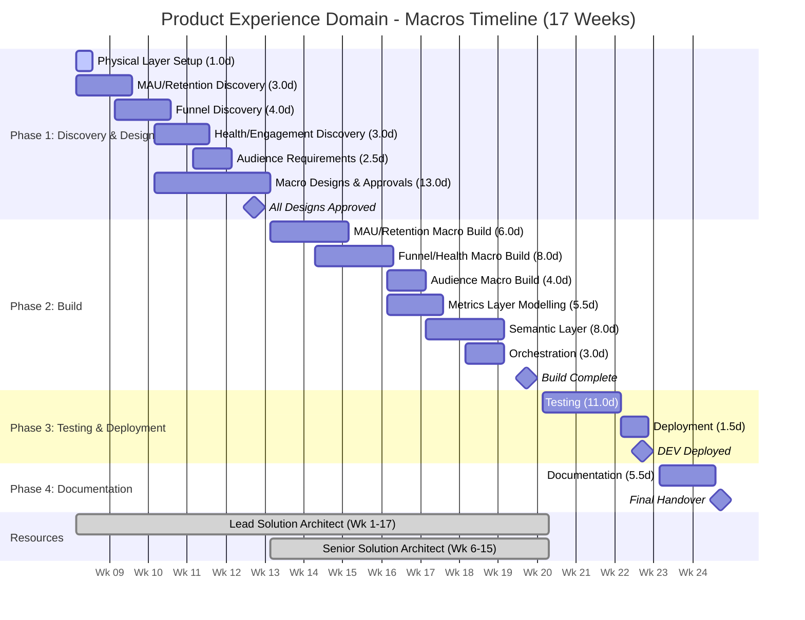
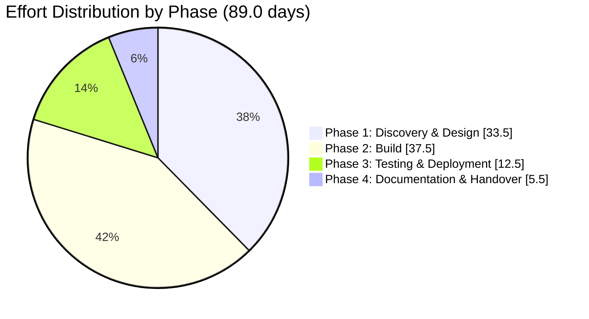

# Product Experience Domain - Macros Consolidation - Scope of Work (INTERNAL)

**Client:** Canva  
**Domain:** Product Experience  
**Initiative:** Macros Consolidation  
**Prepared by:** Snowflake Professional Services  
**Date:** February 2026  
**Version:** 1.0 (DRAFT)  
**Document Status:** For Review

---

## Engagement Outcome

This outcome-based engagement will deliver a consolidated set of DBT macros for standardised reporting across features, products, and teams within the Product Experience domain. Snowflake will design, build, and deploy parameterised DBT macros that consolidate common business processes into predefined pipelines, with outputs materialised in a newly modelled metrics layer. Each macro will support user-defined parameters for subscription-based execution, enable consistent dimensional modelling, and include semantic views for Snowflake Intelligence. This initiative does not involve migrating existing DBT models but rather creates new consolidated pipelines to replace fragmented implementations across teams.

---

## Table of Contents

1. [In-Scope Macros](#1-in-scope-macros)
2. [Out of Scope](#2-out-of-scope)
3. [Effort Estimate](#3-effort-estimate)
   - 3.1 Assumptions Made on Estimate Calculation
   - 3.2 Effort Estimates - Detailed Breakdown
   - 3.3 Effort Summary
   - 3.4 Breakdown by Phase
   - 3.5 Phase-by-Phase Calculation
   - 3.6 Consolidated Effort Table
   - 3.7 Estimate Sensitivity
4. [High-Level Execution Plan](#4-high-level-execution-plan)
5. [Resourcing Needs](#5-resourcing-needs)
6. [Open Questions](#6-open-questions)
7. [Risks and Assumptions](#7-risks-and-assumptions)

---

## 1. In-Scope Macros

### 1.1 Macro Overview

| Macro | Status | Discovery Required | Permutations to Consolidate | Complexity |
|-------|--------|-------------------|----------------------------|------------|
| **MAU (Monthly Active User)** | Clear requirements | Yes (minimal) | 1-2 | Medium |
| **Retention** | Clear requirements | Yes (minimal) | 1-2 | Medium |
| **Funnel** | Requires discovery | Yes | ~3 (GenAI, TE, DE) | Complex |
| **Health / Engagement** | Requires discovery | Yes | ~2 (TE, DE) | Complex |
| **Audience** | No prior art | Yes (new feature) | 0 (greenfield) | Complex |

### 1.2 Macro Specifications

#### 1.2.1 MAU Macros

**Purpose:** Produce Monthly Active User metrics with flexibility in slicing and dicing across dimensions.

**Input Data:**
- Standardised input table with columns: user_id, timestamp, product, feature, action, feature_context, action_context

**Parameters:**
- Rolling vs non-rolling calculation
- Analysis start date / end date
- Number of days to analyse (1, 7, 30 etc)
- Product/feature definition source (configurable)
- Platform filter

**Dimensions:**
- Product (defined in table)
- Feature (defined in table)
- User country (requires join)
- Time span (month, week, day)
- Platform

**Expected Output:**
- Materialised reporting table in metrics layer
- One row per user per snapshot date
- Columns: user_id, event_date, is_dau, is_wau, is_mau, is_new_user, first_active_date_ever, days_since_first_active
- Ranking functions for top products/features by MAU

#### 1.2.2 Retention Macros

**Purpose:** Calculate retention of entities (primarily users) over time based on product/feature usage.

**Parameters:**
- User type: new vs existing to Canva, feature, or product
- User classification: paid vs free vs education (requires join)
- Retention duration
- Retention bucketing: day, week, month (rolling and non-rolling)
- Flexible retention criteria
- Power user split (dynamically defined criteria)
- Platform filter

**Expected Output:**
- Materialised reporting table in metrics layer
- Support for retention tables, curves, and cohort performance
- Granular and aggregated data in separate tables

#### 1.2.3 Funnel Macros (Requires Discovery)

**Purpose:** Calculate funnels - sequence of actions performed consecutively by users.

**Parameters:**
- Time period
- New vs existing users
- Funnel steps (discrete actions)
- Scope: user, design, or session
- Product/feature filter

**Scope Definition:**
- **User:** Any user who has done A > B > C (across any session)
- **Design:** User who has done A > B > C within the same design
- **Session:** User who has done A > B > C within the same session

**Expected Output:**
- Summary table with one row per user
- Boolean for each step completion
- Relative to input steps for given time period

**Discovery Required:** ~3 different implementations exist across GenAI, T&E, and DE teams that need consolidation.

#### 1.2.4 Health / Engagement Macros (Requires Discovery)

**Purpose:** Assign a 'health' score to entities based on action thresholds.

**Parameters:**
- Entity type (user, brand, team)
- Time span
- Health scoring table (configurable thresholds)

**Expected Output:**
- Table with one row per entity
- Columns: entity_id, category, band (e.g., poor/good/great)
- Multiple categories per entity supported

**Discovery Required:** ~2 different implementations exist across T&E and DE teams that need consolidation.

#### 1.2.5 Audience Macros (No Prior Art)

**Purpose:** Generate tables of entities meeting specific criteria based on actions within a time span.

**Parameters:**
- Time span
- Inclusion criteria
- Exclusion criteria
- Entity type (user, brand, organization, design, class, etc.)

**Expected Output:**
- Table with one row per entity
- Entities meeting inclusion criteria within audience definition

**Note:** This is a greenfield development - no existing implementation exists in the monolith.

### 1.3 Deliverables Summary

| # | Deliverable | Description |
|---|-------------|-------------|
| 1 | **Physical Layer Setup** | Configure metrics layer database and schemas for macro outputs |
| 2 | **Discovery & Requirements Consolidation** | Analyse existing implementations for Funnel, Health/Engagement; document consolidated requirements for all macros |
| 3 | **Macro Design & Approval** | Design each macro with parameters, business logic, output schema; obtain Canva stakeholder approval |
| 4 | **DBT Macro Development** | Build 5 parameterised DBT macros with subscription support |
| 5 | **Metrics Layer Dimensional Models** | Create dimensional models for each macro output in metrics layer |
| 6 | **Semantic Layer** | Create 5 semantic views (one per macro) for Snowflake Intelligence |
| 7 | **Orchestration** | Configure Airflow for daily scheduled execution |
| 8 | **Testing** | Data quality tests, unit tests, integration tests |
| 9 | **Documentation** | Solution design, macro specifications, parameter documentation |

---

## 2. Out of Scope

| Item | Rationale |
|------|-----------|
| **Downstream Consumer Re-pointing** | Migration guide provided, but actual re-pointing is consumer responsibility |
| **Decommissioning Old Tables/Macros** | Not included; separate operational activity after parallel run validation |
| **Existing DBT Model Migration** | This initiative creates new consolidated macros, not migration of existing models |
| **Source Data Ingestion** | All source data already available in Snowflake |
| **Infrastructure Provisioning** | Platform team responsibility (databases, Airflow infrastructure) |
| **Productionization** | Handled by Canva internal team |
| **Orchestration Development** | Existing Airflow infrastructure to be used |
| **Report Development** | Semantic views provided; report development is consumer responsibility |
| **Historical Data Backfill** | Initial runs will populate current state; historical backfill is separate activity |

---

## 3. Effort Estimate

### 3.1 Assumptions Made on Estimate Calculation

#### 3.1.1 Discovery & Analysis Assumptions

| Assumption | Value | Source |
|------------|-------|--------|
| Time for discovery per macro (with existing implementations) | 2.0 days | Includes review of multiple permutations |
| Time for requirements consolidation per macro | 1.5 days | Includes stakeholder alignment |
| Time for design approval process per macro | 1.0 days | Per macro design review |
| Access to source data for business transformations | Available | Confirmed in meeting |
| Data sources and tables from upstream dependencies | Available | Confirmed in meeting |
| Existing macro implementations available for review | Yes | Owen to share PRs and design docs |

#### 3.1.2 Macro Complexity Distribution

| Macro | Discovery Required | Permutations | Requirements Status | Complexity |
|-------|-------------------|--------------|---------------------|------------|
| **MAU** | Yes (minimal) | 1-2 | Clear, documented | Medium |
| **Retention** | Yes (minimal) | 1-2 | Clear, documented | Medium |
| **Funnel** | Yes | ~3 | Requires consolidation | Complex |
| **Health/Engagement** | Yes | ~2 | Requires consolidation | Complex |
| **Audience** | Yes (new) | 0 | New feature design | Complex |

#### 3.1.3 Effort per Macro by Type

| Macro Type | Discovery | Design | Build | Test | Semantic | Total |
|------------|-----------|--------|-------|------|----------|-------|
| **Clear Requirements (MAU, Retention)** | 2.0 days | 3.0 days | 4.0 days | 1.5 days | 1.5 days | 12.0 days |
| **Requires Consolidation (Funnel, Health)** | 4.0 days | 3.5 days | 4.5 days | 2.0 days | 1.5 days | 15.5 days |
| **Greenfield (Audience)** | 2.0 days | 3.0 days | 4.0 days | 2.0 days | 1.5 days | 12.5 days |

#### 3.1.4 Other Key Assumptions

| Assumption | Value | Impact |
|------------|-------|--------|
| Total macros in scope | 5 | Confirmed in requirements document |
| Macros with clear requirements | 2 (MAU, Retention) | Lower discovery effort |
| Macros requiring discovery/consolidation | 2 (Funnel, Health/Engagement) | Higher discovery effort |
| Greenfield macros | 1 (Audience) | New design required |
| Output destination | Metrics layer | Dimensional models required |
| Semantic views per macro | 1 | 5 total semantic views |
| Execution frequency | Daily scheduled | Via Airflow |
| Design approval required | Yes, per macro | Stakeholder review cycles |
| Parallel run support | Yes | Short-term parallel execution with old processes |
| DBT version | DBT Core (open source) | Provided by platform team |
| SME availability | 4-6 hours/week | Based on expected commitment |
| No data migration required | Confirmed | Meeting confirmed |
| Source data in standardised format | Available | Common columns: user_id, timestamp, product, feature, action |
| Intermediary structures recommended | Yes | For compute/time optimization |

---

### 3.2 Effort Estimates - Detailed Breakdown

#### 3.2.1 Physical Layer Setup

*Note: MH effort assumes DEV environment setup only.*

| Activity | Description | Effort (Days) |
|----------|-------------|---------------|
| Database/schema configuration | Configure metrics layer schemas for macro outputs | 0.5 |
| Access configuration | Initial role grants and access setup | 0.5 |
| **Subtotal** | | **1.0** |

#### 3.2.2 Discovery & Requirements Consolidation

| Macro | Discovery | Requirements Consolidation | Stakeholder Alignment | Effort (Days) |
|-------|-----------|---------------------------|----------------------|---------------|
| MAU | Review 1-2 existing permutations | Document consolidated requirements | Validate with Owen/Soumya | 3.0 |
| Retention | Review 1-2 existing permutations | Document consolidated requirements | Validate with Owen/Soumya | 3.0 |
| Funnel | Review 3 permutations (GenAI, TE, DE) | Consolidate and reconcile approaches | Align on unified approach | 4.5 |
| Health/Engagement | Review 2 permutations (TE, DE) | Consolidate and reconcile approaches | Align on unified approach | 3.5 |
| Audience | Define new requirements | Design greenfield approach | Stakeholder validation | 2.5 |
| **Subtotal** | | | | **16.5** |

#### 3.2.3 Macro Design (Per Macro with Approval)

*Assumption: Each macro design requires stakeholder review and approval.*

| Macro | Parameter Design | Business Logic Design | Output Schema Design | Design Review | Effort (Days) |
|-------|-----------------|----------------------|---------------------|---------------|---------------|
| MAU | Define subscription parameters | Document transformation logic | Define dimensional model | Canva approval | 3.0 |
| Retention | Define subscription parameters | Document transformation logic | Define dimensional model | Canva approval | 3.0 |
| Funnel | Define subscription parameters | Document transformation logic | Define dimensional model | Canva approval | 3.5 |
| Health/Engagement | Define subscription parameters | Document transformation logic | Define dimensional model | Canva approval | 3.5 |
| Audience | Define subscription parameters | Document transformation logic | Define dimensional model | Canva approval | 3.0 |
| **Subtotal** | | | | | **16.0** |

#### 3.2.4 DBT Macro Development

| Macro | Core Logic Build | Parameter Handling | Output Table Build | Intermediary Structures | Effort (Days) |
|-------|-----------------|-------------------|-------------------|------------------------|---------------|
| MAU | Implement COUNTD logic | Rolling/non-rolling, date ranges | Materialised table with ranking | Consider HLL for approximates | 4.0 |
| Retention | Implement retention calculation | Cohort buckets, user types | Retention curves, cohort tables | Intermediate aggregations | 4.0 |
| Funnel | Implement step sequence logic | Scope (user/design/session) | Summary table with booleans | Step completion tracking | 4.5 |
| Health/Engagement | Implement scoring logic | Health table joins | Banded scoring output | Category aggregations | 4.5 |
| Audience | Implement criteria matching | Inclusion/exclusion logic | Entity membership table | Criteria evaluation | 4.0 |
| **Subtotal** | | | | | **21.0** |

#### 3.2.5 Metrics Layer Dimensional Modelling

| Activity | Description | Calculation | Effort (Days) |
|----------|-------------|-------------|---------------|
| Dimensional model design | Design star schema for each macro output | 5 macros x 0.5 days | 2.5 |
| Granular tables | Design granular output tables | 5 macros x 0.3 days | 1.5 |
| Aggregated tables | Design pre-aggregated tables for performance | 5 macros x 0.3 days | 1.5 |
| **Subtotal** | | | **5.5** |

#### 3.2.6 Semantic Layer Development

| Activity | Description | Calculation | Effort (Days) |
|----------|-------------|-------------|---------------|
| Requirements discovery | Define AI/LLM use cases per macro | 5 macros x 0.3 days | 1.5 |
| Semantic model design | Dimensions, measures, relationships, synonyms | 5 models x 0.5 days | 2.5 |
| Semantic view build | Create and validate semantic views | 5 views x 0.5 days | 2.5 |
| Snowflake Intelligence validation | Test with Cortex Analyst | 5 views x 0.3 days | 1.5 |
| **Subtotal** | | | **8.0** |

#### 3.2.7 Orchestration Configuration

| Activity | Description | Effort (Days) |
|----------|-------------|---------------|
| Airflow DAG configuration | Configure task dependencies for 5 macros | 1.5 |
| Schedule configuration | Daily refresh schedules | 0.5 |
| Testing & validation | End-to-end orchestration testing | 1.0 |
| **Subtotal** | | **3.0** |

#### 3.2.8 Testing

*Assumption: Deployment to UAT and production environments is not included in MH effort scope.*

| Activity | Description | Effort (Days) |
|----------|-------------|---------------|
| Unit test development | Tests for each macro | 3.0 |
| Integration testing | End-to-end pipeline validation | 3.0 |
| Data quality testing | Accuracy, completeness, consistency | 3.0 |
| Parameter validation testing | Test various parameter combinations | 2.0 |
| **Subtotal** | | **11.0** |

#### 3.2.9 Documentation

| Activity | Description | Effort (Days) |
|----------|-------------|---------------|
| Solution design document | Architecture and design documentation | 2.0 |
| Macro specifications | Parameter documentation, usage guides | 2.0 |
| Data architecture document | Data model specifications | 1.0 |
| Knowledge transfer | 2 sessions (overview + deep dive) x 1 hour | 0.5 |
| **Subtotal** | | **5.5** |

#### 3.2.10 Deployment

*Note: MH effort is restricted to DEV environment only.*

| Activity | Description | Effort (Days) |
|----------|-------------|---------------|
| Development environment deployment | Initial deployment and validation | 1.5 |
| **Subtotal** | | **1.5** |

---

### 3.3 Effort Summary

| Category | Effort (Days) |
|----------|---------------|
| Physical Layer Setup | 1.0 |
| Discovery & Requirements Consolidation | 16.5 |
| Macro Design (with Approvals) | 16.0 |
| DBT Macro Development | 21.0 |
| Metrics Layer Dimensional Modelling | 5.5 |
| Semantic Layer Development | 8.0 |
| Orchestration Configuration | 3.0 |
| Testing | 11.0 |
| Documentation | 5.5 |
| Deployment | 1.5 |
| **Total Base Effort** | **89.0 days** |
| **Contingency (15%)** | **13.4 days** |
| **Grand Total** | **102.4 days** |

---

### 3.4 Breakdown by Phase

| Phase | Activities Included | Effort (Days) |
|-------|---------------------|---------------|
| **Phase 1: Discovery & Design** | Physical layer setup, discovery, requirements consolidation, macro design with approvals | 33.5 |
| **Phase 2: Build** | DBT macro development, metrics layer modelling, semantic layer, orchestration | 37.5 |
| **Phase 3: Testing & Deployment** | Testing, deployment | 12.5 |
| **Phase 4: Documentation & Handover** | Documentation, knowledge transfer | 5.5 |
| **Subtotal** | | **89.0** |
| **Contingency (15%)** | | **13.4** |
| **Grand Total** | | **102.4** |

---

### 3.5 Phase-by-Phase Calculation

#### Phase 1: Discovery & Design (26.5 days)

| Activity | Days | Calculation |
|----------|------|-------------|
| Physical layer setup | 1.0 | Schemas + access |
| MAU discovery & requirements | 3.0 | Review 1-2 permutations |
| Retention discovery & requirements | 3.0 | Review 1-2 permutations |
| Funnel discovery & consolidation | 4.5 | 3 permutations to reconcile |
| Health/Engagement discovery & consolidation | 3.5 | 2 permutations to reconcile |
| Audience requirements definition | 2.5 | Greenfield design |
| MAU design & approval | 3.0 | Parameters + logic + schema + review |
| Retention design & approval | 3.0 | Parameters + logic + schema + review |
| Funnel design & approval | 3.5 | Parameters + logic + schema + review |
| Health/Engagement design & approval | 3.5 | Parameters + logic + schema + review |
| Audience design & approval | 3.0 | Parameters + logic + schema + review |
| **Subtotal** | **33.5** | |

#### Phase 2: Build (34.5 days)

| Activity | Days | Calculation |
|----------|------|-------------|
| MAU macro build | 4.0 | Core logic + parameters + output |
| Retention macro build | 4.0 | Core logic + parameters + output |
| Funnel macro build | 4.5 | Complex scope handling |
| Health/Engagement macro build | 4.5 | Scoring logic + categories |
| Audience macro build | 4.0 | Criteria matching |
| Dimensional model design | 2.5 | 5 macros x 0.5 days |
| Granular tables | 1.5 | 5 macros x 0.3 days |
| Aggregated tables | 1.5 | 5 macros x 0.3 days |
| Semantic requirements discovery | 1.5 | 5 macros x 0.3 days |
| Semantic model design | 2.5 | 5 models x 0.5 days |
| Semantic view build | 2.5 | 5 views x 0.5 days |
| Snowflake Intelligence validation | 1.5 | 5 views x 0.3 days |
| Airflow DAG configuration | 1.5 | 5 macro dependencies |
| Schedule configuration | 0.5 | Daily schedules |
| Orchestration testing | 1.0 | End-to-end validation |
| **Subtotal** | **37.5** | |

#### Phase 3: Testing & Deployment (12.5 days)

| Activity | Days | Calculation |
|----------|------|-------------|
| Unit test development | 3.0 | Per macro tests |
| Integration testing | 3.0 | End-to-end validation |
| Data quality testing | 3.0 | Accuracy, completeness |
| Parameter validation testing | 2.0 | Various combinations |
| Dev environment deployment | 1.5 | Initial deployment |
| **Subtotal** | **12.5** | |

#### Phase 4: Documentation & Handover (5.5 days)

| Activity | Days | Calculation |
|----------|------|-------------|
| Solution design document | 2.0 | Architecture documentation |
| Macro specifications | 2.0 | Parameter and usage guides |
| Data architecture document | 1.0 | Data model specs |
| Knowledge transfer | 0.5 | 2 sessions x 1 hour |
| **Subtotal** | **5.5** | |

---

### 3.6 Consolidated Effort Table

| Category | Phase | Activity | Effort (Days) | Calculation |
|----------|-------|----------|---------------|-------------|
| **Physical Layer Setup** | 1 | Database/schema configuration | 0.5 | Metrics layer schemas |
| | 1 | Access configuration | 0.5 | Role grants |
| | | **Subtotal** | **1.0** | |
| **Discovery & Requirements** | 1 | MAU discovery | 3.0 | Review 1-2 permutations |
| | 1 | Retention discovery | 3.0 | Review 1-2 permutations |
| | 1 | Funnel discovery & consolidation | 4.5 | 3 permutations (GenAI, TE, DE) |
| | 1 | Health/Engagement discovery | 3.5 | 2 permutations (TE, DE) |
| | 1 | Audience requirements | 2.5 | Greenfield design |
| | | **Subtotal** | **16.5** | |
| **Macro Design** | 1 | MAU design & approval | 3.0 | Parameters + logic + review |
| | 1 | Retention design & approval | 3.0 | Parameters + logic + review |
| | 1 | Funnel design & approval | 3.5 | Complex consolidation + review |
| | 1 | Health/Engagement design & approval | 3.5 | Complex consolidation + review |
| | 1 | Audience design & approval | 3.0 | New feature + review |
| | | **Subtotal** | **16.0** | |
| **DBT Macro Development** | 2 | MAU macro build | 4.0 | COUNTD, rolling logic |
| | 2 | Retention macro build | 4.0 | Cohorts, curves |
| | 2 | Funnel macro build | 4.5 | Scope handling |
| | 2 | Health/Engagement macro build | 4.5 | Scoring categories |
| | 2 | Audience macro build | 4.0 | Criteria matching |
| | | **Subtotal** | **21.0** | |
| **Metrics Layer Modelling** | 2 | Dimensional model design | 2.5 | 5 macros x 0.5 days |
| | 2 | Granular tables | 1.5 | 5 macros x 0.3 days |
| | 2 | Aggregated tables | 1.5 | 5 macros x 0.3 days |
| | | **Subtotal** | **5.5** | |
| **Semantic Layer** | 2 | Requirements discovery | 1.5 | 5 macros x 0.3 days |
| | 2 | Semantic model design | 2.5 | 5 models x 0.5 days |
| | 2 | Semantic view build | 2.5 | 5 views x 0.5 days |
| | 2 | Snowflake Intelligence validation | 1.5 | Cortex Analyst testing |
| | | **Subtotal** | **8.0** | |
| **Orchestration** | 2 | Airflow DAG configuration | 1.5 | 5 macro dependencies |
| | 2 | Schedule configuration | 0.5 | Daily schedules |
| | 2 | Testing & validation | 1.0 | End-to-end testing |
| | | **Subtotal** | **3.0** | |
| **Testing** | 3 | Unit test development | 3.0 | Per macro tests |
| | 3 | Integration testing | 3.0 | End-to-end validation |
| | 3 | Data quality testing | 3.0 | Accuracy, completeness |
| | 3 | Parameter validation testing | 2.0 | Various combinations |
| | | **Subtotal** | **11.0** | |
| **Deployment** | 3 | Dev environment deployment | 1.5 | Initial deployment |
| | | **Subtotal** | **1.5** | |
| **Documentation** | 4 | Solution design document | 2.0 | Architecture documentation |
| | 4 | Macro specifications | 2.0 | Parameter and usage guides |
| | 4 | Data architecture document | 1.0 | Data model specs |
| | 4 | Knowledge transfer | 0.5 | 2 sessions x 1 hour |
| | | **Subtotal** | **5.5** | |
| | | | | |
| **PHASE TOTALS** | | | | |
| | **Phase 1** | Discovery & Design | **33.5** | |
| | **Phase 2** | Build | **37.5** | |
| | **Phase 3** | Testing & Deployment | **12.5** | |
| | **Phase 4** | Documentation & Handover | **5.5** | |
| | | | | |
| | | **Total Base Effort** | **89.0** | |
| | | **Contingency (15%)** | **13.4** | |
| | | **Grand Total** | **102.4** | |

---

### 3.7 Estimate Sensitivity

| If This Changes... | Impact on Estimate |
|--------------------|--------------------|
| Funnel permutations increase from 3 to 5 | +3-5 days discovery/design |
| Health/Engagement permutations increase from 2 to 4 | +2-4 days discovery/design |
| Additional macros added to scope | +10-15 days per macro |
| Design approval cycles extended | +2-5 days (waiting time) |
| SME availability drops to 2 hrs/week | +5-8 days (waiting time) |
| Parameter complexity increases | +3-5 days development |
| Additional semantic views required per macro | +1-2 days per view |
| Source data not in standardised format | +5-8 days data preparation |
| Intermediary structure requirements increase | +3-5 days optimisation |
| Historical backfill required | +5-10 days (separate activity) |
| Documentation requirements increase | +2-3 days |

---

## 4. High-Level Execution Plan

### Phase 1: Discovery & Design (Weeks 1-5)

**Objectives:** Understand existing implementations, consolidate requirements, design macros, obtain approval

| Week | Activities |
|------|------------|
| 1 | Physical layer setup, begin MAU/Retention discovery, review existing implementations |
| 2 | Complete MAU/Retention discovery, begin Funnel discovery (review 3 permutations) |
| 3 | Complete Funnel discovery, begin Health/Engagement discovery (review 2 permutations) |
| 4 | Complete Health/Engagement discovery, Audience requirements definition, begin macro designs |
| 5 | Complete all macro designs, stakeholder reviews, obtain sign-off for each macro |

**Key Milestones:**
- Week 2: MAU & Retention requirements consolidated and approved
- Week 3: Funnel requirements consolidated
- Week 4: Health/Engagement requirements consolidated, Audience requirements defined
- Week 5: All 5 macro designs approved by Canva stakeholders

### Phase 2: Build (Weeks 6-12)

**Objectives:** Develop all DBT macros, metrics layer models, semantic layer, orchestration

| Week | Activities |
|------|------------|
| 6-7 | Build MAU and Retention macros |
| 8-9 | Build Funnel and Health/Engagement macros |
| 10 | Build Audience macro, begin metrics layer dimensional modelling |
| 11 | Complete metrics layer models, semantic layer development |
| 12 | Semantic view validation, orchestration configuration |

**Key Milestones:**
- Week 7: MAU & Retention macros complete
- Week 9: Funnel & Health/Engagement macros complete
- Week 10: Audience macro complete, Metrics layer models complete
- Week 12: Semantic views deployed, Orchestration operational

### Phase 3: Testing & Deployment (Weeks 13-15)

**Objectives:** Test thoroughly, deploy to DEV

| Week | Activities |
|------|------------|
| 13 | Unit test development, parameter validation testing |
| 14 | Integration testing, data quality testing |
| 15 | DEV deployment, validation |

**Key Milestones:**
- Week 14: All tests passing
- Week 15: DEV deployment complete

### Phase 4: Documentation & Handover (Weeks 16-17)

**Objectives:** Document solution, transfer knowledge

| Week | Activities |
|------|------------|
| 16 | Documentation completion (solution design, macro specifications) |
| 17 | Knowledge transfer sessions, final handover |

**Key Milestones:**
- Week 16: Documentation delivered
- Week 17: Knowledge transfer complete

### Timeline Diagram



### Effort by Phase



### Timeline Summary

```
==============================================================================================
                   PRODUCT EXPERIENCE DOMAIN - MACROS CONSOLIDATION TIMELINE (17 WEEKS)
==============================================================================================

WEEK     1    2    3    4    5    6    7    8    9   10   11   12   13   14   15   16   17
         |    |    |    |    |    |    |    |    |    |    |    |    |    |    |    |    |
---------+----+----+----+----+----+----+----+----+----+----+----+----+----+----+----+----+

+=========================================================================+
| PHASE 1: DISCOVERY & DESIGN (26.5 days)                                 |
+=========================================================================+
| Week 1-5                                                                |
| +---------------------------+                                           |
| | Physical Layer (1.0d)     | Wk 1                                      |
| | ----                      |                                           |
| +---------------------------+                                           |
| +-----------------------------------------------+                       |
| | MAU/Retention Discovery (3.0d)                | Wk 1-2                 |
| | -------------------                           |                       |
| +-----------------------------------------------+                       |
| +-----------------------------------------------+                       |
| | Funnel Discovery & Consolidation (4.0d)       | Wk 2-3                 |
| | -------------------------                     |                       |
| +-----------------------------------------------+                       |
| +-----------------------------------------------+                       |
| | Health/Engagement Discovery (3.0d)            | Wk 3-4                 |
| | -------------------                           |                       |
| +-----------------------------------------------+                       |
| +-------------------------------+                                       |
| | Audience Requirements (2.5d)  | Wk 4                                  |
| | -----------------             |                                       |
| +-------------------------------+                                       |
| +-------------------------------------------------------+               |
| | Macro Designs & Stakeholder Approvals (13.0d)         | Wk 3-5        |
| | -----------------------------------------             |               |
| +-------------------------------------------------------+               |
|                                                                         |
| MILESTONES:                                                             |
|   * Wk 2: MAU & Retention requirements consolidated                     |
|   * Wk 3: Funnel requirements consolidated                              |
|   * Wk 4: Health/Engagement & Audience requirements complete            |
|   * Wk 5: All 5 macro designs approved by Canva stakeholders            |
+=========================================================================+

+=========================================================================+
| PHASE 2: BUILD (34.5 days)                                              |
+=========================================================================+
| Week 6-12                                                               |
|              +---------------------------+                              |
|              | MAU/Retention Build (6d)  | Wk 6-7                        |
|              | --------------------      |                              |
|              +---------------------------+                              |
|              +---------------------------+                              |
|              | Funnel/Health Build (8d)  | Wk 8-9                        |
|              | ----------------------    |                              |
|              +---------------------------+                              |
|                        +-------------------+                            |
|                        | Audience Build (4d)| Wk 10                      |
|                        | --------------    |                            |
|                        +-------------------+                            |
|                        +-------------------------------+                |
|                        | Metrics Layer Modelling (5.5d)| Wk 10-11       |
|                        | -----------------------       |                |
|                        +-------------------------------+                |
|                              +---------------------------+              |
|                              | Semantic Layer (8.0d)     | Wk 11-12     |
|                              | -------------------       |              |
|                              +---------------------------+              |
|                                    +-------------------+                |
|                                    | Orchestration (3d)| Wk 12          |
|                                    | --------------    |                |
|                                    +-------------------+                |
|                                                                         |
| MILESTONES:                                                             |
|   * Wk 7: MAU & Retention macros complete                               |
|   * Wk 9: Funnel & Health/Engagement macros complete                    |
|   * Wk 10: Audience macro complete                                      |
|   * Wk 12: Semantic views deployed, Orchestration operational           |
+=========================================================================+

+=========================================================================+
| PHASE 3: TESTING & DEPLOYMENT (12.5 days)                               |
+=========================================================================+
| Week 13-15                                                              |
|                                    +---------------------------+        |
|                                    | Testing (11.0d)           | Wk 13-14|
|                                    | ----------------------    |        |
|                                    +---------------------------+        |
|                                          +-------------+                |
|                                          | Deploy (1.5d)| Wk 15         |
|                                          | --------    |                |
|                                          +-------------+                |
|                                                                         |
| MILESTONES:                                                             |
|   * Wk 14: All tests passing                                            |
|   * Wk 15: DEV deployment complete                                      |
+=========================================================================+

+=========================================================================+
| PHASE 4: DOCUMENTATION & HANDOVER (5.5 days)                            |
+=========================================================================+
| Week 16-17                                                              |
|                                                +-------------------+    |
|                                                | Documentation     | Wk 16-17|
|                                                | (5.5d) --------   |    |
|                                                +-------------------+    |
|                                                                         |
| MILESTONES:                                                             |
|   * Wk 16: Documentation delivered                                      |
|   * Wk 17: Knowledge transfer complete, Final handover                  |
+=========================================================================+

==============================================================================================
                                    RESOURCE ALLOCATION
==============================================================================================

WEEK     1    2    3    4    5    6    7    8    9   10   11   12   13   14   15   16   17
         |    |    |    |    |    |    |    |    |    |    |    |    |    |    |    |    |

Lead SA  =========================================================================
         Week 1 ----------------------------------------------------------------> Week 17

Senior SA                           ================================================
                                    Week 6 ---------------------------------------> Week 15

==============================================================================================
                                  KEY MILESTONES SUMMARY
==============================================================================================

  Wk 1  * Project kickoff, Infrastructure ready
  Wk 5  * All 5 macro designs approved by Canva stakeholders
  Wk 7  * MAU & Retention macros complete
  Wk 9  * Funnel & Health/Engagement macros complete
  Wk 10 * Audience macro complete
  Wk 12 * Semantic views deployed, Orchestration operational
  Wk 15 * Testing complete, DEV deployed
  Wk 17 * Final handover

==============================================================================================
```

**Total Duration:** ~19-20 weeks (5 months)

---

## 5. Resourcing Needs

### 5.1 Snowflake Professional Services Team

| Role | FTE | Duration | Responsibilities | Required Skills & Expertise |
|------|-----|----------|------------------|----------------------------|
| **Lead Solution Architect** | 1.0 | Full engagement (17 weeks) | Solution architecture, macro design, complex DBT development, technical leadership, stakeholder management | DBT Core (advanced), Snowflake (advanced), Data modeling (advanced), SQL (advanced), Airflow, Semantic Views/Cortex Analyst, Solution design |
| **Senior Solution Architect** | 1.0 | Weeks 6-15 (10 weeks) | DBT macro development, testing | DBT Core (advanced), Snowflake, SQL (advanced), Python, Testing frameworks |

### 5.2 Canva Team Requirements

| Role | Commitment | Duration | Responsibilities |
|------|------------|----------|------------------|
| **Domain SME (Mike/Owen/Soumya)** | 4-6 hrs/week | Full engagement | Requirements clarification, existing implementation review, design validation, parameter definition |
| **Technical Lead** | 2-4 hrs/week | Full engagement | Technical decisions, approvals, escalations |
| **Data Platform Team** | As needed | Full engagement | Airflow infrastructure, database provisioning |
| **QA/Testing Resource** | 2-4 hrs/week | Weeks 13-15 | Testing execution, business validation |
| **GenAI/TE/DE Team Representatives** | As needed | Weeks 2-4 | Funnel/Health macro discovery and consolidation |

### 5.3 Infrastructure Requirements

| Requirement | Owner | Timeline |
|-------------|-------|----------|
| Metrics layer database/schemas | Platform Team | Week 1 |
| Development environment access | Platform Team | Week 1 |
| Airflow environment for orchestration | Platform Team | Week 12 |
| Access to existing macro implementations | Owen/Mike/Soumya | Week 1 |
| Access to source data (standardised format) | Platform Team | Week 1 |
| Design review/approval process | Canva Stakeholders | Weeks 3-5 |

---

## 6. Open Questions

| # | Question | Owner | Impact | Priority |
|---|----------|-------|--------|----------|
| 1 | Can Owen share the PRs and design docs for existing retention/active user macros? | Owen Yan | Blocks discovery phase | High |
| 2 | Who are the owners of the 3 Funnel macro implementations (GenAI, TE, DE)? | Mike | Coordination for discovery | High |
| 3 | Who are the owners of the 2 Health/Engagement implementations (TE, DE)? | Mike | Coordination for discovery | High |
| 4 | What is the process for macro design approval with Canva stakeholders? | Mike | Design phase planning | High |
| 5 | Is there a standard format for the source data table (user_id, timestamp, product, feature, action)? | Mike | Source data assumptions | Medium |
| 6 | Are there performance requirements for macro execution (SLAs)? | Technical Lead | Build optimisation | Medium |
| 7 | What is the expected volume of data processed by each macro? | Owen/Soumya | Architecture decisions | Medium |
| 8 | Will parallel run support be required with old implementations? | Mike | Additional testing effort | Medium |
| 9 | What are the entity types expected for Audience macro (beyond user)? | Mike | Design scope | Medium |

---

## 7. Risks and Assumptions

### 7.1 Assumptions

| # | Assumption | Source |
|---|------------|--------|
| A1 | All source data is currently available in Snowflake in standardised format | Meeting confirmed |
| A2 | Total macros in scope is 5 (MAU, Retention, Funnel, Health/Engagement, Audience) | Requirements document |
| A3 | MAU and Retention have clear, documented requirements | Meeting confirmed |
| A4 | Funnel requires discovery with ~3 permutations to consolidate | Meeting confirmed |
| A5 | Health/Engagement requires discovery with ~2 permutations to consolidate | Meeting confirmed |
| A6 | Audience is greenfield with no prior art | Meeting confirmed |
| A7 | DBT Core (open source) is the transformation platform | Meeting confirmed |
| A8 | Each macro design requires stakeholder approval before implementation | User requirement |
| A9 | All target outputs go to metrics layer | Meeting confirmed |
| A10 | Daily scheduled execution via Airflow | Meeting confirmed |
| A11 | No existing DBT model migration required | Meeting confirmed |
| A12 | No data migration required | Meeting confirmed |
| A13 | Platform team will provision databases and Airflow infrastructure | Standard assumption |
| A14 | SME availability of 4-6 hours/week throughout engagement | Expected commitment |
| A15 | Design reviews are approved in a timely fashion | MH effort assumption |
| A16 | Deployment to UAT and production environments is not included in MH effort scope | MH effort assumption |
| A17 | MH effort is restricted to DEV environment only | Standard assumption |
| A18 | Access to source data for business transformations is available | User confirmed |
| A19 | Data sources and tables from upstream dependencies are available | User confirmed |
| A20 | One semantic view per macro will be created | Standard approach |
| A21 | Parameters are computational (affecting transformation logic) | Meeting confirmed |
| A22 | Parallel run support may be needed short-term | Meeting confirmed |

### 7.2 Risks

| # | Risk | Likelihood | Impact | Mitigation |
|---|------|------------|--------|------------|
| R1 | **Funnel consolidation complexity** - 3 permutations more different than expected | Medium | High | Early discovery with all team representatives; document differences; stakeholder alignment |
| R2 | **Health/Engagement consolidation complexity** - 2 permutations diverge significantly | Medium | Medium | Early discovery; SME involvement; iterative approach |
| R3 | **Design approval delays** - Stakeholder reviews take longer than expected | Medium | High | Clear approval process; scheduled review sessions; escalation path |
| R4 | **SME availability** - Domain experts unavailable for required workshops | Medium | High | Identify backup SMEs; flexible scheduling; document decisions |
| R5 | **Source data format inconsistencies** - Data not in expected standardised format | Medium | High | Early data profiling; format validation; transformation adjustments |
| R6 | **Parameter complexity** - More parameters required than anticipated | Medium | Medium | Iterative design; prioritise core parameters; defer advanced to phase 2 |
| R7 | **Scope creep** - Additional macros or parameters identified during discovery | Medium | Medium | Strict change control; document all additions; separate backlog |
| R8 | **Platform team capacity** - Infrastructure provisioning delays | Low | High | Early engagement; clear timeline commitments; escalation path |
| R9 | **Performance requirements unclear** - SLAs not defined until late | Medium | Medium | Define performance expectations in design phase; build for optimisation |
| R10 | **Parallel run complexity** - Validation against old implementations challenging | Medium | Medium | Clear reconciliation criteria; acceptable variance thresholds |
| R11 | **Intermediary structure design** - Optimisation requirements unclear | Low | Medium | Build for flexibility; iterate based on performance testing |

---

**Document History:**

| Version | Date | Author | Changes |
|---------|------|--------|---------|
| 1.0 | February 2026 | Snowflake PS | Initial draft |

---

*This Scope of Work is based on information gathered during the Product Experience Domain - Macros scoping meeting held on February 11, 2026, and supporting documentation provided by Canva (Product Experience Macros Requirements PDF). Estimates are subject to refinement upon receipt of existing macro implementations, discovery outcomes, and design approvals.*
