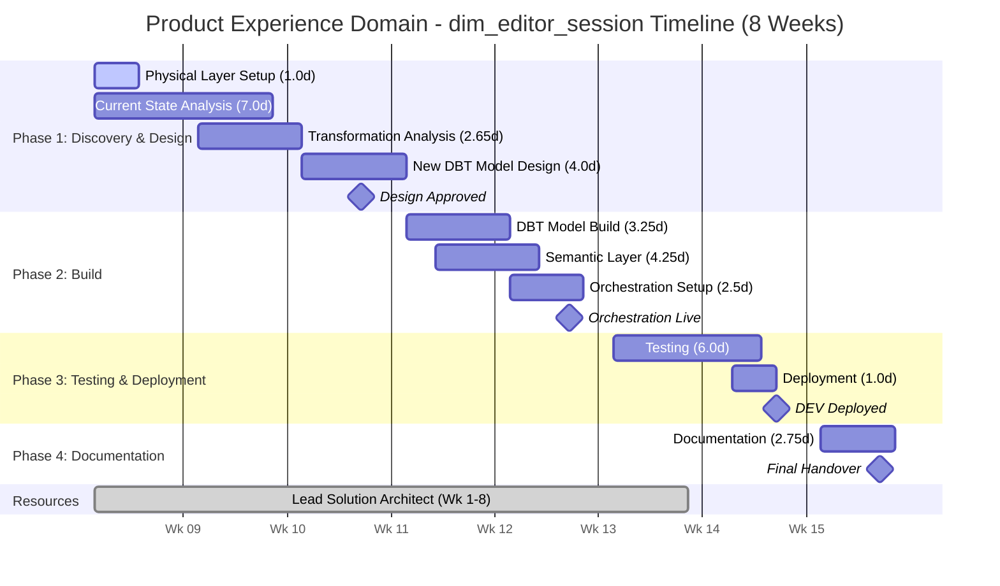
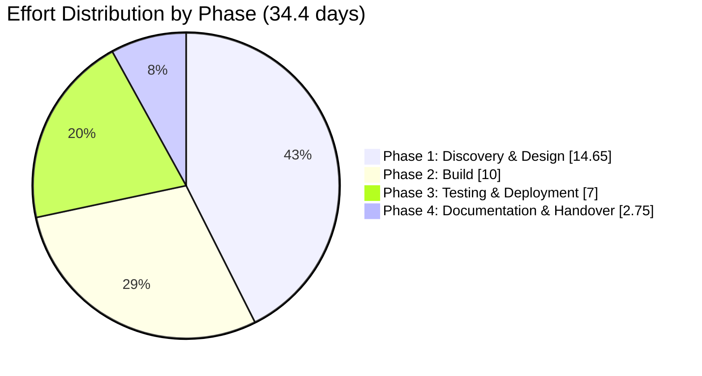

# Product Experience Domain Data Migration - Scope of Work (INTERNAL)

**Client:** Canva  
**Domain:** Product Experience  
**Pipeline:** dim_editor_session  
**Prepared by:** Snowflake Professional Services  
**Date:** February 2026  
**Version:** 1.0 (DRAFT)  
**Document Status:** For Review

---

## Engagement Outcome

This outcome-based engagement will deliver a fully modernised data pipeline for the dim_editor_session entity as part of Canva's enterprise data migration initiative. Snowflake will analyse, redesign, and rebuild the existing DBT project into a new three-layer architecture (Conformed, Metrics, Semantic), restructure the monolithic dimension table into a proper star schema with grain-appropriate fact and dimension tables, establish semantic views for Snowflake Intelligence, configure orchestration through Airflow, and deliver complete documentation.

---

## Table of Contents

1. [In-Scope Pipelines](#1-in-scope-pipelines)
2. [Out of Scope](#2-out-of-scope)
3. [Effort Estimate](#3-effort-estimate)
   - 3.1 Assumptions Made on Estimate Calculation
   - 3.2 Effort Estimates - Detailed Breakdown
   - 3.3 Effort Summary
   - 3.4 Breakdown by Phase
   - 3.5 Phase-by-Phase Calculation
   - 3.6 Consolidated Effort Table
   - 3.7 Estimate Sensitivity
4. [High-Level Execution Plan](#4-high-level-execution-plan)
5. [Resourcing Needs](#5-resourcing-needs)
6. [Open Questions](#6-open-questions)
7. [Risks and Assumptions](#7-risks-and-assumptions)

---

## 1. In-Scope Pipelines

### 1.1 Data Pipelines

| Pipeline | Current Tables | Future State (Three-Layer Architecture) | Description |
|----------|----------------|----------------------------------------|-------------|
| **dim_editor_session** | dim_editor_session (monolithic dimension with mixed facts/dimensions) | **Conformed Layer:** dim_user, dim_device, dim_design, dim_platform, dim_network_status **Metrics Layer:** fact_editor_session, bridge tables as needed | Editor session tracking - remodeled from monolithic dimension table to proper star schema with separated dimensional attributes and session facts |

**Current State Tables:** 1 monolithic dimension table (dim_editor_session)  
**Target State Tables:** ~5-7 grain-appropriate dimension and fact tables

### 1.2 Current DBT Models

| Model Name | Purpose | Source | Contains CTEs / Macros / LoC | Complexity |
|------------|---------|--------|------------------------------|------------|
| _fact_editor_event_track_filtered | Collect events with editing context and attributes | Analytics Events | Yes / Yes / 100 | Complex |
| _stg_editor_session_first_event | Calculate earliest event_time per design_session_id | _fact_editor_event_track_filtered | Yes / No / 80 | Medium |
| _stg_editor_session_last_event | Calculate latest event_time per design_session_id | _fact_editor_event_track_filtered | Yes / No / 50 | Medium |
| _stg_editor_session_details | Accumulative stats and indicators for each session | _fact_editor_event_track_filtered, event_design_opened | Yes / No / 120 | Medium |
| _stg_editor_session_summary | Summary of each session with metadata | Multiple staging tables | Yes / No / 220 | Complex |
| _dim_editor_session | Summary with aggregated stats | Multiple staging tables, dim_user | No / No / 120 | Medium |
| dim_editor_session | View of _dim_editor_session | _dim_editor_session | No / Yes (dbt utils) / 60 | Simple |

### 1.3 Deliverables Summary

| # | Deliverable | Description |
|---|-------------|-------------|
| 1 | **Physical Layer Setup** | Create 3 Snowflake databases (product_experience_conformed, product_experience_metrics, product_experience_semantic) with schemas (source, internal, expose) |
| 2 | **Data Model Analysis & Redesign** | Analyse current 1 monolithic dimension table and 7 DBT models; redesign into 3-layer star schema architecture with grain-appropriate tables |
| 3 | **DBT Project Development** | Analyse, redesign, and build ~5 DBT models in new namespace (target 30% reduction from 7 models) |
| 4 | **Semantic Layer** | Create 1 semantic view and model (Editor Session) for Snowflake Intelligence |
| 5 | **Orchestration** | Daily scheduled orchestration for dim_editor_session via Airflow |
| 6 | **Testing** | Data quality tests, unit tests, integration tests |
| 7 | **Documentation** | Solution design, data architecture, migration guide for downstream consumers |

---

## 2. Out of Scope

| Item | Rationale |
|------|-----------|
| **Downstream Consumer Re-pointing** | Migration guide provided, but actual re-pointing is consumer responsibility |
| **Upstream Source Migration/Remodelling** | Source data consumed as-is from current location |
| **Governance Implementation** | No policies or classifications to be migrated per domain owner confirmation |
| **Decommissioning Old Tables** | Not included; separate operational activity |
| **Source Data Ingestion** | All source data already available in Snowflake |
| **Infrastructure Provisioning** | Platform team responsibility (databases, Airflow infrastructure) |
| **Productionization** | Handled by Canva internal team (complex production environment requires specialized tooling) |
| **Historical Data Migration** | Not required - rebuild from source (data volume manageable) |

---

## 3. Effort Estimate

### 3.1 Assumptions Made on Estimate Calculation

#### 3.1.1 Discovery & Analysis Assumptions

| Assumption | Value | Source |
|------------|-------|--------|
| Time to analyse existing data model (per table) | 0.5 days | Industry standard for documented models |
| Time per DBT model initial analysis | 0.25 days | Based on YAML documentation availability |
| Time per DBT model detailed analysis (complex) | 0.5 days | For models with macros/complex CTEs |
| Current state documentation availability | Limited | PDF documentation provided; reverse engineering may be required |
| Access to source data for business transformations | Available | Required for analysis |
| Data sources and tables from upstream dependencies | Available | Required for development |

#### 3.1.2 DBT Model Complexity Distribution (Confirmed)

| Pipeline | Simple | Medium | Complex | Total |
|----------|--------|--------|---------|-------|
| **dim_editor_session** | 1 | 4 | 2 | 7 |
| **Percentage** | **14%** | **57%** | **29%** | **100%** |

*Note: Complexity based on CTEs, macros, and lines of code as documented in PDF.*

#### 3.1.3 Effort per Model by Complexity

| Complexity Level | Definition | Effort per Model (Analysis) | Effort per Model (Build) |
|------------------|------------|-----------------------------|--------------------------| 
| **Simple** | Direct SELECT, minimal joins, no macros | 0.15 days | 0.25 days |
| **Medium** | Multiple joins, CTEs, standard transformations | 0.25 days | 0.5 days |
| **Complex** | Macros, complex CTEs, window functions, business logic | 0.5 days | 1.0 days |

#### 3.1.4 Model Distribution Across Layers

| Layer | Estimated Model Count | Rationale |
|-------|----------------------|-----------|
| Conformed Layer | ~2-3 | Shared dimensions (user, device, design, platform) |
| Metrics Layer | ~2 | fact_editor_session and supporting bridge tables |
| Semantic Layer | 1 semantic view | One semantic view for new star schema (not DBT model) |

*Note: The current state architecture does not have the three-layer structure (Conformed, Metrics, Semantic). The distribution of DBT models across the new layers will be determined during the Discovery & Design phase.*

#### 3.1.5 Other Key Assumptions

| Assumption | Value | Impact |
|------------|-------|--------|
| Total DBT models in scope (current state) | 7 | Confirmed in PDF documentation |
| Estimated new DBT models (target state) | ~5 (~70% of current) | Target 30% reduction through redesign consolidation |
| Overall complexity rating | 14% simple, 57% medium, 29% complex | Based on PDF model analysis |
| Target table architecture | Star schema | Dimension table to be remodeled into fact + dimension tables |
| Refresh frequency | Daily scheduled | Standard batch process |
| Target tables type | Native Snowflake tables | Confirmed |
| DBT version | DBT Core (open source) | Provided by platform team |
| SME availability | 4-6 hours/week | Based on expected commitment |
| Upstream dependencies complete | Prior to initiative start | Source data available |
| Environment scope | DEV and UAT only | Production handled by Canva internal team |

---

### 3.2 Effort Estimates - Detailed Breakdown

#### 3.2.1 Physical Layer Setup

*Note: MH effort assumes DEV environment setup only.*

| Activity | Description | Effort (Days) |
|----------|-------------|---------------|
| Database creation | Create 3 databases: product_experience_conformed, product_experience_metrics, product_experience_semantic | 0.25 |
| Schema creation | Create schemas per database: source, internal, expose | 0.25 |
| Access configuration | Initial role grants and access setup | 0.5 |
| **Subtotal** | | **1.0** |

#### 3.2.2 Current State Analysis & Data Model Redesign

*Assumption: Design reviews are approved in a timely fashion.*

| Activity | Description | Calculation | Effort (Days) |
|----------|-------------|-------------|---------------|
| Table analysis | Analyse 1 current monolithic dimension table structure, relationships | 1 table | 0.5 |
| Data profiling | Volume, distribution, quality assessment | 1 table x 0.5 days | 0.5 |
| Column analysis | Analyse 50+ columns for dimension vs fact classification | Based on PDF | 2.0 |
| Star schema design | Design new 3-layer star schema architecture (dimension and fact separation) | | 3.0 |
| Design review & iteration | Stakeholder review and refinement | | 1.0 |
| **Subtotal** | | | **7.0** |

#### 3.2.3 Transformation Layer Analysis (DBT Models)

| Activity | Description | Calculation | Effort (Days) |
|----------|-------------|-------------|---------------|
| Simple model analysis | Analyse simple DBT models | 1 model x 0.15 days | 0.15 |
| Medium model analysis | Analyse medium DBT models | 4 models x 0.25 days | 1.0 |
| Complex model analysis | Analyse complex DBT models | 2 models x 0.5 days | 1.0 |
| Lineage documentation | Document model dependencies | | 0.5 |
| **Subtotal** | | | **2.65** |

#### 3.2.4 New DBT Model Design

*Assumption: The redesigned target state is estimated at 70% of the current model count (5 models), as the redesign exercise is expected to consolidate functionality and eliminate redundancy (target 30% reduction).*

| Activity | Description | Calculation | Effort (Days) |
|----------|-------------|-------------|---------------|
| New model design | Design 5 models for new 3-layer architecture | 5 models x 0.3 days | 1.5 |
| Star schema model design | Design dimension and fact table models | | 1.5 |
| Design documentation | Technical specifications | | 1.0 |
| **Subtotal** | | | **4.0** |

#### 3.2.5 New DBT Model Build

*Assumption: Complexity distribution for new models follows similar proportions - Simple 1, Medium 3, Complex 1.*

| Activity | Description | Calculation | Effort (Days) |
|----------|-------------|-------------|---------------|
| Simple model build | Build simple DBT models | 1 model x 0.25 days | 0.25 |
| Medium model build | Build medium DBT models | 3 models x 0.5 days | 1.5 |
| Complex model build | Build complex DBT models | 1 model x 1.0 days | 1.0 |
| Model configuration | YAML configs, tests, documentation | 5 models x 0.1 days | 0.5 |
| **Subtotal** | | | **3.25** |

#### 3.2.6 Semantic Layer Development

| Activity | Description | Calculation | Effort (Days) |
|----------|-------------|-------------|---------------|
| Requirements discovery | Define AI/LLM use cases for editor session | 1 area x 0.5 days | 0.5 |
| Metric definition | Define metrics for semantic layer | | 1.0 |
| Semantic model design | Dimensions, measures, relationships, synonyms | 1 model x 1.0 days | 1.0 |
| Semantic view build | Create and validate semantic view | 1 view x 0.75 days | 0.75 |
| Snowflake Intelligence validation | Test with Cortex Analyst | | 1.0 |
| **Subtotal** | | | **4.25** |

#### 3.2.7 Orchestration Setup

| Activity | Description | Effort (Days) |
|----------|-------------|---------------|
| Orchestration design | Daily scheduled patterns | 0.5 |
| Airflow DAG development | Add task dependencies for 1 pipeline (existing Airflow) | 1.0 |
| Schedule configuration | Daily refresh schedules | 0.5 |
| Testing & validation | End-to-end orchestration testing | 0.5 |
| **Subtotal** | | **2.5** |

#### 3.2.8 Testing

*Assumption: Deployment to UAT and production environments is not included in MH effort scope.*

| Activity | Description | Effort (Days) |
|----------|-------------|---------------|
| Unit test development | New tests for new models | 2.0 |
| Integration testing | End-to-end pipeline validation | 2.0 |
| Data quality testing | Accuracy, completeness, consistency | 2.0 |
| **Subtotal** | | **6.0** |

#### 3.2.9 Documentation

*Note: Migration guide and runbooks not included in scope.*

| Activity | Description | Effort (Days) |
|----------|-------------|---------------|
| Solution design document | Architecture and design documentation | 1.5 |
| Data architecture document | Data model specifications | 1.0 |
| Knowledge transfer | 1 session x 1 hour | 0.25 |
| **Subtotal** | | **2.75** |

#### 3.2.10 Deployment

*Note: MH effort is restricted to DEV environment only. Deployment to TEST/UAT and Production environments is not included.*

| Activity | Description | Effort (Days) |
|----------|-------------|---------------|
| Development environment deployment | Initial deployment and validation | 1.0 |
| **Subtotal** | | **1.0** |

---

### 3.3 Effort Summary

| Category | Effort (Days) |
|----------|---------------|
| Physical Layer Setup | 1.0 |
| Current State Analysis & Data Model Redesign | 7.0 |
| Transformation Layer Analysis (DBT) | 2.65 |
| New DBT Model Design | 4.0 |
| New DBT Model Build | 3.25 |
| Semantic Layer Development | 4.25 |
| Orchestration Setup | 2.5 |
| Testing | 6.0 |
| Documentation | 2.75 |
| Deployment | 1.0 |
| **Total Base Effort** | **34.4 days** |
| **Contingency (15%)** | **5.2 days** |
| **Grand Total** | **39.6 days** |

---

### 3.4 Breakdown by Phase

| Phase | Activities Included | Effort (Days) |
|-------|---------------------|---------------|
| **Phase 1: Discovery & Design** | Physical layer setup, current state analysis, transformation analysis, new model design | 14.65 |
| **Phase 2: Build** | DBT model build, semantic layer, orchestration | 10.0 |
| **Phase 3: Testing & Deployment** | Testing, deployment | 7.0 |
| **Phase 4: Documentation & Handover** | Documentation, knowledge transfer | 2.75 |
| **Subtotal** | | **34.4** |
| **Contingency (15%)** | | **5.2** |
| **Grand Total** | | **39.6** |

---

### 3.5 Phase-by-Phase Calculation

#### Phase 1: Discovery & Design (14.65 days)

| Activity | Days | Calculation |
|----------|------|-------------|
| Physical layer setup | 1.0 | 3 DBs + schemas + access |
| Table analysis | 0.5 | 1 table |
| Data profiling | 0.5 | 1 table x 0.5 days |
| Column analysis | 2.0 | 50+ columns dimension/fact classification |
| Star schema design | 3.0 | 3-layer architecture with star schema |
| Design review | 1.0 | Stakeholder iterations |
| Simple model analysis | 0.15 | 1 model x 0.15 days |
| Medium model analysis | 1.0 | 4 models x 0.25 days |
| Complex model analysis | 1.0 | 2 models x 0.5 days |
| Lineage documentation | 0.5 | Model dependency mapping |
| New model design | 1.5 | 5 models x 0.3 days |
| Star schema model design | 1.5 | Dimension and fact table models |
| Design documentation | 1.0 | Technical specifications |
| **Subtotal** | **14.65** | |

#### Phase 2: Build (10.0 days)

| Activity | Days | Calculation |
|----------|------|-------------|
| Simple model build | 0.25 | 1 model x 0.25 days |
| Medium model build | 1.5 | 3 models x 0.5 days |
| Complex model build | 1.0 | 1 model x 1.0 days |
| Model configuration | 0.5 | 5 models (YAML, tests) |
| Semantic requirements discovery | 0.5 | 1 area x 0.5 days |
| Metric definition | 1.0 | Metrics for semantic layer |
| Semantic model design | 1.0 | 1 model x 1.0 days |
| Semantic view build | 0.75 | 1 view x 0.75 days |
| Snowflake Intelligence validation | 1.0 | Cortex Analyst testing |
| Orchestration design | 0.5 | Daily patterns |
| Airflow DAG development | 1.0 | 1 pipeline task dependencies |
| Schedule configuration | 0.5 | Daily schedules |
| Orchestration testing | 0.5 | End-to-end validation |
| **Subtotal** | **10.0** | |

#### Phase 3: Testing & Deployment (7.0 days)

| Activity | Days | Calculation |
|----------|------|-------------|
| Unit test development | 2.0 | New model tests |
| Integration testing | 2.0 | End-to-end validation |
| Data quality testing | 2.0 | Accuracy, completeness |
| Dev environment deployment | 1.0 | Initial deployment |
| **Subtotal** | **7.0** | |

#### Phase 4: Documentation & Handover (2.75 days)

| Activity | Days | Calculation |
|----------|------|-------------|
| Solution design document | 1.5 | Architecture documentation |
| Data architecture document | 1.0 | Data model specs |
| Knowledge transfer | 0.25 | 1 session x 1 hour |
| **Subtotal** | **2.75** | |

---

### 3.6 Consolidated Effort Table

| Category | Phase | Activity | Effort (Days) | Calculation |
|----------|-------|----------|---------------|-------------|
| **Physical Layer Setup** | 1 | Database creation | 0.25 | 3 databases |
| | 1 | Schema creation | 0.25 | Schemas per database |
| | 1 | Access configuration | 0.5 | Initial role grants |
| | | **Subtotal** | **1.0** | |
| **Current State Analysis** | 1 | Table analysis | 0.5 | 1 table |
| | 1 | Data profiling | 0.5 | 1 table |
| | 1 | Column analysis | 2.0 | 50+ columns classification |
| | 1 | Star schema design | 3.0 | 3-layer architecture |
| | 1 | Design review & iteration | 1.0 | Stakeholder review |
| | | **Subtotal** | **7.0** | |
| **Transformation Analysis** | 1 | Simple model analysis | 0.15 | 1 model x 0.15 days |
| | 1 | Medium model analysis | 1.0 | 4 models x 0.25 days |
| | 1 | Complex model analysis | 1.0 | 2 models x 0.5 days |
| | 1 | Lineage documentation | 0.5 | Model dependencies |
| | | **Subtotal** | **2.65** | |
| **New DBT Model Design** | 1 | New model design | 1.5 | 5 models x 0.3 days |
| | 1 | Star schema model design | 1.5 | Dimension/fact models |
| | 1 | Design documentation | 1.0 | Technical specifications |
| | | **Subtotal** | **4.0** | |
| **New DBT Model Build** | 2 | Simple model build | 0.25 | 1 model x 0.25 days |
| | 2 | Medium model build | 1.5 | 3 models x 0.5 days |
| | 2 | Complex model build | 1.0 | 1 model x 1.0 days |
| | 2 | Model configuration | 0.5 | YAML, tests, docs |
| | | **Subtotal** | **3.25** | |
| **Semantic Layer** | 2 | Requirements discovery | 0.5 | 1 area x 0.5 days |
| | 2 | Metric definition | 1.0 | Metrics for semantic layer |
| | 2 | Semantic model design | 1.0 | 1 model x 1.0 days |
| | 2 | Semantic view build | 0.75 | 1 view x 0.75 days |
| | 2 | Snowflake Intelligence validation | 1.0 | Cortex Analyst testing |
| | | **Subtotal** | **4.25** | |
| **Orchestration Setup** | 2 | Orchestration design | 0.5 | Daily patterns |
| | 2 | Airflow DAG development | 1.0 | Existing Airflow |
| | 2 | Schedule configuration | 0.5 | Daily schedules |
| | 2 | Testing & validation | 0.5 | End-to-end testing |
| | | **Subtotal** | **2.5** | |
| **Testing** | 3 | Unit test development | 2.0 | New model tests |
| | 3 | Integration testing | 2.0 | End-to-end validation |
| | 3 | Data quality testing | 2.0 | Accuracy, completeness |
| | | **Subtotal** | **6.0** | |
| **Deployment** | 3 | Dev environment deployment | 1.0 | Initial deployment |
| | | **Subtotal** | **1.0** | |
| **Documentation** | 4 | Solution design document | 1.5 | Architecture documentation |
| | 4 | Data architecture document | 1.0 | Data model specs |
| | 4 | Knowledge transfer | 0.25 | 1 session x 1 hour |
| | | **Subtotal** | **2.75** | |
| | | | | |
| **PHASE TOTALS** | | | | |
| | **Phase 1** | Discovery & Design | **14.65** | |
| | **Phase 2** | Build | **10.0** | |
| | **Phase 3** | Testing & Deployment | **7.0** | |
| | **Phase 4** | Documentation & Handover | **2.75** | |
| | | | | |
| | | **Total Base Effort** | **34.4** | |
| | | **Contingency (15%)** | **5.2** | |
| | | **Grand Total** | **39.6** | |

---

### 3.7 Estimate Sensitivity

| If This Changes... | Impact on Estimate |
|--------------------|--------------------|
| DBT model count increases from 7 to 10 | +3-5 days |
| Complexity distribution shifts further toward complex | +2-4 days |
| Star schema design requires additional tables beyond estimate | +2-3 days |
| SME availability drops to 2 hrs/week | +3-5 days (waiting time) |
| Code sharing mechanism delayed by 2+ weeks | +3-5 days (rework/discovery) |
| Additional semantic views required | +3-4 days per view |
| Column classification more complex than anticipated | +2-3 days analysis |
| Source dependency issues | +2-4 days (investigation/workarounds) |
| Documentation requirements increase | +2-3 days |

---

## 4. High-Level Execution Plan

### Phase 1: Discovery & Design (Weeks 1-3)

**Objectives:** Understand current state, design target star schema architecture, obtain approval

| Week | Activities |
|------|------------|
| 1 | Physical layer setup, receive documentation and sample DBT models, begin table analysis |
| 2 | Data profiling, column analysis (dimension vs fact classification), DBT model analysis |
| 3 | Star schema design, design review with stakeholders, obtain sign-off |

**Key Milestones:**
- Solution Design Document approved
- DBT model complexity breakdown confirmed
- Star schema design for dim_editor_session signed off
- Dimension and fact table separation design approved

### Phase 2: Build (Weeks 4-5)

**Objectives:** Develop all DBT models, semantic layer, orchestration

| Week | Activities |
|------|------------|
| 4 | Build Conformed layer DBT models (dimension tables), Build Metrics layer DBT models (fact table) |
| 5 | Semantic layer development (1 semantic view), Orchestration setup (daily scheduled) |

**Key Milestones:**
- Conformed layer models complete
- Metrics layer models complete
- Semantic view deployed
- Daily orchestration operational

### Phase 3: Testing & Deployment (Weeks 6-7)

**Objectives:** Test thoroughly, deploy to DEV

| Week | Activities |
|------|------------|
| 6 | Unit test development, integration testing |
| 7 | Data quality testing, DEV deployment |

**Key Milestones:**
- All tests passing
- DEV deployment complete

### Phase 4: Documentation & Handover (Week 8)

**Objectives:** Document solution, transfer knowledge

| Week | Activities |
|------|------------|
| 8 | Documentation completion, knowledge transfer, final handover |

**Key Milestones:**
- Documentation delivered
- Knowledge transfer complete

### Timeline Diagram



### Effort by Phase



### Timeline Summary

```
==============================================================================================
                        PRODUCT EXPERIENCE DOMAIN - dim_editor_session TIMELINE (8 WEEKS)
==============================================================================================

WEEK     1    2    3    4    5    6    7    8
         |    |    |    |    |    |    |    |
---------+----+----+----+----+----+----+----+

+=========================================================================+
| PHASE 1: DISCOVERY & DESIGN (14.65 days)                                |
+=========================================================================+
| Week 1-3                                                                |
| +---------------------------+                                           |
| | Physical Layer (1.0d)     | Wk 1                                      |
| | ----                      |                                           |
| +---------------------------+                                           |
| +-----------------------------------------------+                       |
| | Current State Analysis (7.0d)                 | Wk 1-2                 |
| | ---------------------------------             |                       |
| +-----------------------------------------------+                       |
| +-------------------------------+                                       |
| | Transformation Analysis (2.65d)| Wk 2                                 |
| | -----------------             |                                       |
| +-------------------------------+                                       |
| +-------------------------------+                                       |
| | New DBT Model Design (4.0d)   | Wk 3                                  |
| | ----------------------        |                                       |
| +-------------------------------+                                       |
|                                                                         |
| MILESTONES:                                                             |
|   * Wk 1: Infrastructure ready, documentation received                  |
|   * Wk 2: Current state analysis complete                               |
|   * Wk 3: Solution Design Document approved, Star schema sign-off       |
+=========================================================================+

+=========================================================================+
| PHASE 2: BUILD (10.0 days)                                              |
+=========================================================================+
| Week 4-5                                                                |
|              +---------------------------+                              |
|              | DBT Model Build (3.25d)   | Wk 4                          |
|              | ------------------        |                              |
|              +---------------------------+                              |
|              +---------------------------+                              |
|              | Semantic Layer (4.25d)    | Wk 4-5                        |
|              | ----------------------    |                              |
|              +---------------------------+                              |
|              +-------------------+                                      |
|              | Orchestration (2.5d)| Wk 5                                |
|              | --------------    |                                      |
|              +-------------------+                                      |
|                                                                         |
| MILESTONES:                                                             |
|   * Wk 4: DBT models complete                                           |
|   * Wk 5: Semantic view deployed, Orchestration operational             |
+=========================================================================+

+=========================================================================+
| PHASE 3: TESTING & DEPLOYMENT (7.0 days)                                |
+=========================================================================+
| Week 6-7                                                                |
|                        +---------------------------+                    |
|                        | Testing (6.0d)            | Wk 6-7             |
|                        | ----------------------    |                    |
|                        +---------------------------+                    |
|                        +-------------+                                  |
|                        | Deploy (1d) | Wk 7                              |
|                        | --------    |                                  |
|                        +-------------+                                  |
|                                                                         |
| MILESTONES:                                                             |
|   * Wk 7: All tests passing, DEV deployment complete                    |
+=========================================================================+

+=========================================================================+
| PHASE 4: DOCUMENTATION & HANDOVER (2.75 days)                           |
+=========================================================================+
| Week 8                                                                  |
|                                  +-------------------+                  |
|                                  | Documentation     | Wk 8             |
|                                  | (2.75d) -----     |                  |
|                                  +-------------------+                  |
|                                                                         |
| MILESTONES:                                                             |
|   * Wk 8: Documentation delivered, Knowledge transfer complete          |
+=========================================================================+

==============================================================================================
                                    RESOURCE ALLOCATION
==============================================================================================

WEEK     1    2    3    4    5    6    7    8
         |    |    |    |    |    |    |    |

Lead SA  ================================================
         Week 1 ----------------------------------------> Week 8

==============================================================================================
                                  KEY MILESTONES SUMMARY
==============================================================================================

  Wk 1  * Project kickoff, Infrastructure ready
  Wk 3  * Solution Design Document approved
  Wk 5  * DBT models complete, Orchestration operational
  Wk 7  * Testing complete, DEV deployed
  Wk 8  * Final handover

==============================================================================================
```

**Total Duration:** ~8 weeks (2 months)

---

## 5. Resourcing Needs

### 5.1 Snowflake Professional Services Team

| Role | FTE | Duration | Responsibilities | Required Skills & Expertise |
|------|-----|----------|------------------|----------------------------|
| **Lead Solution Architect** | 1.0 | Full engagement (8 weeks) | Solution architecture, DBT development, star schema design, stakeholder management | DBT Core (advanced), Snowflake (advanced), Data modeling (advanced), SQL (advanced), Airflow, Semantic Views/Cortex Analyst, Solution design |

### 5.2 Canva Team Requirements

| Role | Commitment | Duration | Responsibilities |
|------|------------|----------|------------------|
| **Domain SME (Owen Yan / Wilson)** | 4-6 hrs/week | Full engagement | Requirements clarification, metrics definition, model validation, column classification |
| **Technical Lead (Mike)** | 2-4 hrs/week | Full engagement | Technical decisions, approvals, escalations, complexity assessment |
| **Data Platform Team** | As needed | Full engagement | Airflow infrastructure, database provisioning |
| **QA/Testing Resource** | 2-4 hrs/week | Weeks 6-7 | Testing execution, business validation |

### 5.3 Infrastructure Requirements

| Requirement | Owner | Timeline |
|-------------|-------|----------|
| 3 Snowflake databases (product_experience_conformed, product_experience_metrics, product_experience_semantic) | Platform Team | Week 1 |
| Development environment access | Platform Team | Week 1 |
| Airflow environment for orchestration | Platform Team | Week 5 |
| Access to existing DBT models | Owen Yan | Week 1 |
| Documentation and model specifications | Owen Yan | Week 1 |

---

## 6. Open Questions

| # | Question | Owner | Impact | Priority |
|---|----------|-------|--------|----------|
| 1 | Can detailed documentation on existing DBT models be shared? | Owen Yan | Blocks detailed analysis phase | High |
| 2 | What are the specific metric definitions for the semantic layer? | Owen Yan | Impacts semantic layer effort | High |
| 3 | Are there additional business questions beyond those listed in the PDF? | Owen Yan | May expand semantic layer scope | Medium |
| 4 | What is the expected data volume for dim_editor_session? | Owen Yan | Impacts testing approach | Medium |
| 5 | Are there downstream consumers that need to be notified of migration? | Owen Yan | Documentation scope | Medium |
| 6 | Will views mimicking old table signatures be required for backward compatibility? | Technical Lead | Additional development | Medium |

---

## 7. Risks and Assumptions

### 7.1 Assumptions

| # | Assumption | Source |
|---|------------|--------|
| A1 | All source data is currently available in Snowflake; no new ingestion required | Meeting confirmed |
| A2 | Total DBT models in scope is 7 | Confirmed in PDF documentation |
| A3 | DBT complexity rating is 14% simple, 57% medium, 29% complex (1 simple, 4 medium, 2 complex) | PDF analysis |
| A4 | DBT Core (open source) is the transformation platform | Meeting confirmed |
| A5 | All target tables are native Snowflake tables | Meeting confirmed |
| A6 | Platform team will provision databases and Airflow infrastructure | Meeting confirmed |
| A7 | SME availability of 4-6 hours/week throughout engagement | Expected commitment |
| A8 | No major changes to source models during migration period | Standard assumption |
| A9 | Design reviews are approved in a timely fashion | MH effort assumption |
| A10 | Deployment to UAT and production environments is not included in MH effort scope | MH effort assumption |
| A11 | MH effort is restricted to DEV and UAT environments only | Meeting confirmed |
| A12 | Target 30% reduction in model count through consolidation | Standard assumption for redesign |
| A13 | Access to source data for business transformations is available | Required for analysis |
| A14 | Data sources and tables from upstream dependencies are available | Required for development |
| A15 | Cortex Code CLI (or later version) can be connected to target Snowflake environment | Development tooling |
| A16 | Access to personnel with source data knowledge for target state model design is available | Required for analysis |
| A17 | One semantic view for the new star schema will be created | Meeting confirmed |

### 7.2 Risks

| # | Risk | Likelihood | Impact | Mitigation |
|---|------|------------|--------|------------|
| R1 | **Column classification complexity** - 50+ columns difficult to classify as dimension vs fact | Medium | Medium | Early SME engagement; iterative design approach; clear classification criteria |
| R2 | **Code sharing delays** - Access to existing DBT models not established in time | Medium | High | Early engagement with Platform Team; fallback to detailed documentation review |
| R3 | **Scope creep** - Additional columns or models identified during discovery | Medium | Medium | Strict change control; document all additions; separate backlog for Phase 2 |
| R4 | **SME availability** - Domain SMEs unavailable for required workshops | Medium | High | Identify backup SMEs; flexible scheduling; document decisions |
| R5 | **Star schema design complexity** - More complex than anticipated | Medium | Medium | Early design workshops; iterative approach |
| R6 | **Source model changes during migration** - Bug fixes break alignment | Low | Medium | Communication protocol; change notification process; weekly sync |
| R7 | **Platform team capacity** - Infrastructure provisioning delays | Low | High | Early engagement; clear timeline commitments; escalation path |
| R8 | **Semantic layer requirements unclear** - Business questions not fully defined | Medium | Medium | Use questions from PDF as baseline; iterative refinement |

---

**Document History:**

| Version | Date | Author | Changes |
|---------|------|--------|---------|
| 1.0 | February 2026 | Snowflake PS | Initial draft |

---

*This Scope of Work is based on information gathered during the Product Experience Domain scoping meeting held on February 5, 2026, and supporting documentation provided by Canva (Product Experience - Dim Editor Session Pipeline PDF). Estimates are subject to refinement upon receipt of detailed model specifications and business requirements.*
