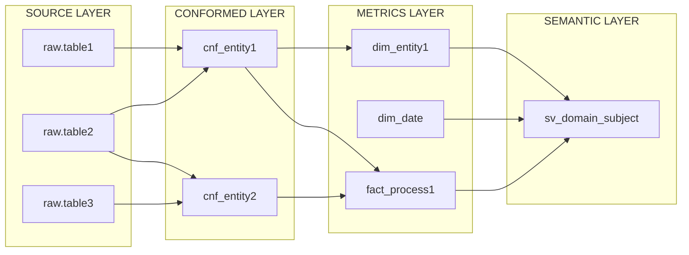
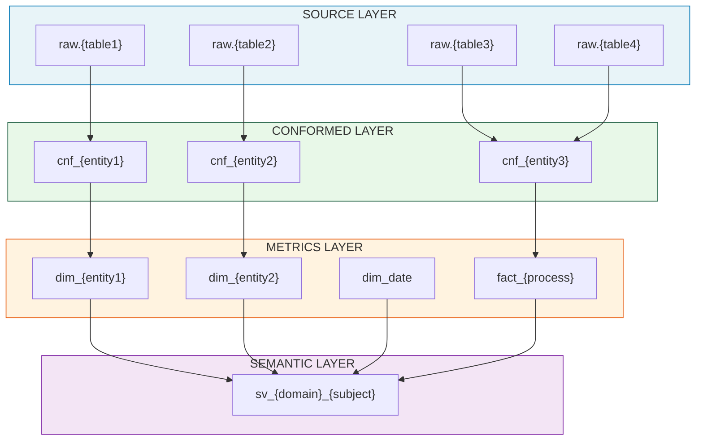
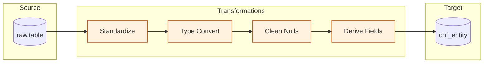

# Output Specification & Deliverables

This document defines the complete structure and format of all deliverables produced by the DBT Monolith Migration Skill.

---

## 1. Deliverables Overview

| # | Deliverable | Description | Format | Required |
|---|-------------|-------------|--------|----------|
| 1 | **DDL Scripts** | New table structure definitions | SQL | ✅ |
| 2 | **DBT Project** | Complete domain-owned DBT project | SQL, YAML | ✅ |
| 3.1 | **Domain Overview** | Executive summary | Markdown | ✅ |
| 3.2 | **Data Dictionary** | Column-level definitions | Markdown | ✅ |
| 3.3 | **Lineage Documentation** | Data flow & dependencies | Markdown | ✅ |
| 3.4 | **DBT Project Spec** | Project configuration details | Markdown | ✅ |
| 3.5 | **Semantic View Spec** | Semantic view definitions | YAML + Markdown | ✅ |
| 3.6 | **Migration Report** | Summary of changes | Markdown | ✅ |
| 4 | **Migration Scripts** | Data migration SQL | SQL | ⚪ Optional |

---

## 2. Output Directory Structure

```
{domain}_transform/
├── dbt_project.yml                    # DBT project configuration
├── packages.yml                       # Package dependencies
├── profiles.yml.example               # Example profile (DO NOT include credentials)
│
├── ddl/                               # DDL for new table structures
│   ├── 01_conformed_layer.sql         # Conformed layer DDL
│   ├── 02_metrics_layer.sql           # Metrics layer DDL
│   └── 03_semantic_layer.sql          # Semantic view DDL
│
├── models/
│   ├── staging/                       # Source definitions only
│   │   └── schema.yml                 # Source definitions with freshness
│   │
│   ├── conformed/                     # Conformed layer models
│   │   ├── cnf_{entity_1}.sql
│   │   ├── cnf_{entity_2}.sql
│   │   └── schema.yml                 # Model + column documentation
│   │
│   ├── metrics/                       # Metrics layer models
│   │   ├── dimensions/
│   │   │   ├── dim_{entity_1}.sql
│   │   │   ├── dim_{entity_2}.sql
│   │   │   ├── dim_date.sql
│   │   │   └── schema.yml
│   │   └── facts/
│   │       ├── fact_{process_1}.sql
│   │       ├── fact_{process_2}.sql
│   │       └── schema.yml
│   │
│   └── semantic/                      # Semantic view definitions
│       ├── sv_{domain}_{subject}.sql
│       └── schema.yml
│
├── macros/                            # Reusable macros
│   ├── tier_logic/
│   │   ├── calculate_customer_tier.sql
│   │   ├── calculate_order_tier.sql
│   │   └── calculate_product_tier.sql
│   ├── date_helpers/
│   │   ├── fiscal_year.sql
│   │   ├── fiscal_quarter.sql
│   │   └── fiscal_month.sql
│   └── margins/
│       ├── gross_margin.sql
│       └── margin_pct.sql
│
├── tests/                             # Custom tests
│   └── custom/
│       └── {test_name}.sql
│
├── seeds/                             # Static reference data (if needed)
│   └── {seed_name}.csv
│
├── semantic/                          # Snowflake semantic view YAML
│   ├── sv_{domain}_{subject}.yaml
│   └── README.md
│
├── migration/                         # Optional migration scripts
│   ├── 01_migrate_conformed.sql
│   ├── 02_migrate_metrics.sql
│   └── validation_queries.sql
│
└── docs/                              # Documentation
    ├── domain_overview.md             # 3.1 Domain Overview
    ├── data_dictionary.md             # 3.2 Data Dictionary (all layers)
    ├── lineage.md                     # 3.3 Lineage Documentation
    ├── dbt_project_spec.md            # 3.4 DBT Project Specifications
    ├── semantic_view_spec.md          # 3.5 Semantic View Specifications
    └── migration_report.md            # 3.6 Migration Report
```

---

## 3. DDL Scripts Specification

### 3.1 File: `ddl/01_conformed_layer.sql`

```sql
/*
================================================================================
CONFORMED LAYER DDL
Domain: {DOMAIN_NAME}
Generated: {TIMESTAMP}
================================================================================
*/

-- ============================================================================
-- cnf_{entity_name}
-- Description: {entity description}
-- Grain: {what one row represents}
-- ============================================================================

CREATE TABLE IF NOT EXISTS {{ database }}.{{ schema_conformed }}.cnf_{entity_name} (
    -- Primary Key
    {entity}_id             VARCHAR(255)    NOT NULL    COMMENT 'Natural key from source',
    
    -- Attributes
    {column_name}           {DATA_TYPE}     {NULL|NOT NULL}    COMMENT '{description}',
    
    -- SCD Metadata
    valid_from              TIMESTAMP_NTZ   NOT NULL    COMMENT 'Record validity start',
    valid_to                TIMESTAMP_NTZ   NOT NULL    COMMENT 'Record validity end',
    is_current              BOOLEAN         NOT NULL    COMMENT 'Current record flag',
    
    -- Audit
    created_at              TIMESTAMP_NTZ   NOT NULL    COMMENT 'Record creation timestamp',
    updated_at              TIMESTAMP_NTZ   NOT NULL    COMMENT 'Record update timestamp',
    loaded_at               TIMESTAMP_NTZ   NOT NULL    COMMENT 'ETL load timestamp',
    
    -- Constraints
    CONSTRAINT pk_cnf_{entity_name} PRIMARY KEY ({entity}_id, valid_from)
)
CLUSTER BY ({clustering_columns})
COMMENT = '{table description}';
```

### 3.2 File: `ddl/02_metrics_layer.sql`

```sql
/*
================================================================================
METRICS LAYER DDL
Domain: {DOMAIN_NAME}
Generated: {TIMESTAMP}
================================================================================
*/

-- ============================================================================
-- dim_{entity_name}
-- Description: {dimension description}
-- SCD Type: {0|1|2}
-- ============================================================================

CREATE TABLE IF NOT EXISTS {{ database }}.{{ schema_metrics }}.dim_{entity_name} (
    -- Surrogate Key
    {entity}_key            VARCHAR(255)    NOT NULL    COMMENT 'Surrogate primary key',
    
    -- Natural Key
    {entity}_id             VARCHAR(255)    NOT NULL    COMMENT 'Natural business key',
    
    -- Attributes
    {column_name}           {DATA_TYPE}     {NULL|NOT NULL}    COMMENT '{description}',
    
    -- Derived Attributes
    {derived_column}        {DATA_TYPE}     {NULL|NOT NULL}    COMMENT '{calculation description}',
    
    -- SCD2 Metadata (if applicable)
    valid_from              TIMESTAMP_NTZ   NOT NULL    COMMENT 'Record validity start',
    valid_to                TIMESTAMP_NTZ   NOT NULL    COMMENT 'Record validity end',
    is_current              BOOLEAN         NOT NULL    COMMENT 'Current record flag',
    
    -- Audit
    created_at              TIMESTAMP_NTZ   NOT NULL    COMMENT 'Record creation timestamp',
    updated_at              TIMESTAMP_NTZ   NOT NULL    COMMENT 'Record update timestamp',
    
    CONSTRAINT pk_dim_{entity_name} PRIMARY KEY ({entity}_key)
)
COMMENT = '{dimension description}';


-- ============================================================================
-- fact_{process_name}
-- Description: {fact table description}
-- Grain: {what one row represents}
-- ============================================================================

CREATE TABLE IF NOT EXISTS {{ database }}.{{ schema_metrics }}.fact_{process_name} (
    -- Surrogate Key
    {process}_key           VARCHAR(255)    NOT NULL    COMMENT 'Surrogate primary key',
    
    -- Foreign Keys
    {dim1}_key              VARCHAR(255)    NOT NULL    COMMENT 'FK to dim_{dim1}',
    {dim2}_key              VARCHAR(255)    NOT NULL    COMMENT 'FK to dim_{dim2}',
    date_key                VARCHAR(255)    NOT NULL    COMMENT 'FK to dim_date',
    
    -- Degenerate Dimensions
    {transaction}_id        VARCHAR(255)    NOT NULL    COMMENT 'Transaction identifier',
    
    -- Measures
    {measure_name}          NUMBER(18,2)    NOT NULL    COMMENT '{measure description}',
    
    -- Timestamps
    {event}_at              TIMESTAMP_NTZ   NOT NULL    COMMENT '{event} timestamp',
    
    CONSTRAINT pk_fact_{process_name} PRIMARY KEY ({process}_key),
    CONSTRAINT fk_fact_{process_name}_{dim1} FOREIGN KEY ({dim1}_key) 
        REFERENCES {{ database }}.{{ schema_metrics }}.dim_{dim1}({dim1}_key),
    CONSTRAINT fk_fact_{process_name}_{dim2} FOREIGN KEY ({dim2}_key) 
        REFERENCES {{ database }}.{{ schema_metrics }}.dim_{dim2}({dim2}_key),
    CONSTRAINT fk_fact_{process_name}_date FOREIGN KEY (date_key) 
        REFERENCES {{ database }}.{{ schema_metrics }}.dim_date(date_key)
)
CLUSTER BY (date_key, {dim1}_key)
COMMENT = '{fact table description} | Grain: {grain}';
```

### 3.3 File: `ddl/03_semantic_layer.sql`

```sql
/*
================================================================================
SEMANTIC LAYER DDL
Domain: {DOMAIN_NAME}
Generated: {TIMESTAMP}
Note: Semantic views are created via Snowflake Intelligence or API
================================================================================
*/

-- Reference documentation for semantic views
-- Actual semantic view creation uses YAML definitions in /semantic/ folder

-- Placeholder view for documentation purposes
CREATE OR REPLACE VIEW {{ database }}.{{ schema_semantic }}.sv_{domain}_{subject}_placeholder AS
SELECT
    -- This is a placeholder. Actual semantic view is defined in:
    -- semantic/sv_{domain}_{subject}.yaml
    'See semantic/sv_{domain}_{subject}.yaml for semantic view definition' AS documentation
;
```

---

## 4. DBT Project Specifications

### 4.1 File: `dbt_project.yml`

```yaml
name: '{domain}_transform'
version: '1.0.0'
config-version: 2

profile: '{domain}_profile'

model-paths: ["models"]
analysis-paths: ["analyses"]
test-paths: ["tests"]
seed-paths: ["seeds"]
macro-paths: ["macros"]
snapshot-paths: ["snapshots"]

target-path: "target"
clean-targets:
  - "target"
  - "dbt_packages"

vars:
  domain_name: '{domain}'
  domain_full_name: '{Domain Full Name}'
  
  source_database: '{{ env_var("SOURCE_DATABASE", "RAW_DB") }}'
  source_schema: '{{ env_var("SOURCE_SCHEMA", "RAW_SCHEMA") }}'
  
  target_database: '{{ env_var("TARGET_DATABASE", "{DOMAIN}_DB") }}'
  schema_conformed: 'CONFORMED'
  schema_metrics: 'METRICS'
  schema_semantic: 'SEMANTIC'
  
  fiscal_year_start_month: 7
  
  customer_tier_thresholds:
    platinum: 10000
    gold: 5000
    silver: 1000
    
  order_tier_thresholds:
    high_value: 1000
    medium_value: 500
    low_value: 100
    
  product_tier_thresholds:
    star: 100000
    performer: 50000
    steady: 10000

models:
  {domain}_transform:
    +database: '{{ var("target_database") }}'
    
    staging:
      +materialized: ephemeral
      
    conformed:
      +schema: '{{ var("schema_conformed") }}'
      +materialized: table
      +tags: ['conformed', '{domain}']
      
    metrics:
      +schema: '{{ var("schema_metrics") }}'
      dimensions:
        +materialized: table
        +tags: ['metrics', 'dimension', '{domain}']
      facts:
        +materialized: incremental
        +incremental_strategy: merge
        +tags: ['metrics', 'fact', '{domain}']
        
    semantic:
      +schema: '{{ var("schema_semantic") }}'
      +materialized: view
      +tags: ['semantic', '{domain}']

seeds:
  {domain}_transform:
    +schema: SEEDS

tests:
  +severity: error
  +store_failures: true
```

### 4.2 File: `packages.yml`

```yaml
packages:
  - package: dbt-labs/dbt_utils
    version: [">=1.1.0", "<2.0.0"]
    
  - package: calogica/dbt_expectations
    version: [">=0.10.0", "<0.11.0"]
    
  - package: dbt-labs/codegen
    version: [">=0.12.0", "<0.13.0"]
```

### 4.3 File: `profiles.yml.example`

```yaml
# EXAMPLE PROFILE - DO NOT COMMIT ACTUAL CREDENTIALS
# Copy this file to ~/.dbt/profiles.yml and fill in your credentials

{domain}_profile:
  target: dev
  outputs:
    dev:
      type: snowflake
      account: "{{ env_var('SNOWFLAKE_ACCOUNT') }}"
      user: "{{ env_var('SNOWFLAKE_USER') }}"
      password: "{{ env_var('SNOWFLAKE_PASSWORD') }}"
      role: "{DOMAIN}_DEVELOPER"
      database: "{DOMAIN}_DB"
      warehouse: "{DOMAIN}_WH"
      schema: "DEV"
      threads: 4
      
    prod:
      type: snowflake
      account: "{{ env_var('SNOWFLAKE_ACCOUNT') }}"
      user: "{{ env_var('SNOWFLAKE_USER') }}"
      authenticator: externalbrowser
      role: "{DOMAIN}_ADMIN"
      database: "{DOMAIN}_DB"
      warehouse: "{DOMAIN}_WH"
      schema: "PROD"
      threads: 8
```

---

## 5. Documentation Specifications

### 5.1 Domain Overview (`docs/domain_overview.md`)

```markdown
# {Domain Full Name} Domain - Data Overview

## 1. Executive Summary

| Attribute | Value |
|-----------|-------|
| **Domain** | {Domain Full Name} |
| **Abbreviation** | {domain} |
| **Domain Owner** | {Team/Person Name} |
| **Generated** | {Date} |
| **Source Project** | transform (monolith) |
| **Source Models Analyzed** | {count} |
| **Target Models Created** | {count} |
| **Redundancies Eliminated** | {count} |

## 2. Domain Scope

### 2.1 Business Context
{2-3 paragraph description of what this domain covers, its business purpose, and key stakeholders}

### 2.2 Key Business Questions Answered
- {Question 1 this domain helps answer}
- {Question 2}
- {Question 3}

### 2.3 Primary Stakeholders
| Stakeholder | Role | Usage |
|-------------|------|-------|
| {Team 1} | {Role} | {How they use this data} |
| {Team 2} | {Role} | {How they use this data} |

## 3. Entity Catalog

### 3.1 Conformed Layer Entities

| Entity | Model Name | Description | Source |
|--------|------------|-------------|--------|
| {Entity 1} | cnf_{entity} | {Description} | {source table(s)} |
| {Entity 2} | cnf_{entity} | {Description} | {source table(s)} |

### 3.2 Metrics Layer - Dimensions

| Dimension | Model Name | Description | SCD Type |
|-----------|------------|-------------|----------|
| {Dim 1} | dim_{entity} | {Description} | {0/1/2} |
| {Dim 2} | dim_{entity} | {Description} | {0/1/2} |

### 3.3 Metrics Layer - Facts

| Fact | Model Name | Grain | Description |
|------|------------|-------|-------------|
| {Fact 1} | fact_{process} | {grain} | {Description} |
| {Fact 2} | fact_{process} | {grain} | {Description} |

## 4. Key Metrics

| Metric | Fact Table | Calculation | Business Definition |
|--------|------------|-------------|---------------------|
| {Metric 1} | fact_{x} | {formula} | {business definition} |
| {Metric 2} | fact_{x} | {formula} | {business definition} |

## 5. Data Lineage Summary



## 6. Semantic Views

| Semantic View | Purpose | Primary Use Cases |
|---------------|---------|-------------------|
| sv_{domain}_{subject} | {Purpose} | {Use case 1}, {Use case 2} |

## 7. Migration Summary

### 7.1 Models Consolidated

| Original Models | Consolidated To | Reason |
|-----------------|-----------------|--------|
| {model1}, {model2} | {target_model} | {Reason} |

### 7.2 Macros Extracted

| Macro | Replaces | Usage Count |
|-------|----------|-------------|
| {macro_name} | {inline logic} | {count} models |

### 7.3 Breaking Changes

| Change | Impact | Migration Path |
|--------|--------|----------------|
| {change} | {impact} | {how to migrate} |
```

### 5.2 Data Dictionary (`docs/data_dictionary.md`)

```markdown
# {Domain Full Name} - Data Dictionary

## Overview

| Attribute | Value |
|-----------|-------|
| **Domain** | {Domain Full Name} |
| **Generated** | {Date} |
| **Total Models** | {count} |
| **Total Columns** | {count} |

---

## Conformed Layer

### cnf_{entity_name}

#### Description
{Detailed description of this conformed entity}

#### Grain
{What one row represents}

#### Primary Key
`{entity}_id` + `valid_from` (composite for SCD2)

#### Columns

| Column | Data Type | Nullable | Description | Source | Transformation |
|--------|-----------|----------|-------------|--------|----------------|
| {entity}_id | VARCHAR(255) | NO | Natural business key | {source.column} | Direct |
| {column_name} | {TYPE} | {YES/NO} | {Description} | {source.column} | {transformation applied} |
| valid_from | TIMESTAMP_NTZ | NO | SCD2 validity start | System generated | - |
| valid_to | TIMESTAMP_NTZ | NO | SCD2 validity end | System generated | - |
| is_current | BOOLEAN | NO | Current record flag | System generated | - |
| created_at | TIMESTAMP_NTZ | NO | Record creation time | {source._etl_created} | Direct |
| updated_at | TIMESTAMP_NTZ | NO | Record update time | {source._etl_updated} | Direct |
| loaded_at | TIMESTAMP_NTZ | NO | ETL load timestamp | {source._etl_loaded_at} | Direct |

#### Tests

| Column | Test Type | Configuration |
|--------|-----------|---------------|
| {entity}_id | unique (composite) | With valid_from |
| {entity}_id | not_null | - |
| is_current | accepted_values | [true, false] |

---

## Metrics Layer - Dimensions

### dim_{entity_name}

#### Description
{Detailed description of this dimension}

#### SCD Type
{Type 0/1/2 with explanation}

#### Primary Key
`{entity}_key`

#### Columns

| Column | Data Type | Nullable | Description | Business Rules | Example Values |
|--------|-----------|----------|-------------|----------------|----------------|
| {entity}_key | VARCHAR(255) | NO | Surrogate primary key | Generated via dbt_utils.generate_surrogate_key | abc123def456... |
| {entity}_id | VARCHAR(255) | NO | Natural business key | From source | CUST-001 |
| {column_name} | {TYPE} | {YES/NO} | {Description} | {rules} | {examples} |
| {entity}_tier | VARCHAR(50) | NO | Value tier | Calculated via macro | PLATINUM, GOLD, SILVER, BRONZE |
| is_current | BOOLEAN | NO | Current record flag | TRUE for latest version | TRUE, FALSE |

#### Hierarchies

| Hierarchy | Levels | Example |
|-----------|--------|---------|
| Geography | city → state → country → region | Melbourne → VIC → AU → APAC |
| {hierarchy} | {levels} | {example} |

---

## Metrics Layer - Facts

### fact_{process_name}

#### Description
{Detailed description of this fact table}

#### Grain
**{Explicit statement of what one row represents}**

Example: One row per order line item

#### Primary Key
`{process}_key`

#### Foreign Keys

| Column | References | Join Type |
|--------|------------|-----------|
| customer_key | dim_customer.customer_key | INNER |
| product_key | dim_product.product_key | LEFT |
| date_key | dim_date.date_key | INNER |

#### Columns

| Column | Data Type | Nullable | Description | Additive | Aggregation |
|--------|-----------|----------|-------------|----------|-------------|
| {process}_key | VARCHAR(255) | NO | Surrogate PK | N/A | COUNT DISTINCT |
| customer_key | VARCHAR(255) | NO | FK to dim_customer | N/A | COUNT DISTINCT |
| {measure}_amount | NUMBER(18,2) | NO | {Description} | YES | SUM |
| {measure}_count | INTEGER | NO | {Description} | YES | SUM |
| {measure}_pct | NUMBER(5,2) | NO | {Description} | NO | AVG |

#### Measures Detail

| Measure | Formula | Business Definition | Currency |
|---------|---------|---------------------|----------|
| line_amount | quantity × unit_price | Gross line value before discounts | USD |
| net_amount | line_amount - discount_amount | Net line value after discounts | USD |
| margin_pct | (unit_price - unit_cost) / unit_price × 100 | Profit margin percentage | N/A |

---

## Semantic Layer

### sv_{domain}_{subject}

#### Description
{Business-friendly description of what this semantic view enables}

#### Intended Users
- {User group 1}: {How they use it}
- {User group 2}: {How they use it}

#### Available Dimensions

| Dimension | Description | Example Values |
|-----------|-------------|----------------|
| {dim_name} | {Description} | {examples} |

#### Available Measures

| Measure | Description | Calculation |
|---------|-------------|-------------|
| {measure_name} | {Business description} | {formula} |

#### Sample Questions This View Can Answer
1. {Question 1}
2. {Question 2}
3. {Question 3}
```

### 5.3 Lineage Documentation (`docs/lineage.md`)

```markdown
# {Domain Full Name} - Data Lineage

## Overview

| Attribute | Value |
|-----------|-------|
| **Domain** | {Domain Full Name} |
| **Generated** | {Date} |
| **Total Sources** | {count} |
| **Total Models** | {count} |
| **Max Depth** | {number} levels |

---

## Full Lineage Diagram



---

## Model-Level Lineage

### cnf_{entity_name}

#### Upstream Dependencies (Sources)

| Source | Table | Columns Used |
|--------|-------|--------------|
| {source_name} | {table_name} | {col1}, {col2}, {col3} |

#### Downstream Dependents

| Model | Type | Relationship |
|-------|------|--------------|
| dim_{entity} | Dimension | Primary consumer |
| fact_{process} | Fact | FK lookup |

#### Transformation Flow



#### Transformation Summary

| Transformation | Description | Affected Columns |
|----------------|-------------|------------------|
| Standardization | Lowercase, trim | email |
| Type Conversion | String to date | created_at |
| Cleaning | Remove nulls | All required columns |
| Derivation | Calculated field | full_name (first + last) |

---

### dim_{entity_name}

#### Upstream Dependencies

| Dependency | Type | Join/Reference |
|------------|------|----------------|
| cnf_{entity} | Conformed | Primary source |
| cnf_{other} | Conformed | LEFT JOIN for attributes |

#### Downstream Dependents

| Model | Type | Join Column |
|-------|------|-------------|
| fact_{process1} | Fact | {entity}_key |
| fact_{process2} | Fact | {entity}_key |
| sv_{domain}_{subject} | Semantic | {entity}_key |

#### Key Transformations

1. **Surrogate Key Generation**
   ```sql
   {{ dbt_utils.generate_surrogate_key(['{entity}_id', 'valid_from']) }}
   ```

2. **Tier Calculation**
   ```sql
   {{ calculate_customer_tier('lifetime_value') }}
   ```

3. **SCD2 Implementation**
   - Tracks changes to: {list of tracked columns}
   - Validity columns: valid_from, valid_to, is_current

---

### fact_{process_name}

#### Upstream Dependencies

| Dependency | Type | Join Condition | Join Type |
|------------|------|----------------|-----------|
| cnf_{entity1} | Conformed | {entity1}_id | INNER |
| dim_{entity1} | Dimension | {entity1}_id (current) | LEFT |
| dim_{entity2} | Dimension | {entity2}_id (current) | LEFT |
| dim_date | Dimension | date_day | LEFT |

#### Downstream Dependents

| Model | Type | Usage |
|-------|------|-------|
| sv_{domain}_{subject} | Semantic | Primary fact source |

#### Grain Documentation

| Grain Level | Description |
|-------------|-------------|
| **Defined Grain** | One row per {grain definition} |
| **Primary Key** | {process}_key (surrogate) |
| **Natural Key** | {natural key columns} |

#### Measures Calculation

| Measure | Calculation | Dependencies |
|---------|-------------|--------------|
| line_amount | quantity × unit_price | cnf_orders |
| margin_pct | (price - cost) / price × 100 | cnf_orders, cnf_products |

---

## Data Flow Summary

### Source to Target Mapping

| Source Table | → | Conformed Model | → | Metrics Model(s) | → | Semantic View |
|--------------|---|-----------------|---|------------------|---|---------------|
| raw.{table1} | → | cnf_{entity1} | → | dim_{entity1}, fact_{process} | → | sv_{domain}_{subject} |
| raw.{table2} | → | cnf_{entity2} | → | dim_{entity2} | → | sv_{domain}_{subject} |
```

### 5.4 DBT Project Specifications (`docs/dbt_project_spec.md`)

```markdown
# {Domain Full Name} - DBT Project Specifications

## 1. Project Overview

| Attribute | Value |
|-----------|-------|
| **Project Name** | {domain}_transform |
| **Version** | 1.0.0 |
| **DBT Version Required** | >=1.7.0 |
| **Profile Name** | {domain}_profile |

## 2. Directory Structure

```
{domain}_transform/
├── dbt_project.yml          # Project configuration
├── packages.yml             # Dependencies
├── models/                  # SQL models
├── macros/                  # Reusable macros
├── tests/                   # Custom tests
├── seeds/                   # Static data
├── semantic/                # Semantic view definitions
└── docs/                    # Documentation
```

## 3. Configuration Details

### 3.1 Variables

| Variable | Default | Description | Override Via |
|----------|---------|-------------|--------------|
| domain_name | {domain} | Domain abbreviation | dbt_project.yml |
| source_database | RAW_DB | Source database | Environment variable |
| target_database | {DOMAIN}_DB | Target database | Environment variable |
| fiscal_year_start_month | 7 | Fiscal year start | dbt_project.yml |
| customer_tier_thresholds | {dict} | Tier boundaries | dbt_project.yml |

### 3.2 Model Configurations

| Layer | Schema | Materialization | Tags |
|-------|--------|-----------------|------|
| Conformed | CONFORMED | table | conformed, {domain} |
| Dimensions | METRICS | table | metrics, dimension, {domain} |
| Facts | METRICS | incremental | metrics, fact, {domain} |
| Semantic | SEMANTIC | view | semantic, {domain} |

### 3.3 Incremental Strategy

| Model Type | Strategy | Unique Key | Merge Update Columns |
|------------|----------|------------|----------------------|
| Facts | merge | {process}_key | All non-key columns |

## 4. Dependencies

### 4.1 Packages

| Package | Version | Purpose |
|---------|---------|---------|
| dbt_utils | >=1.1.0 | Surrogate keys, date spine |
| dbt_expectations | >=0.10.0 | Advanced testing |
| codegen | >=0.12.0 | Code generation |

### 4.2 External Dependencies

| Dependency | Type | Required For |
|------------|------|--------------|
| shared_macros | Git package | Cross-domain macros |

## 5. Execution Guide

### 5.1 Initial Setup

```bash
# Clone repository
git clone {repo_url}
cd {domain}_transform

# Install dependencies
dbt deps

# Configure profile
cp profiles.yml.example ~/.dbt/profiles.yml
# Edit ~/.dbt/profiles.yml with your credentials
```

### 5.2 Common Commands

```bash
# Compile all models
dbt compile

# Run all models
dbt run

# Run specific layer
dbt run --select tag:conformed
dbt run --select tag:dimension
dbt run --select tag:fact

# Run tests
dbt test

# Generate documentation
dbt docs generate
dbt docs serve
```

### 5.3 Recommended Run Order

1. `dbt run --select tag:conformed`
2. `dbt run --select tag:dimension`
3. `dbt run --select tag:fact`
4. `dbt test`

## 6. Environment Configuration

### 6.1 Required Environment Variables

| Variable | Description | Example |
|----------|-------------|---------|
| SNOWFLAKE_ACCOUNT | Snowflake account identifier | abc12345.us-east-1 |
| SNOWFLAKE_USER | Snowflake username | dbt_user |
| SNOWFLAKE_PASSWORD | Snowflake password | *** |
| SOURCE_DATABASE | Override source database | RAW_DB |
| TARGET_DATABASE | Override target database | PEX_DB |

### 6.2 Roles & Permissions Required

| Role | Purpose | Permissions Needed |
|------|---------|-------------------|
| {DOMAIN}_DEVELOPER | Development | SELECT on sources, CRUD on target schemas |
| {DOMAIN}_ADMIN | Production | All of above + CREATE SCHEMA |

## 7. Testing Strategy

### 7.1 Test Categories

| Category | Scope | Run Frequency |
|----------|-------|---------------|
| Schema tests | All models | Every run |
| Data tests | Business rules | Every run |
| Unit tests | Macros | On change |

### 7.2 Test Commands

```bash
# Run all tests
dbt test

# Run tests for specific model
dbt test --select dim_customer

# Run only data tests
dbt test --select test_type:data
```

## 8. CI/CD Integration

### 8.1 Pre-merge Checks

```bash
dbt compile
dbt run --select state:modified+
dbt test --select state:modified+
```

### 8.2 Production Deployment

```bash
dbt run --target prod
dbt test --target prod
```
```

### 5.5 Semantic View Specifications (`docs/semantic_view_spec.md`)

```markdown
# {Domain Full Name} - Semantic View Specifications

## 1. Overview

| Attribute | Value |
|-----------|-------|
| **Domain** | {Domain Full Name} |
| **Total Semantic Views** | {count} |
| **Target Platform** | Snowflake Intelligence |

## 2. Semantic Views Summary

| Semantic View | Purpose | Primary Fact | Dimensions |
|---------------|---------|--------------|------------|
| sv_{domain}_{subject1} | {purpose} | fact_{x} | dim_{a}, dim_{b}, dim_date |
| sv_{domain}_{subject2} | {purpose} | fact_{y} | dim_{c}, dim_date |

---

## 3. Semantic View Definitions

### sv_{domain}_{subject}

#### 3.1 Overview

| Attribute | Value |
|-----------|-------|
| **Name** | sv_{domain}_{subject} |
| **Description** | {Business-friendly description} |
| **Primary Use Cases** | {Use case 1}, {Use case 2} |
| **Target Users** | {User group 1}, {User group 2} |

#### 3.2 Sample Questions

This semantic view is designed to answer questions like:
1. "{Sample question 1}?"
2. "{Sample question 2}?"
3. "{Sample question 3}?"

#### 3.3 Base Tables

| Table | Type | Schema.Table | Role |
|-------|------|--------------|------|
| orders | Fact | METRICS.fact_orders | Primary fact table |
| customers | Dimension | METRICS.dim_customer | Customer attributes |
| products | Dimension | METRICS.dim_product | Product attributes |
| dates | Dimension | METRICS.dim_date | Time dimension |

#### 3.4 Relationships (Joins)

| Relationship | Left Table | Right Table | Join Type | Condition |
|--------------|------------|-------------|-----------|-----------|
| order_customer | fact_orders | dim_customer | LEFT | fact_orders.customer_key = dim_customer.customer_key |
| order_product | fact_orders | dim_product | LEFT | fact_orders.product_key = dim_product.product_key |
| order_date | fact_orders | dim_date | LEFT | fact_orders.date_key = dim_date.date_key |

#### 3.5 Dimensions

| Dimension | Source Column | Data Type | Description | Sample Values |
|-----------|---------------|-----------|-------------|---------------|
| order_date | dim_date.date_day | DATE | Date of order | 2025-01-15 |
| customer_name | dim_customer.full_name | VARCHAR | Customer full name | John Smith |
| customer_tier | dim_customer.customer_tier | VARCHAR | Customer value tier | PLATINUM, GOLD |
| product_name | dim_product.product_name | VARCHAR | Product name | Widget Pro |
| product_category | dim_product.category | VARCHAR | Product category | Electronics |

#### 3.6 Measures

| Measure | Expression | Data Type | Description | Aggregation |
|---------|------------|-----------|-------------|-------------|
| total_orders | COUNT(DISTINCT fact_orders.order_id) | INTEGER | Count of unique orders | COUNT DISTINCT |
| total_revenue | SUM(fact_orders.order_amount) | DECIMAL | Sum of order amounts | SUM |
| avg_order_value | AVG(fact_orders.order_amount) | DECIMAL | Average order amount | AVG |
| total_quantity | SUM(fact_orders.quantity) | INTEGER | Sum of items ordered | SUM |
| margin_pct | AVG(fact_orders.margin_pct) | DECIMAL | Average margin percentage | AVG |

#### 3.7 Time Dimensions

| Time Dimension | Source Column | Granularities |
|----------------|---------------|---------------|
| order_date | dim_date.date_day | Day, Week, Month, Quarter, Year |

#### 3.8 Filters (Optional Pre-filters)

| Filter | Expression | Description |
|--------|------------|-------------|
| is_completed | fact_orders.order_status = 'COMPLETED' | Only completed orders |
| current_year | dim_date.year = YEAR(CURRENT_DATE()) | Current year only |

---

## 4. YAML Specification

### File: `semantic/sv_{domain}_{subject}.yaml`

```yaml
name: sv_{domain}_{subject}
description: |
  {Multi-line business description}
  
  ## Purpose
  {What this semantic view enables}
  
  ## Target Users
  - {User group 1}
  - {User group 2}
  
  ## Sample Questions
  - {Question 1}
  - {Question 2}

tables:
  - name: orders
    base_table:
      database: "{DOMAIN}_DB"
      schema: "METRICS"
      table: "fact_orders"
    
    description: "Order transaction facts"
    
    dimensions:
      - name: order_id
        expr: order_id
        description: "Unique order identifier"
        data_type: VARCHAR
        
      - name: order_date
        expr: order_date
        description: "Date the order was placed"
        data_type: DATE
        
    measures:
      - name: total_revenue
        expr: SUM(order_amount)
        description: "Total gross revenue"
        data_type: DECIMAL
        default_aggregation: SUM
        
      - name: order_count
        expr: COUNT(DISTINCT order_id)
        description: "Number of unique orders"
        data_type: INTEGER
        default_aggregation: COUNT_DISTINCT
        
      - name: avg_order_value
        expr: AVG(order_amount)
        description: "Average order amount"
        data_type: DECIMAL
        default_aggregation: AVG
        
    time_dimensions:
      - name: order_date
        expr: order_date
        description: "Order date for time-based analysis"

  - name: customers
    base_table:
      database: "{DOMAIN}_DB"
      schema: "METRICS"
      table: "dim_customer"
    
    description: "Customer dimension"
    
    dimensions:
      - name: customer_name
        expr: full_name
        description: "Customer full name"
        
      - name: customer_tier
        expr: customer_tier
        description: "Customer value tier"
        
      - name: customer_segment
        expr: customer_segment
        description: "Customer segment"

  - name: products
    base_table:
      database: "{DOMAIN}_DB"
      schema: "METRICS"
      table: "dim_product"
    
    description: "Product dimension"
    
    dimensions:
      - name: product_name
        expr: product_name
        description: "Product name"
        
      - name: category
        expr: category
        description: "Product category"

joins:
  - name: order_customer
    left_table: orders
    right_table: customers
    join_type: left
    condition: "orders.customer_key = customers.customer_key"
    
  - name: order_product
    left_table: orders
    right_table: products
    join_type: left
    condition: "orders.product_key = products.product_key"

verified_queries:
  - name: "Total Revenue by Customer Tier"
    question: "What is the total revenue by customer tier?"
    sql: |
      SELECT 
        customer_tier,
        SUM(order_amount) as total_revenue
      FROM {{ database }}.METRICS.fact_orders f
      JOIN {{ database }}.METRICS.dim_customer c 
        ON f.customer_key = c.customer_key
      WHERE c.is_current = TRUE
      GROUP BY customer_tier
      ORDER BY total_revenue DESC
      
  - name: "Monthly Order Count"
    question: "How many orders were placed each month?"
    sql: |
      SELECT 
        d.year_month,
        COUNT(DISTINCT f.order_id) as order_count
      FROM {{ database }}.METRICS.fact_orders f
      JOIN {{ database }}.METRICS.dim_date d 
        ON f.date_key = d.date_key
      GROUP BY d.year_month
      ORDER BY d.year_month
```

---

## 5. Deployment Instructions

### 5.1 Via Snowflake Intelligence UI

1. Navigate to Snowflake Intelligence
2. Create new Semantic View
3. Upload YAML definition
4. Validate and publish

### 5.2 Via SQL

```sql
CREATE OR REPLACE SEMANTIC VIEW {DOMAIN}_DB.SEMANTIC.sv_{domain}_{subject}
  FROM FILE '@{stage}/semantic/sv_{domain}_{subject}.yaml';
```

### 5.3 Validation

```sql
-- Test semantic view
SELECT * FROM {DOMAIN}_DB.SEMANTIC.sv_{domain}_{subject} LIMIT 10;

-- Verify joins
DESCRIBE SEMANTIC VIEW {DOMAIN}_DB.SEMANTIC.sv_{domain}_{subject};
```
```

### 5.6 Migration Report (`docs/migration_report.md`)

```markdown
# Migration Report: {Domain Full Name} Domain

## 1. Executive Summary

| Metric | Value |
|--------|-------|
| **Migration Date** | {Date} |
| **Domain** | {Domain Full Name} ({domain}) |
| **Source Project** | transform (monolith) |
| **Target Project** | {domain}_transform |
| **Migration Status** | {Complete / Partial / In Progress} |

### Key Outcomes

| Metric | Before | After | Change |
|--------|--------|-------|--------|
| Total Models | {n} | {n} | {-n / +n} |
| Total Lines of SQL | {n} | {n} | {-n%} |
| Duplicate Logic Instances | {n} | 0 | -100% |
| Test Count | {n} | {n} | {+n%} |
| Documentation Coverage | {n%} | 100% | {+n%} |
| Macros Created | 0 | {n} | +{n} |

---

## 2. Models Migrated

### 2.1 Source Models Analyzed

| # | Original Model | Path | Status |
|---|----------------|------|--------|
| 1 | {model_name} | models/{path} | Migrated |
| 2 | {model_name} | models/{path} | Consolidated |
| 3 | {model_name} | models/{path} | Deprecated |

### 2.2 Target Models Created

| # | New Model | Layer | Source Model(s) |
|---|-----------|-------|-----------------|
| 1 | cnf_{entity} | Conformed | {source models} |
| 2 | dim_{entity} | Metrics | cnf_{entity} |
| 3 | fact_{process} | Metrics | cnf_{entities} |
| 4 | sv_{domain}_{subject} | Semantic | dim_*, fact_* |

---

## 3. Consolidation Summary

### 3.1 Models Consolidated

| Original Models | Consolidated To | Reason | Lines Saved |
|-----------------|-----------------|--------|-------------|
| stg_orders, stg_orders_v2, stg_orders_completed | cnf_orders | Duplicate staging logic | {n} |
| int_customer_360, int_customer_summary | dim_customer | Overlapping aggregations | {n} |
| rpt_sales_daily, rpt_sales_summary | fact_orders + semantic | Redundant reporting | {n} |

### 3.2 Models Deprecated

| Model | Reason | Replacement |
|-------|--------|-------------|
| {model_name} | Unused | None |
| {model_name} | Duplicate | {replacement} |

---

## 4. Redundancy Elimination

### 4.1 Logic Patterns Extracted to Macros

| Pattern | Occurrences Found | Macro Created | Impact |
|---------|-------------------|---------------|--------|
| Customer tier CASE statement | {n} | calculate_customer_tier | Centralized business rule |
| Fiscal year calculation | {n} | fiscal_year | Consistent FY handling |
| Date truncation logic | {n} | date_trunc_to_period | Standardized date handling |
| Margin calculation | {n} | margin_pct | Consistent margin calc |

### 4.2 Hardcoded Values Removed

| Pattern | Occurrences | Resolution |
|---------|-------------|------------|
| Direct database references | {n} | Replaced with {{ source() }} |
| Hardcoded dates | {n} | Replaced with variables/macros |
| Hardcoded thresholds | {n} | Moved to dbt_project.yml vars |

---

## 5. Schema Changes

### 5.1 Table Structure Changes

| Original Table | New Table(s) | Change Type | Notes |
|----------------|--------------|-------------|-------|
| customers | dim_customer | Restructured | Added surrogate key, SCD2 |
| orders | cnf_orders, fact_orders | Split | Separated conformed from metrics |
| - | dim_date | New | Calendar dimension added |

### 5.2 Column Changes

| Table | Column | Change | Reason |
|-------|--------|--------|--------|
| dim_customer | customer_key | Added | Surrogate primary key |
| dim_customer | customer_tier | Added | Calculated attribute |
| fact_orders | customer_id | Removed | Replaced with customer_key FK |

---

## 6. Breaking Changes

### 6.1 Summary

| Change | Severity | Impact | Migration Required |
|--------|----------|--------|-------------------|
| {change description} | HIGH | {impact} | Yes |
| {change description} | MEDIUM | {impact} | Yes |
| {change description} | LOW | {impact} | Optional |

### 6.2 Migration Paths

#### Breaking Change 1: {Description}

**Before:**
```sql
SELECT * FROM old_schema.customers
```

**After:**
```sql
SELECT * FROM {DOMAIN}_DB.METRICS.dim_customer
WHERE is_current = TRUE
```

**Migration Steps:**
1. {Step 1}
2. {Step 2}

---

## 7. Validation Results

### 7.1 Compilation

| Check | Result | Notes |
|-------|--------|-------|
| dbt compile | ✅ Pass | All {n} models compiled |
| dbt deps | ✅ Pass | All packages installed |

### 7.2 Testing

| Test Category | Total | Passed | Failed | Skipped |
|---------------|-------|--------|--------|---------|
| Schema Tests | {n} | {n} | 0 | 0 |
| Data Tests | {n} | {n} | 0 | 0 |
| Custom Tests | {n} | {n} | 0 | 0 |
| **Total** | {n} | {n} | 0 | 0 |

### 7.3 Data Validation

| Validation | Source | Target | Match | Notes |
|------------|--------|--------|-------|-------|
| Row Count - Customers | {n} | {n} | ✅ | - |
| Row Count - Orders | {n} | {n} | ✅ | - |
| Sum - Revenue | ${n} | ${n} | ✅ | - |
| Distinct - Customer IDs | {n} | {n} | ✅ | - |

---

## 8. Recommendations

### 8.1 Immediate Actions

1. {Action 1}
2. {Action 2}

### 8.2 Future Improvements

1. {Improvement 1}
2. {Improvement 2}

---

## 9. Appendix

### 9.1 Files Generated

| File | Path | Description |
|------|------|-------------|
| DDL | ddl/*.sql | Table definitions |
| Models | models/**/*.sql | DBT model SQL |
| Schema | models/**/schema.yml | Documentation & tests |
| Macros | macros/**/*.sql | Reusable logic |
| Semantic | semantic/*.yaml | Semantic view definitions |
| Docs | docs/*.md | Documentation |

### 9.2 Execution Log

```
{Timestamp} - Migration started
{Timestamp} - Source analysis complete: {n} models analyzed
{Timestamp} - Redundancy analysis complete: {n} duplicates found
{Timestamp} - Target design complete
{Timestamp} - Model generation complete
{Timestamp} - Test generation complete
{Timestamp} - Documentation generation complete
{Timestamp} - Compilation successful
{Timestamp} - All tests passed
{Timestamp} - Migration complete
```
```

---

## 6. Optional: Data Migration Scripts

### 6.1 File: `migration/01_migrate_conformed.sql`

```sql
/*
================================================================================
DATA MIGRATION SCRIPT: Conformed Layer
Domain: {DOMAIN_NAME}
Generated: {TIMESTAMP}
================================================================================

IMPORTANT: Review and test in DEV environment before running in PROD.
Estimated runtime: {estimate}
*/

-- Pre-migration validation
SELECT 'Source row count' as check_type, COUNT(*) as count
FROM {{ source_database }}.{{ source_schema }}.{source_table};

-- Migration: cnf_{entity_name}
INSERT INTO {{ target_database }}.CONFORMED.cnf_{entity_name}
SELECT
    {column_mappings}
FROM {{ source_database }}.{{ source_schema }}.{source_table}
WHERE {filter_conditions};

-- Post-migration validation
SELECT 'Target row count' as check_type, COUNT(*) as count
FROM {{ target_database }}.CONFORMED.cnf_{entity_name};
```

### 6.2 File: `migration/validation_queries.sql`

```sql
/*
================================================================================
MIGRATION VALIDATION QUERIES
Domain: {DOMAIN_NAME}
Generated: {TIMESTAMP}
================================================================================
*/

-- Row count comparison
SELECT
    'Row Count Validation' as validation_type,
    '{source_table}' as source_table,
    '{target_table}' as target_table,
    (SELECT COUNT(*) FROM {source_schema}.{source_table}) as source_count,
    (SELECT COUNT(*) FROM {target_schema}.{target_table}) as target_count,
    CASE 
        WHEN source_count = target_count THEN 'PASS'
        ELSE 'FAIL'
    END as status;

-- Aggregate comparison
SELECT
    'Revenue Sum Validation' as validation_type,
    (SELECT SUM(amount) FROM {source_schema}.{source_table}) as source_sum,
    (SELECT SUM(order_amount) FROM {target_schema}.fact_orders) as target_sum,
    CASE 
        WHEN ABS(source_sum - target_sum) < 0.01 THEN 'PASS'
        ELSE 'FAIL'
    END as status;

-- Distinct key comparison
SELECT
    'Distinct Key Validation' as validation_type,
    (SELECT COUNT(DISTINCT customer_id) FROM {source_schema}.{source_table}) as source_distinct,
    (SELECT COUNT(DISTINCT customer_id) FROM {target_schema}.dim_customer) as target_distinct,
    CASE 
        WHEN source_distinct = target_distinct THEN 'PASS'
        ELSE 'FAIL'
    END as status;
```

---

## 7. Validation Checklist

Before marking migration complete, verify all outputs:

### Documentation
- [ ] `docs/domain_overview.md` - Complete with all sections
- [ ] `docs/data_dictionary.md` - All models and columns documented
- [ ] `docs/lineage.md` - All dependencies documented
- [ ] `docs/dbt_project_spec.md` - Configuration documented
- [ ] `docs/semantic_view_spec.md` - Semantic views fully specified
- [ ] `docs/migration_report.md` - Summary complete

### DDL
- [ ] `ddl/01_conformed_layer.sql` - All conformed tables
- [ ] `ddl/02_metrics_layer.sql` - All dims and facts
- [ ] `ddl/03_semantic_layer.sql` - Semantic view references

### DBT Project
- [ ] `dbt_project.yml` - Valid configuration
- [ ] `packages.yml` - All dependencies listed
- [ ] All models compile successfully
- [ ] All tests pass
- [ ] Schema.yml in every model directory

### Semantic Layer
- [ ] `semantic/*.yaml` - Valid YAML definitions
- [ ] All measures defined
- [ ] All dimensions defined
- [ ] Relationships correctly specified
- [ ] Verified queries included

### Optional Migration
- [ ] Migration scripts generated (if requested)
- [ ] Validation queries included
- [ ] Rollback plan documented
